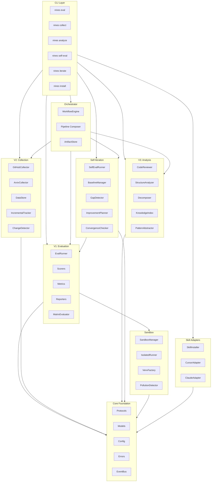
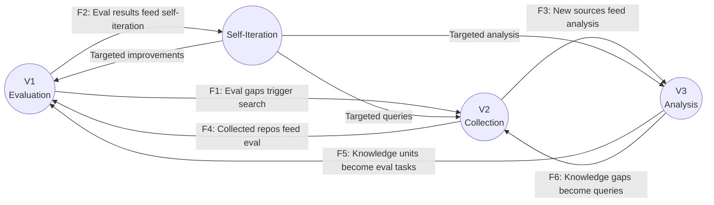
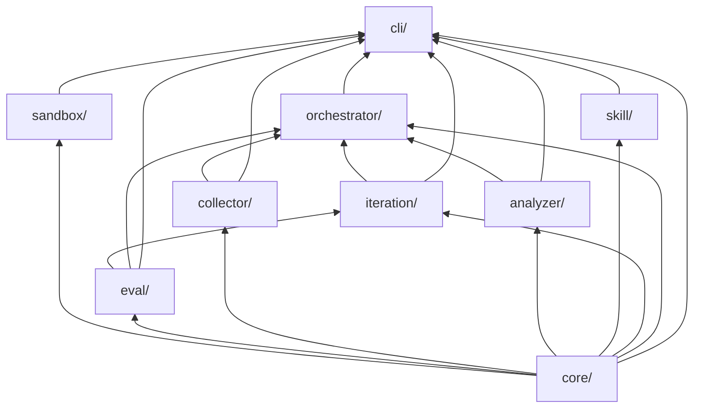
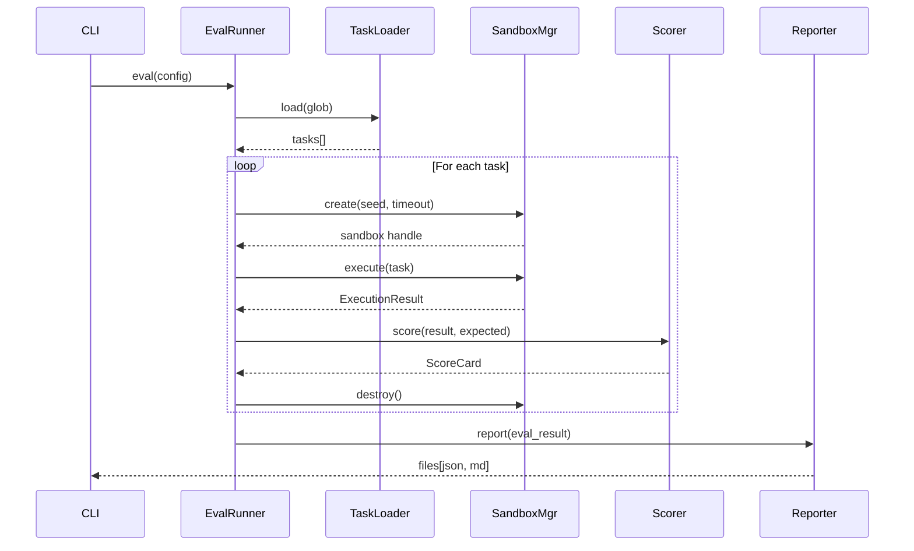
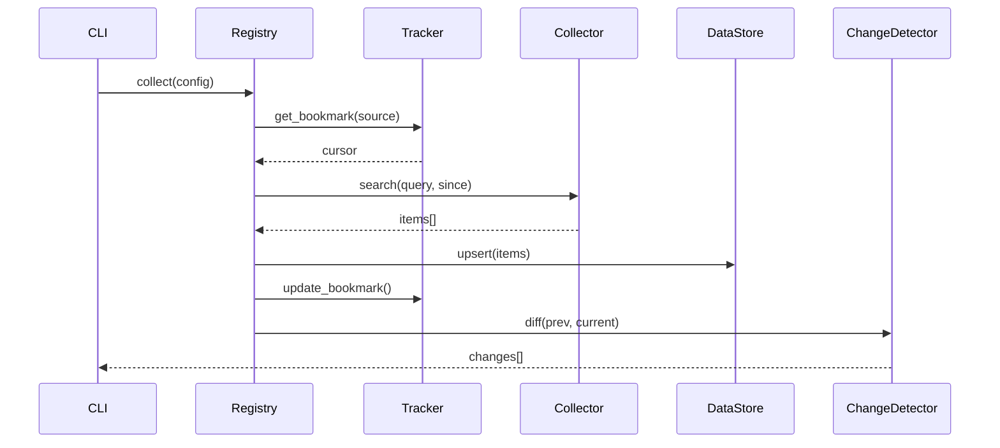

# Architecture Overview

<!-- auto-updated: version from src/nines/__init__.py -->

NineS {{ nines_version }} is organized around a three-vertex capability model with supporting infrastructure for orchestration, isolation, and agent runtime integration.

---

## System Architecture



---

## Three-Vertex Model

The three vertices form a mutual reinforcement loop through six directed data flows:



| Flow | Direction | Purpose |
|------|-----------|---------|
| F1 | V1 → V2 | Evaluation gaps trigger targeted information collection |
| F2 | V1 → Iteration | Evaluation scores feed the MAPIM self-improvement loop |
| F3 | V2 → V3 | Collected repositories become analysis targets |
| F4 | V2 → V1 | Collected data generates evaluation benchmarks |
| F5 | V3 → V1 | Knowledge units become evaluation task candidates |
| F6 | V3 → V2 | Knowledge gaps generate new search queries |

---

## Module Dependency Graph

Dependencies follow a strict DAG with `core/` at the foundation. No circular dependencies exist.



### Dependency Rules

| Rule | Description |
|------|-------------|
| R1 | `core/` has zero imports from any other NineS module |
| R2 | No circular dependencies between any two modules |
| R3 | Vertex modules (`eval/`, `collector/`, `analyzer/`) do not import each other |
| R4 | `orchestrator/` is the only module permitted to import all vertex modules |
| R5 | `cli/` may import from any module (composition root) |
| R6 | `sandbox/` depends only on `core/` |
| R7 | `iteration/` depends on `core/` and `eval/` only |
| R8 | `skill/` depends only on `core/` |

### Topological Order

```
core → sandbox → eval → collector → analyzer → skill → iteration → orchestrator → cli
```

---

## Data Flow Diagrams

### Evaluation Flow (V1)



### Collection Flow (V2)



### MAPIM Iteration Flow

```mermaid
sequenceDiagram
    participant Loop as MAPIMOrchestrator
    participant Eval as SelfEvalRunner
    participant Gap as GapDetector
    participant Conv as ConvergenceChecker
    participant Plan as ImprovementPlanner

    loop Until converged or max iterations
        Loop->>Eval: measure(19 dimensions)
        Eval-->>Loop: SelfEvalReport
        Loop->>Gap: detect(report, baseline)
        Gap-->>Loop: GapAnalysisReport
        Loop->>Conv: check(composite_scores)
        Conv-->>Loop: ConvergenceReport
        alt Converged
            Loop->>Loop: terminate & report
        else Not converged
            Loop->>Plan: plan(gaps, history)
            Plan-->>Loop: ImprovementPlan
            Loop->>Loop: execute actions
        end
    end
```

---

## Key Design Decisions

| Decision | Choice | Rationale |
|----------|--------|-----------|
| Structural subtyping | Python `Protocol` | Third-party extensions work without knowing NineS base types |
| Storage backend | SQLite (WAL mode) | Zero-config, single-file, sufficient for single-user MVP |
| Configuration format | TOML | Human-readable, well-typed, Python ecosystem standard |
| Template engine | Jinja2 | Flexible, familiar, maintains separation of concerns |
| Rate limiting | Token bucket | Per-source calibration with adaptive backoff |
| Convergence detection | 4-method majority vote | Statistical rigor avoids premature/missed convergence |
| Sandbox isolation | Process + venv + tmpdir | Docker-free MVP (CON-05) with full isolation |
| Logging | structlog | Structured JSON for CI, colored console for development |
