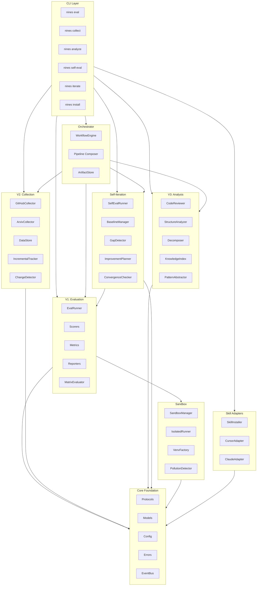
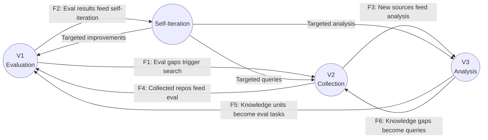
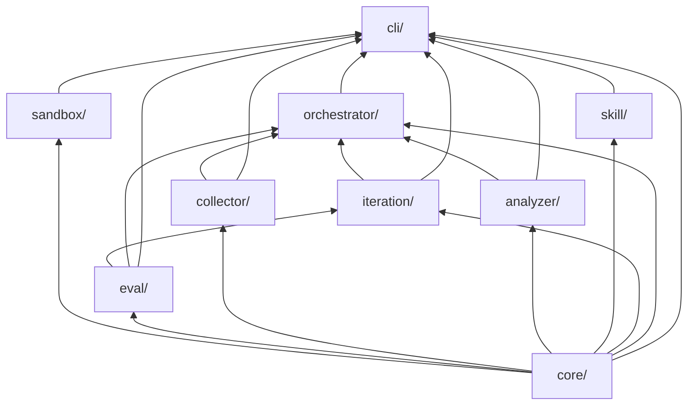
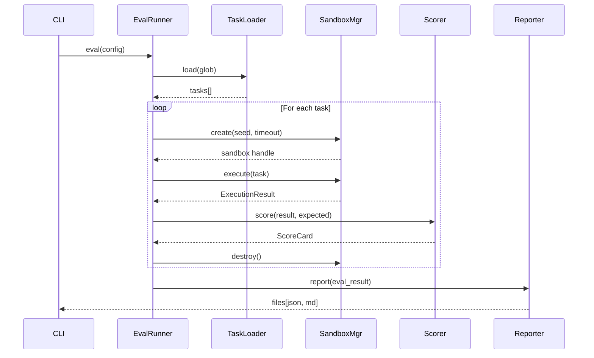
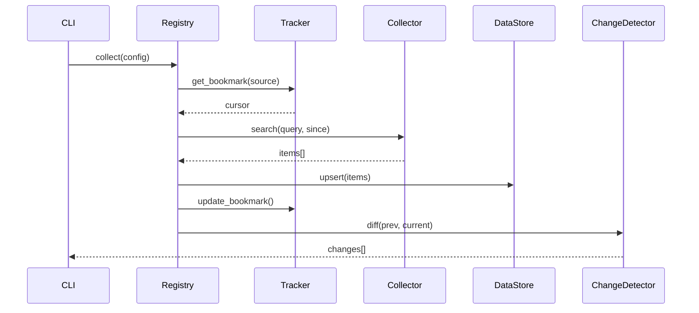

# 架构概览

<!-- auto-updated: version from src/nines/__init__.py -->

NineS {{ nines_version }} 围绕三顶点能力模型组织，辅以编排、隔离和 Agent 运行时集成的支撑基础设施。

---

## 系统架构



---

## 三顶点模型

三个顶点通过六条有向数据流形成相互强化的循环：



| 流 | 方向 | 用途 |
|----|------|------|
| F1 | V1 → V2 | 评估缺口触发定向信息采集 |
| F2 | V1 → Iteration | 评估分数输入 MAPIM 自改进循环 |
| F3 | V2 → V3 | 采集到的仓库成为分析目标 |
| F4 | V2 → V1 | 采集的数据生成评估基准 |
| F5 | V3 → V1 | 知识单元成为评估任务候选 |
| F6 | V3 → V2 | 知识缺口生成新的搜索查询 |

---

## 模块依赖图

依赖关系遵循严格的有向无环图（DAG），`core/` 处于基础层。不存在循环依赖。



### 依赖规则

| 规则 | 描述 |
|------|------|
| R1 | `core/` 不从任何其他 NineS 模块导入 |
| R2 | 任意两个模块之间不存在循环依赖 |
| R3 | 顶点模块（`eval/`、`collector/`、`analyzer/`）不相互导入 |
| R4 | `orchestrator/` 是唯一允许导入所有顶点模块的模块 |
| R5 | `cli/` 可以从任何模块导入（组合根） |
| R6 | `sandbox/` 仅依赖 `core/` |
| R7 | `iteration/` 仅依赖 `core/` 和 `eval/` |
| R8 | `skill/` 仅依赖 `core/` |

### 拓扑排序

```
core → sandbox → eval → collector → analyzer → skill → iteration → orchestrator → cli
```

---

## 数据流图

### 评估流程（V1）



### 采集流程（V2）



### MAPIM 迭代流程

```mermaid
sequenceDiagram
    participant Loop as MAPIMOrchestrator
    participant Eval as SelfEvalRunner
    participant Gap as GapDetector
    participant Conv as ConvergenceChecker
    participant Plan as ImprovementPlanner

    loop Until converged or max iterations
        Loop->>Eval: measure(19 dimensions)
        Eval-->>Loop: SelfEvalReport
        Loop->>Gap: detect(report, baseline)
        Gap-->>Loop: GapAnalysisReport
        Loop->>Conv: check(composite_scores)
        Conv-->>Loop: ConvergenceReport
        alt Converged
            Loop->>Loop: terminate & report
        else Not converged
            Loop->>Plan: plan(gaps, history)
            Plan-->>Loop: ImprovementPlan
            Loop->>Loop: execute actions
        end
    end
```

---

## 关键设计决策

| 决策 | 选择 | 理由 |
|------|------|------|
| 结构化子类型 | Python `Protocol` | 第三方扩展无需了解 NineS 基类型即可工作 |
| 存储后端 | SQLite（WAL 模式） | 零配置、单文件、足以支撑单用户 MVP |
| 配置格式 | TOML | 可读性好、类型明确、Python 生态标准 |
| 模板引擎 | Jinja2 | 灵活、熟悉、保持关注点分离 |
| 速率限制 | Token bucket | 按源校准，支持自适应退避 |
| 收敛检测 | 4 方法多数投票 | 统计严谨性，避免过早/遗漏收敛 |
| 沙箱隔离 | Process + venv + tmpdir | 无 Docker 的 MVP（CON-05），提供完整隔离 |
| 日志 | structlog | CI 环境使用结构化 JSON，开发环境使用彩色控制台 |
