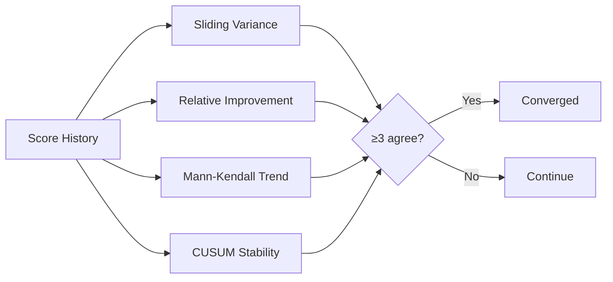

# Self-Evaluation Dimensions

<!-- auto-updated: version from src/nines/__init__.py -->

NineS {{ nines_version }} tracks 19 self-evaluation dimensions across four categories. Each dimension has a concrete measurement method, improvement direction, and target value.

---

## Dimension Summary

| ID | Name | Category | Metric | Direction | MVP Target |
|----|------|----------|--------|-----------|------------|
| D01 | Scoring Accuracy | V1 Evaluation | Agreement rate with golden test set | Higher is better | ≥0.90 |
| D02 | Evaluation Coverage | V1 Evaluation | Fraction of task types loadable & scorable | Higher is better | 1.00 |
| D03 | Reliability (Pass^k) | V1 Evaluation | Same pass/fail across k runs (k=3) | Higher is better | ≥0.95 |
| D04 | Report Quality | V1 Evaluation | Required report sections present & valid | Higher is better | 1.00 |
| D05 | Scorer Agreement | V1 Evaluation | Pairwise Cohen's κ across scorer types | Higher is better | ≥0.70 |
| D06 | Source Coverage | V2 Search | Active sources / configured sources | Higher is better | 1.00 |
| D07 | Tracking Freshness | V2 Search | Median detection lag (minutes) | Lower is better | ≤60 min |
| D08 | Change Detection Recall | V2 Search | Detected changes / actual changes | Higher is better | ≥0.85 |
| D09 | Data Completeness | V2 Search | Populated fields / total fields | Higher is better | ≥0.90 |
| D10 | Collection Throughput | V2 Search | Entities collected per minute | Higher is better | ≥50 |
| D11 | Decomposition Coverage | V3 Analysis | Captured elements / total analyzable | Higher is better | ≥0.85 |
| D12 | Abstraction Quality | V3 Analysis | Pattern classification F1 score | Higher is better | ≥0.60 |
| D13 | Code Review Accuracy | V3 Analysis | Finding detection F1 score | Higher is better | ≥0.70 |
| D14 | Index Recall | V3 Analysis | Recall@10 on benchmark queries | Higher is better | ≥0.70 |
| D15 | Structure Recognition | V3 Analysis | Correctly identified patterns / total | Higher is better | ≥0.60 |
| D16 | Pipeline Latency | System-wide | End-to-end p50 (seconds) | Lower is better | ≤30s |
| D17 | Sandbox Isolation | System-wide | Clean PollutionReport rate | Higher is better | 1.00 |
| D18 | Convergence Rate | System-wide | 1 − (iterations / max_iterations) | Higher is better | ≥0.50 |
| D19 | Cross-Vertex Synergy | System-wide | Mean lagged cross-correlation | Higher is better | ≥0.00 |

---

## Detailed Dimension Specifications

### V1 Evaluation Dimensions (D01–D05)

#### D01: Scoring Accuracy

| Field | Value |
|-------|-------|
| **Measurement** | Run `EvalRunner` on ≥30 golden test tasks. Compare output scores against ground-truth labels. |
| **Formula** | `accuracy = count(\|nines_score − golden_score\| ≤ 0.05) / total_tasks` |
| **Data Source** | `data/golden_test_set/` with `expected_score` fields |
| **Improvement** | Expand golden test set, recalibrate scorer thresholds |

#### D02: Evaluation Coverage

| Field | Value |
|-------|-------|
| **Measurement** | Enumerate all task types in schema. For each, attempt load → execute → score. |
| **Formula** | `coverage = successful_types / total_defined_types` |
| **Improvement** | Implement missing task-type loaders |

#### D03: Reliability (Pass^k Consistency)

| Field | Value |
|-------|-------|
| **Measurement** | Run ≥20 tasks × k=3 independent runs in fresh sandboxes with identical seeds. |
| **Formula** | `consistency = count(all_k_agree) / total_tasks` |
| **Improvement** | Fix non-determinism in sandbox, tighten seed control |

#### D04: Report Quality

| Field | Value |
|-------|-------|
| **Measurement** | Parse `MarkdownReporter` and `JSONReporter` output. Check required sections. |
| **Formula** | `quality = present_valid_sections / total_required_sections` |
| **Required sections** | summary, task_results, per_dimension_scores, statistical_summary, recommendations, metadata |

#### D05: Scorer Agreement

| Field | Value |
|-------|-------|
| **Measurement** | Score ≥20 outputs with all applicable scorers. Compute pairwise Cohen's κ. |
| **Formula** | Mean pairwise κ across all scorer pairs |
| **Improvement** | Recalibrate scorer parameters, add calibration datasets |

### V2 Search Dimensions (D06–D10)

#### D06: Source Coverage

| Field | Value |
|-------|-------|
| **Measurement** | Execute lightweight health-check query per configured source. |
| **Formula** | `coverage = active_sources / configured_sources` |
| **Improvement** | Fix API credentials, check network connectivity |

#### D07: Tracking Freshness

| Field | Value |
|-------|-------|
| **Measurement** | Track canary entities with known change schedules. Measure detection lag. |
| **Formula** | `median(detection_time − change_time)` across canaries |
| **Normalization** | Inverted: `1 − min(lag, 120) / 120` |

#### D08: Change Detection Recall

| Field | Value |
|-------|-------|
| **Measurement** | Compare detected changes against ground-truth change log over 7-day window. |
| **Formula** | `recall = true_positives / (true_positives + false_negatives)` |
| **Improvement** | Fix pagination, widen query scope |

#### D09: Data Completeness

| Field | Value |
|-------|-------|
| **Measurement** | Query all entities. Check populated fields per entity model schema. |
| **Formula** | `mean(populated_fields / total_fields)` across all entities |

#### D10: Collection Throughput

| Field | Value |
|-------|-------|
| **Measurement** | Record entities collected and wall-clock time per source. |
| **Formula** | `entities / duration_minutes` |

### V3 Analysis Dimensions (D11–D15)

#### D11: Decomposition Coverage

| Field | Value |
|-------|-------|
| **Measurement** | Run AST extractor to count all elements. Run Decomposer. Compare. |
| **Formula** | `captured_elements / total_analyzable_elements` |

#### D12: Abstraction Quality

| Field | Value |
|-------|-------|
| **Measurement** | Run pattern detection on human-annotated reference codebases. |
| **Formula** | Macro-averaged F1 across architectural labels |

#### D13: Code Review Accuracy

| Field | Value |
|-------|-------|
| **Measurement** | Run `CodeReviewer` on annotated code files with known issues. |
| **Formula** | F1 = 2 × (precision × recall) / (precision + recall) |
| **Match criteria** | Correct file, line range (±3 lines), and issue category |

#### D14: Index Recall

| Field | Value |
|-------|-------|
| **Measurement** | Execute ≥15 benchmark queries against indexed knowledge units. |
| **Formula** | `mean(relevant_in_top_10 / total_relevant)` |

#### D15: Structure Recognition Rate

| Field | Value |
|-------|-------|
| **Measurement** | Run `StructureAnalyzer` on 5 reference codebases with known architectures. |
| **Formula** | `correctly_identified / total_annotated_patterns` |

### System-Wide Dimensions (D16–D19)

#### D16: Pipeline Latency

| Field | Value |
|-------|-------|
| **Measurement** | Instrument `EvalRunner` with timing. Run golden test set. |
| **Formula** | p50 wall-clock time across all tasks |
| **Normalization** | `1 − min(p50, 300) / 300` |

#### D17: Sandbox Isolation Effectiveness

| Field | Value |
|-------|-------|
| **Measurement** | Wrap every execution with `execute_with_pollution_check()`. |
| **Formula** | `clean_runs / total_runs` |
| **Critical** | Any value below 1.0 is a critical bug |

#### D18: Self-Iteration Convergence Rate

| Field | Value |
|-------|-------|
| **Measurement** | Run MAPIM loop. Record iterations until 4-method convergence. |
| **Formula** | `1 − (iterations_to_converge / max_iterations)` |

#### D19: Cross-Vertex Synergy Score

| Field | Value |
|-------|-------|
| **Measurement** | Extract per-vertex scores at each iteration. Compute lagged correlations. |
| **Formula** | `mean(corr(ΔVa[t], ΔVb[t+1]))` across all 6 directed vertex pairs |
| **Minimum data** | Requires ≥5 iteration data points |

---

## How Baselines Work

Baselines freeze dimension scores at a point in time for comparison:

1. **Establish** — Run full self-evaluation. Store results as `data/baselines/{version}/baseline.json`
2. **Compare** — Run new self-evaluation. Compare each dimension against baseline values
3. **Track** — Detect improvements, regressions, and stagnation per dimension
4. **Accept** — Baseline accepted when ≥17/19 dimensions have CV ≤ 0.05 across 3 stability runs

Multi-round stability verification runs the full evaluation 3 times and checks:

- Per-dimension: Coefficient of variation CV ≤ 0.05
- Binary metrics (D17): All 3 runs must agree
- Fallback: `max − min < 0.10 × mean` for n=3

---

## How Convergence is Measured

Convergence uses a **4-method majority vote** (≥3 of 4 must agree):



| Method | Converged When | Default Parameters |
|--------|---------------|-------------------|
| Sliding Window Variance | σ²(last w scores) < τ | w=5, τ=0.001 |
| Relative Improvement | avg step improvement < threshold | threshold=0.005 |
| Mann-Kendall Trend | \|Z\| ≤ 1.96 (no significant trend) | 95% confidence |
| CUSUM Stability | No shift from reference mean | h=1.0, δ=0.5 |

---

## Composite Scoring Formula

```
V1_score = weighted_mean(normalized(D01..D05))
V2_score = weighted_mean(normalized(D06..D10))
V3_score = weighted_mean(normalized(D11..D15))
system_score = weighted_mean(normalized(D16..D19))

composite = 0.30 × V1 + 0.25 × V2 + 0.25 × V3 + 0.20 × system
```

Lower-is-better dimensions (D07, D16) are inverted via `1 − min(value, cap) / cap` before aggregation. D19 (synergy) is clamped to [0, 1]. Weights are configurable via `[self_eval.weights]` in `nines.toml`.
