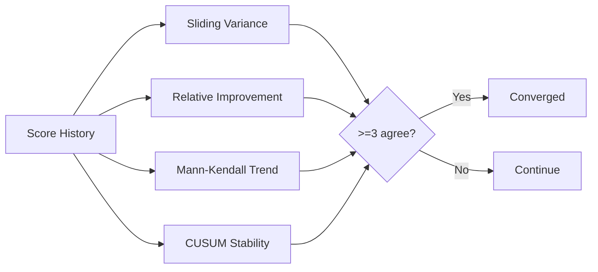

# 自评估维度

<!-- auto-updated: version from src/nines/__init__.py -->

NineS {{ nines_version }} 跟踪 19 个自评估维度，分为四个类别。每个维度具有具体的度量方法、改进方向和目标值。

---

## 维度摘要

| ID | 名称 | 类别 | 指标 | 方向 | MVP 目标 |
|----|------|------|------|------|---------|
| D01 | Scoring Accuracy | V1 Evaluation | 与黄金测试集的一致率 | 越高越好 | ≥0.90 |
| D02 | Evaluation Coverage | V1 Evaluation | 可加载和评分的任务类型比例 | 越高越好 | 1.00 |
| D03 | Reliability (Pass^k) | V1 Evaluation | k 次运行结果一致（k=3） | 越高越好 | ≥0.95 |
| D04 | Report Quality | V1 Evaluation | 必需报告章节存在且有效 | 越高越好 | 1.00 |
| D05 | Scorer Agreement | V1 Evaluation | 各 scorer 类型间成对 Cohen's κ | 越高越好 | ≥0.70 |
| D06 | Source Coverage | V2 Search | 活跃源 / 已配置源 | 越高越好 | 1.00 |
| D07 | Tracking Freshness | V2 Search | 中位检测延迟（分钟） | 越低越好 | ≤60 min |
| D08 | Change Detection Recall | V2 Search | 检测到的变更 / 实际变更 | 越高越好 | ≥0.85 |
| D09 | Data Completeness | V2 Search | 已填充字段 / 总字段 | 越高越好 | ≥0.90 |
| D10 | Collection Throughput | V2 Search | 每分钟采集的实体数 | 越高越好 | ≥50 |
| D11 | Decomposition Coverage | V3 Analysis | 捕获的元素 / 总可分析元素 | 越高越好 | ≥0.85 |
| D12 | Abstraction Quality | V3 Analysis | 模式分类 F1 分数 | 越高越好 | ≥0.60 |
| D13 | Code Review Accuracy | V3 Analysis | 发现检测 F1 分数 | 越高越好 | ≥0.70 |
| D14 | Index Recall | V3 Analysis | 基准查询的 Recall@10 | 越高越好 | ≥0.70 |
| D15 | Structure Recognition | V3 Analysis | 正确识别的模式 / 总数 | 越高越好 | ≥0.60 |
| D16 | Pipeline Latency | System-wide | 端到端 p50（秒） | 越低越好 | ≤30s |
| D17 | Sandbox Isolation | System-wide | 清洁 PollutionReport 率 | 越高越好 | 1.00 |
| D18 | Convergence Rate | System-wide | 1 − (iterations / max_iterations) | 越高越好 | ≥0.50 |
| D19 | Cross-Vertex Synergy | System-wide | 平均滞后交叉相关 | 越高越好 | ≥0.00 |

---

## 详细维度规格

### V1 Evaluation 维度（D01–D05）

#### D01: Scoring Accuracy

| 字段 | 值 |
|------|---|
| **度量方法** | 在 ≥30 个黄金测试任务上运行 `EvalRunner`。将输出分数与真实标签进行比较。 |
| **公式** | `accuracy = count(\|nines_score − golden_score\| ≤ 0.05) / total_tasks` |
| **数据来源** | `data/golden_test_set/`，包含 `expected_score` 字段 |
| **改进方向** | 扩展黄金测试集，重新校准 scorer 阈值 |

#### D02: Evaluation Coverage

| 字段 | 值 |
|------|---|
| **度量方法** | 枚举 schema 中的所有任务类型。对每种类型，尝试 load → execute → score。 |
| **公式** | `coverage = successful_types / total_defined_types` |
| **改进方向** | 实现缺失的任务类型加载器 |

#### D03: Reliability (Pass^k Consistency)

| 字段 | 值 |
|------|---|
| **度量方法** | 运行 ≥20 个任务 × k=3 次独立运行，在全新沙箱中使用相同种子。 |
| **公式** | `consistency = count(all_k_agree) / total_tasks` |
| **改进方向** | 修复沙箱中的非确定性，收紧种子控制 |

#### D04: Report Quality

| 字段 | 值 |
|------|---|
| **度量方法** | 解析 `MarkdownReporter` 和 `JSONReporter` 输出。检查必需章节。 |
| **公式** | `quality = present_valid_sections / total_required_sections` |
| **必需章节** | summary、task_results、per_dimension_scores、statistical_summary、recommendations、metadata |

#### D05: Scorer Agreement

| 字段 | 值 |
|------|---|
| **度量方法** | 使用所有适用的 scorer 评分 ≥20 个输出。计算成对 Cohen's κ。 |
| **公式** | 所有 scorer 对的平均成对 κ |
| **改进方向** | 重新校准 scorer 参数，添加校准数据集 |

### V2 Search 维度（D06–D10）

#### D06: Source Coverage

| 字段 | 值 |
|------|---|
| **度量方法** | 对每个已配置的源执行轻量级健康检查查询。 |
| **公式** | `coverage = active_sources / configured_sources` |
| **改进方向** | 修复 API 凭证，检查网络连接 |

#### D07: Tracking Freshness

| 字段 | 值 |
|------|---|
| **度量方法** | 跟踪具有已知变更计划的金丝雀实体。度量检测延迟。 |
| **公式** | `median(detection_time − change_time)`，跨所有金丝雀 |
| **归一化** | 反转：`1 − min(lag, 120) / 120` |

#### D08: Change Detection Recall

| 字段 | 值 |
|------|---|
| **度量方法** | 将检测到的变更与 7 天窗口内的真实变更日志进行比较。 |
| **公式** | `recall = true_positives / (true_positives + false_negatives)` |
| **改进方向** | 修复分页，扩大查询范围 |

#### D09: Data Completeness

| 字段 | 值 |
|------|---|
| **度量方法** | 查询所有实体。按实体模型 schema 检查已填充字段。 |
| **公式** | `mean(populated_fields / total_fields)`，跨所有实体 |

#### D10: Collection Throughput

| 字段 | 值 |
|------|---|
| **度量方法** | 记录每个源采集的实体数量和实际耗时。 |
| **公式** | `entities / duration_minutes` |

### V3 Analysis 维度（D11–D15）

#### D11: Decomposition Coverage

| 字段 | 值 |
|------|---|
| **度量方法** | 运行 AST 提取器计数所有元素。运行 Decomposer。比较。 |
| **公式** | `captured_elements / total_analyzable_elements` |

#### D12: Abstraction Quality

| 字段 | 值 |
|------|---|
| **度量方法** | 在人工标注的参考代码库上运行模式检测。 |
| **公式** | 跨架构标签的宏平均 F1 |

#### D13: Code Review Accuracy

| 字段 | 值 |
|------|---|
| **度量方法** | 在具有已知问题的标注代码文件上运行 `CodeReviewer`。 |
| **公式** | F1 = 2 × (precision × recall) / (precision + recall) |
| **匹配标准** | 正确的文件、行范围（±3 行）和问题类别 |

#### D14: Index Recall

| 字段 | 值 |
|------|---|
| **度量方法** | 对索引的知识单元执行 ≥15 个基准查询。 |
| **公式** | `mean(relevant_in_top_10 / total_relevant)` |

#### D15: Structure Recognition Rate

| 字段 | 值 |
|------|---|
| **度量方法** | 在 5 个具有已知架构的参考代码库上运行 `StructureAnalyzer`。 |
| **公式** | `correctly_identified / total_annotated_patterns` |

### System-Wide 维度（D16–D19）

#### D16: Pipeline Latency

| 字段 | 值 |
|------|---|
| **度量方法** | 对 `EvalRunner` 进行计时检测。运行黄金测试集。 |
| **公式** | 所有任务的 p50 实际耗时 |
| **归一化** | `1 − min(p50, 300) / 300` |

#### D17: Sandbox Isolation Effectiveness

| 字段 | 值 |
|------|---|
| **度量方法** | 使用 `execute_with_pollution_check()` 包装每次执行。 |
| **公式** | `clean_runs / total_runs` |
| **严重性** | 任何低于 1.0 的值都是严重 bug |

#### D18: Self-Iteration Convergence Rate

| 字段 | 值 |
|------|---|
| **度量方法** | 运行 MAPIM 循环。记录达到 4 方法收敛的迭代次数。 |
| **公式** | `1 − (iterations_to_converge / max_iterations)` |

#### D19: Cross-Vertex Synergy Score

| 字段 | 值 |
|------|---|
| **度量方法** | 提取每次迭代的逐顶点分数。计算滞后相关性。 |
| **公式** | `mean(corr(ΔVa[t], ΔVb[t+1]))`，跨所有 6 个有向顶点对 |
| **最小数据量** | 需要 ≥5 个迭代数据点 |

---

## 基线的工作原理

基线在某个时间点冻结维度分数以用于比较：

1. **建立** — 运行完整的自评估。将结果存储为 `data/baselines/{version}/baseline.json`
2. **比较** — 运行新的自评估。将每个维度与基线值进行比较
3. **跟踪** — 检测每个维度的改进、回退和停滞
4. **接受** — 当 ≥17/19 个维度在 3 次稳定性运行中 CV ≤ 0.05 时接受基线

多轮稳定性验证运行完整评估 3 次并检查：

- 逐维度：变异系数 CV ≤ 0.05
- 二元指标（D17）：3 次运行必须一致
- 兜底方案：`max − min < 0.10 × mean`（n=3）

---

## 收敛的度量方式

收敛使用 **4 方法多数投票**（≥3/4 必须一致）：



| 方法 | 收敛条件 | 默认参数 |
|------|---------|---------|
| Sliding Window Variance | σ²(最近 w 个分数) < τ | w=5, τ=0.001 |
| Relative Improvement | 平均步进改进 < threshold | threshold=0.005 |
| Mann-Kendall Trend | \|Z\| ≤ 1.96（无显著趋势） | 95% 置信度 |
| CUSUM Stability | 未检测到偏离参考均值的偏移 | h=1.0, δ=0.5 |

---

## 综合评分公式

```
V1_score = weighted_mean(normalized(D01..D05))
V2_score = weighted_mean(normalized(D06..D10))
V3_score = weighted_mean(normalized(D11..D15))
system_score = weighted_mean(normalized(D16..D19))

composite = 0.30 × V1 + 0.25 × V2 + 0.25 × V3 + 0.20 × system
```

越低越好的维度（D07、D16）在聚合前通过 `1 − min(value, cap) / cap` 进行反转。D19（synergy）裁剪到 [0, 1]。权重可通过 `nines.toml` 中的 `[self_eval.weights]` 配置。
