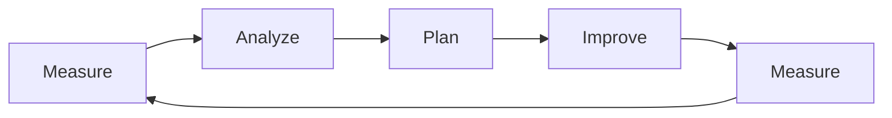
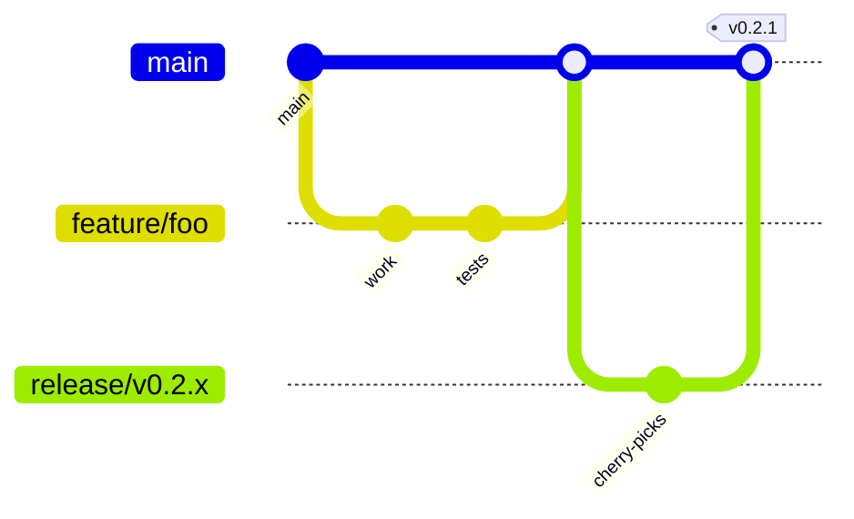
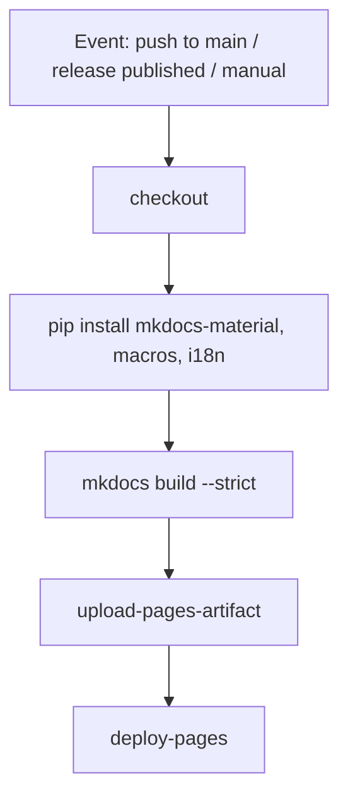

# Development Plan

<!-- auto-updated: version from src/nines/__init__.py -->

This page describes **how** NineS is engineered day to day: methodology, Git workflow, releases, automation, quality gates, and documentation practices. For **what** ships **when**, see the [Roadmap](roadmap.md). The current package version is **{{ nines_version }}**.

---

## Development Methodology

NineS treats product evolution as a **closed loop** aligned with the **MAPIM** pattern used inside the product itself: **Measure → Analyze → Plan → Improve → Measure**. Engineering work is organized into short iterations that always close with verifiable evidence (tests, metrics, or docs).

| Phase | Engineering focus | Typical outputs |
|-------|-------------------|-----------------|
| **Measure** | Baseline behavior, gaps, regressions | Failing tests, benchmarks, issue reproducers |
| **Analyze** | Root cause, scope, dependencies | Design notes, risk assessment, split tasks |
| **Plan** | Sequencing, interfaces, rollout | Branch plan, API sketches, doc updates outline |
| **Improve** | Implementation with tests | Code, tests, structured logging, error semantics |
| **Measure** (again) | Verify improvement | Green CI locally, coverage diff, doc accuracy |



!!! tip "Alignment with the product"
    MAPIM is both the **runtime** self-improvement loop (`nines iterate`) and a **team** habit: every meaningful change should be justified by measurement, executed with a plan, and validated by new or updated tests.

**Collaboration norms:**

- Prefer small, reviewable changes with a single clear intent.
- Keep module dependency rules (see [Contributing — Module Ownership](contributing.md#module-ownership)) when touching package boundaries.
- Follow the **no silent failures** policy: exceptions are logged, re-raised, or converted into explicit `NinesError` states.

---

## Branching Strategy

The default branch is **`main`**. All work flows through **topic branches** and **pull requests**. Direct pushes to protected branches are not allowed.



| Branch type | Naming | Purpose |
|-------------|--------|---------|
| **Default** | `main` | Integrates reviewed work; always deployable documentation builds expect this branch. |
| **Feature / fix / docs** | `feature/…`, `fix/…`, `docs/…`, `refactor/…` | Short-lived branches for one logical change. |
| **Release (optional)** | `release/vMAJOR.MINOR.x` | Stabilization, cherry-picks, or hotfix trains when you need a controlled branch **without** freezing `main`. |

!!! warning "Protected branches"
    Never push directly to `main`, `master`, `yc_dev`, or `production`. Create a feature branch and open a PR/MR.

**Typical flow:**

1. `git checkout main && git pull`
2. `git checkout -b feature/your-change`
3. Commit with [conventional-style messages](contributing.md#commit-messages)
4. Push and open a PR into `main`
5. After approval, squash-merge or merge per team convention

---

## Release Process

NineS follows **Semantic Versioning** (**MAJOR.MINOR.PATCH**). The single source of truth for the public version string is duplicated in two files that **must stay identical**:

| Location | Field |
|----------|--------|
| `src/nines/__init__.py` | `__version__ = "…"` |
| `pyproject.toml` | `version = "…"` |

**Tag convention:** Annotated Git tags **`v{{ nines_version }}`** (example: `v0.2.0`) for releases. Tags align with the version in `__init__.py` / `pyproject.toml`.

**Release checklist (maintainers):**

1. Ensure `main` is green locally: `make test`, `make lint`, `make typecheck`.
2. Bump **`__version__`** and **`pyproject.toml`** together to the new semver.
3. Summarize user-visible changes (release notes on GitHub or a project changelog—keep them consistent with the tag).
4. Create the Git tag and GitHub **Release**; publishing a release participates in [documentation deployment](#cicd-pipeline).

!!! note "Version sync in CI"
    Pull requests that modify `src/nines/__init__.py` or `pyproject.toml` trigger the **Version Sync Check** workflow. It fails if the two version strings differ.

---

## CI/CD Pipeline

GitHub Actions automate **consistency checks** and **documentation builds**. Application test/lint/typecheck are expected to run **locally** or on a future CI job; today the repository workflows focus on version alignment and docs.

### Version Sync Check

**Workflow:** `.github/workflows/version-check.yml`  
**Triggers:** `pull_request` when paths include `src/nines/__init__.py` or `pyproject.toml`.

The job extracts versions from both files and **fails the PR** if they do not match.

<a id="documentation-deployment"></a>

### Documentation Deployment

**Workflow:** `.github/workflows/deploy-pages.yml`  
**Triggers:**

| Trigger | When |
|---------|------|
| `push` to **`main`** | Only if changed paths include `docs/**`, `mkdocs.yml`, `src/nines/__init__.py`, or `README.md` |
| `release` | **`published`** — when a GitHub Release is published |
| `workflow_dispatch` | Manual run from the Actions tab |

**Steps (summary):** Checkout → install MkDocs stack → `mkdocs build --strict` → upload artifact → deploy to **GitHub Pages**.



!!! info "Strict builds"
    `--strict` treats warnings as errors, so broken links and macro issues fail the pipeline early.

---

## Quality Gates

Before merging, contributors should satisfy the following gates (see [Contributing](contributing.md) for commands).

| Gate | Tool | Scope |
|------|------|--------|
| **Tests** | `pytest` | `tests/` — unit and integration |
| **Lint** | `ruff` | `src/`, `tests/` |
| **Format** | `ruff format` | Same paths (run before review) |
| **Types** | `mypy` (strict) | `src/nines/` |
| **Coverage** | `pytest-cov` | `make coverage` — HTML under `reports/htmlcov/` (Makefile) |

**Makefile targets:** `make test`, `make lint`, `make format`, `make typecheck`, `make coverage`.

**Project coverage aspirations** (from the [Roadmap](roadmap.md), not necessarily enforced as a hard CI threshold today):

- Docstring coverage toward **≥80%** on public APIs.
- CLI command coverage toward **≥70%** where applicable.

!!! note "Mandatory verification"
    New logic and fixes should include tests. Do not skip verification or mark tests as placeholders to bypass expectations.

---

## Development Workflow

End-to-end flow for a feature or bugfix:

1. **Sync** — `git checkout main && git pull`
2. **Branch** — `git checkout -b feature/short-description`
3. **Develop** — Code + tests; respect module import boundaries
4. **Local gates** — `make format && make lint && make typecheck && make test`
5. **Docs** — If behavior is user-visible, update English doc and **`.zh.md`** counterpart where applicable
6. **Version** — If releasing, bump `__init__.py` and `pyproject.toml` **together** (or let the release PR do it)
7. **PR** — Describe intent, link issues, paste relevant command output if helpful
8. **Review** — Address feedback; keep CI green (version check on version files)
9. **Merge** — After approval; docs may auto-deploy per [CI rules](#documentation-deployment)

For commit message style, branch naming, and review expectations, see [Contributing](contributing.md).

---

## Testing Strategy

| Layer | Location | Role |
|-------|----------|------|
| **Unit** | `tests/test_*.py` | Fast, isolated behavior of modules |
| **Integration** | `tests/integration/` | Cross-module flows (eval, collect/analyze, iteration, sandbox) |

**Naming:** Files `test_<area>_<topic>.py`; functions `test_<behavior>_when_<condition>()` for clarity.

**Shared setup:** `tests/conftest.py` provides fixtures and temp environments.

**Running:**

```bash
make test
uv run pytest tests/test_eval_runner.py -v
uv run pytest -k "sandbox" -v
make coverage
```

---

## Documentation Standards

**Site generator:** MkDocs **Material** with **suffix-based i18n** (`mkdocs-static-i18n`): English `page.md`, Chinese `page.zh.md`.

**Structure:** Pages live under `docs/`; navigation is declared in `mkdocs.yml`. Development docs include [Contributing](contributing.md), this plan, and the [Roadmap](roadmap.md).

**Macros:** The `mkdocs-macros-plugin` loads `docs/hooks/version_hook.py`, exposing **`{{ nines_version }}`** (and `project_name`) parsed from `src/nines/__init__.py`. Use the macro in prose where the current version should track releases automatically.

**Authoring workflow for translations:**

1. Edit the English source (`*.md`).
2. Mirror structural changes in `*.zh.md` (same headings, tables, diagrams where feasible).
3. Run `mkdocs build --strict` locally before pushing doc changes.

**Extensions in use:** Admonitions, SuperFences with **Mermaid**, tabbed blocks, tables of contents—see `mkdocs.yml` for the full list.

---

## Related Links

| Document | Purpose |
|----------|---------|
| [Contributing](contributing.md) | Setup, style, PR checklist, module matrix |
| [Roadmap](roadmap.md) | Priorities, timeline, metrics, risks |
| [CLI reference](../user-guide/cli-reference.md) | `nines` commands including MAPIM iteration |
