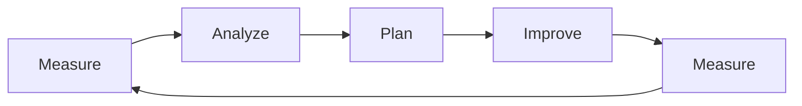
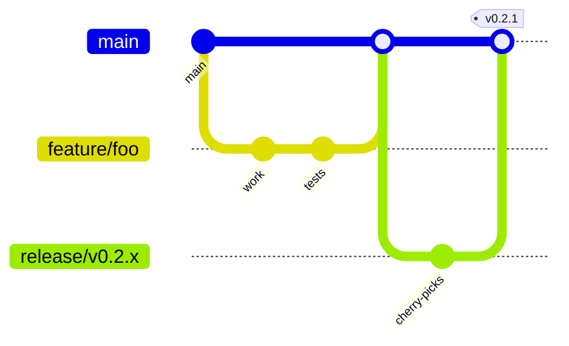
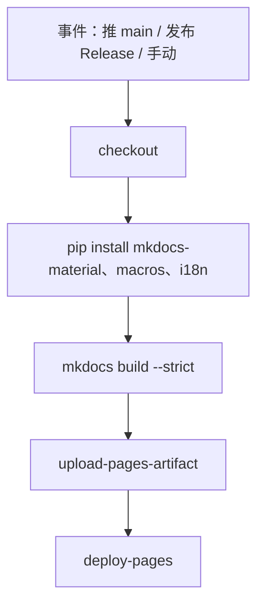

# 开发计划

<!-- auto-updated: version from src/nines/__init__.py -->

本文说明 NineS **如何**开展日常工程：**方法论**、**Git 工作流**、**发布**、**自动化**、**质量门槛**与**文档规范**。关于「做什么、何时做」，请参阅[路线图](roadmap.zh.md)。当前包版本为 **{{ nines_version }}**。

---

## 开发方法论

NineS 将产品演进视为与产品内置 **MAPIM** 模式一致的**闭环**：**度量 → 分析 → 计划 → 改进 → 度量**。工程工作划分为短迭代，每一轮都应以可验证证据收尾（测试、指标或文档）。

| 阶段 | 工程侧重点 | 典型产出 |
|------|------------|----------|
| **度量** | 基线行为、差距、回归 | 失败用例、基准、问题复现 |
| **分析** | 根因、范围、依赖 | 设计笔记、风险评估、任务拆分 |
| **计划** | 顺序、接口、上线方式 | 分支计划、API 草图、文档更新提纲 |
| **改进** | 带测试的实现 | 代码、测试、结构化日志、错误语义 |
| **再度量** | 验证改进 | 本地 CI 通过、覆盖率变化、文档准确性 |



!!! tip "与产品能力对齐"
    MAPIM 既是**运行时**自改进循环（`nines iterate`），也是**团队**习惯：每项实质变更都应有度量依据、按计划实施，并由新增或更新的测试验证。

**协作约定：**

- 倾向小而可审的变更，意图单一清晰。
- 修改包边界时遵守模块依赖规则（见[贡献指南 — 模块所有权](contributing.zh.md#module-ownership-zh)）。
- 遵守**禁止静默失败**策略：异常需记录、重抛或转为显式 `NinesError` 状态。

---

## 分支策略

默认分支为 **`main`**。所有工作经**主题分支**与**拉取请求**合入。禁止直接向受保护分支推送。



| 分支类型 | 命名 | 用途 |
|----------|------|------|
| **默认** | `main` | 合入已评审工作；文档站点构建默认依赖该分支。 |
| **功能 / 修复 / 文档** | `feature/…`、`fix/…`、`docs/…`、`refactor/…` | 短生命周期，承载单一逻辑变更。 |
| **发布（可选）** | `release/v主版本.次版本.x` | 在需要**不冻结 `main`** 的情况下做稳定化、遴选合并或热修列车。 |

!!! warning "受保护分支"
    禁止直接向 `main`、`master`、`yc_dev` 或 `production` 推送。请创建功能分支并提交 PR/MR。

**典型流程：**

1. `git checkout main && git pull`
2. `git checkout -b feature/your-change`
3. 使用[约定式提交消息](contributing.zh.md#commit-messages-zh)提交
4. 推送并针对 `main` 打开 PR
5. 评审通过后按团队约定 squash-merge 或 merge

---

## 发布流程

NineS 采用**语义化版本**（**主版本.次版本.修订号**）。对外版本字符串在两个文件中保持一致，**必须同步修改**：

| 位置 | 字段 |
|------|------|
| `src/nines/__init__.py` | `__version__ = "…"` |
| `pyproject.toml` | `version = "…"` |

**标签约定：** 带注解的 Git 标签 **`v{{ nines_version }}`**（例如 `v0.2.0`）。标签与 `__init__.py` / `pyproject.toml` 中的版本一致。

**发布清单（维护者）：**

1. 本地确认 `main` 健康：`make test`、`make lint`、`make typecheck`。
2. 将 **`__version__`** 与 **`pyproject.toml`** 一并提升到新版本号。
3. 汇总面向用户的变更（GitHub Release 说明或项目变更日志，并与标签保持一致）。
4. 创建 Git 标签与 GitHub **Release**；发布 Release 会参与[文档部署](#documentation-deployment)。

!!! note "CI 中的版本同步检查"
    若 PR 修改 `src/nines/__init__.py` 或 `pyproject.toml`，将触发 **Version Sync Check** 工作流；两处版本不一致则 PR 失败。

---

## CI/CD 流水线

GitHub Actions 负责**一致性检查**与**文档构建**。应用层测试/静态检查/类型检查以**本地**或未来 CI 为准；当前仓库工作流侧重版本对齐与文档。

### 版本同步检查

**工作流：** `.github/workflows/version-check.yml`  
**触发：** `pull_request`，且路径包含 `src/nines/__init__.py` 或 `pyproject.toml`。

任务从两处提取版本字符串，若不一致则**使 PR 失败**。

<a id="documentation-deployment"></a>

### 文档部署

**工作流：** `.github/workflows/deploy-pages.yml`  
**触发：**

| 触发 | 条件 |
|------|------|
| 推送到 **`main`** | 仅当变更路径包含 `docs/**`、`mkdocs.yml`、`src/nines/__init__.py` 或 `README.md` |
| `release` | 类型为 **`published`**（发布 GitHub Release 时） |
| `workflow_dispatch` | 在 Actions 中手动运行 |

**步骤概要：** 检出 → 安装 MkDocs 相关依赖 → `mkdocs build --strict` → 上传构件 → 部署至 **GitHub Pages**。



!!! info "严格构建"
    `--strict` 将警告视为错误，断链与宏问题会尽早导致流水线失败。

---

## 质量门槛

合入前，贡献者应满足下列门槛（命令见[贡献指南](contributing.zh.md)）。

| 门槛 | 工具 | 范围 |
|------|------|------|
| **测试** | `pytest` | `tests/` — 单元与集成 |
| **Lint** | `ruff` | `src/`、`tests/` |
| **格式** | `ruff format` | 同上（评审前运行） |
| **类型** | `mypy`（严格） | `src/nines/` |
| **覆盖率** | `pytest-cov` | `make coverage` — HTML 报告（Makefile 中为 `reports/htmlcov/`） |

**Makefile 目标：** `make test`、`make lint`、`make format`、`make typecheck`、`make coverage`。

**覆盖率目标（来自[路线图](roadmap.zh.md)，当前未必作为硬 CI 阈值）：**

- 公共 API 文档字符串覆盖率向 **≥80%** 推进。
- 在适用场景下 CLI 路径覆盖率向 **≥70%** 推进。

!!! note "强制验证"
    新逻辑与缺陷修复应附带测试。不得以占位或「待办」方式绕过验证预期。

---

## 开发工作流

功能或缺陷修复的端到端流程：

1. **同步** — `git checkout main && git pull`
2. **分支** — `git checkout -b feature/short-description`
3. **开发** — 代码 + 测试；遵守模块导入边界
4. **本地门槛** — `make format && make lint && make typecheck && make test`
5. **文档** — 若行为对用户可见，更新英文文档及对应的 **`.zh.md`**
6. **版本** — 若发布，**同时**提升 `__init__.py` 与 `pyproject.toml`（或由发布 PR 统一处理）
7. **PR** — 说明意图、关联 issue、必要时附命令输出摘要
8. **评审** — 处理反馈；修改版本文件时保持 CI 通过（版本检查）
9. **合并** — 批准后合入；文档可能按 [CI 规则](#documentation-deployment)自动部署

提交消息、分支命名与评审期望见[贡献指南](contributing.zh.md)。

---

## 测试策略

| 层级 | 位置 | 作用 |
|------|------|------|
| **单元** | `tests/test_*.py` | 模块行为的快速隔离测试 |
| **集成** | `tests/integration/` | 跨模块流程（评估、采集/分析、迭代、沙箱等） |

**命名：** 文件 `test_<领域>_<主题>.py`；函数 `test_<行为>_when_<条件>()` 便于检索。

**共享设施：** `tests/conftest.py` 提供 fixture 与临时环境。

**运行示例：**

```bash
make test
uv run pytest tests/test_eval_runner.py -v
uv run pytest -k "sandbox" -v
make coverage
```

---

## 文档规范

**站点生成：** MkDocs **Material**，**后缀式 i18n**（`mkdocs-static-i18n`）：英文 `page.md`，中文 `page.zh.md`。

**结构：** 页面位于 `docs/`；导航在 `mkdocs.yml` 中声明。开发类文档包括[贡献指南](contributing.zh.md)、本页与[路线图](roadmap.zh.md)。

**宏：** `mkdocs-macros-plugin` 加载 `docs/hooks/version_hook.py`，暴露从 `src/nines/__init__.py` 解析的 **`{{ nines_version }}`**（以及 `project_name`）。正文需要随发布更新的版本号时使用该宏。

**翻译工作流：**

1. 编辑英文源文件（`*.md`）。
2. 在 `*.zh.md` 中镜像结构变更（标题、表格、图表尽量一致）。
3. 推送文档前本地执行 `mkdocs build --strict`。

**已启用扩展：** 提示块（admonition）、带 **Mermaid** 的 SuperFences、标签页、目录等——完整列表见 `mkdocs.yml`。

---

## 相关链接

| 文档 | 用途 |
|------|------|
| [贡献指南](contributing.zh.md) | 环境、风格、PR 清单、模块矩阵 |
| [路线图](roadmap.zh.md) | 优先级、时间线、指标、风险 |
| [CLI 参考](../user-guide/cli-reference.zh.md) | 含 MAPIM 迭代的 `nines` 命令 |
