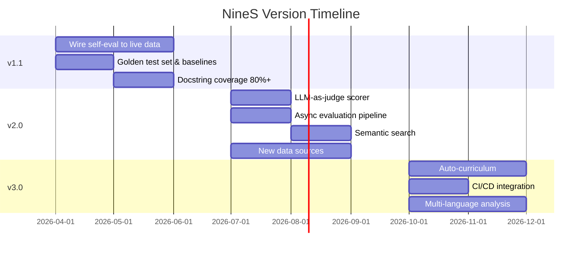

# Roadmap

<!-- auto-updated: version from src/nines/__init__.py -->

NineS development follows a phased roadmap aligned with the three-vertex capability model. The current version is {{ nines_version }}.

---

## Version Timeline

---

## v1.1 Priorities (Near-Term: 2–4 weeks)

**Focus:** Wire self-evaluation to live data; improve baseline documentation quality.

### Must Have (P0)

| ID | Item | Description | Effort |
|----|------|-------------|--------|
| v1.1-01 | Wire V1 evaluators | Implement live `ScoringAccuracyEvaluator`, `ReliabilityEvaluator`, etc. using golden test set and real `EvalRunner` execution | 3 days |
| v1.1-02 | Wire V2 evaluators | Implement live `SourceCoverageEvaluator`, `TrackingFreshnessEvaluator`, etc. using actual collector pipeline | 3 days |
| v1.1-03 | Wire V3 evaluators | Implement live `DecompositionCoverageEvaluator`, `CodeReviewAccuracyEvaluator`, etc. using reference codebases | 3 days |
| v1.1-04 | Create golden test set | Curate 30+ evaluation tasks with known-correct scores (10 trivial, 10 moderate, 10 complex) | 2 days |

### Should Have (P1)

| ID | Item | Description | Effort |
|----|------|-------------|--------|
| v1.1-05 | Canary tracking entities | Configure 3–5 GitHub repos + 2–3 arXiv queries for change detection validation | 1 day |
| v1.1-06 | Annotate reference codebases | Prepare 2–3 open-source Python projects with architectural annotations | 2 days |
| v1.1-07 | Docstring coverage 80%+ | Add docstrings to undocumented functions | 2 days |
| v1.1-08 | Search benchmark queries | Curate 15+ benchmark queries with ground-truth KnowledgeUnit IDs | 1 day |
| v1.1-09 | CLI test coverage 70%+ | Add tests for CLI command paths | 2 days |
| v1.1-10 | Wire system-wide evaluators | Implement `PipelineLatencyEvaluator`, `SandboxIsolationEvaluator`, `ConvergenceRateEvaluator`, `CrossVertexSynergyEvaluator` | 2 days |

### Nice to Have (P2)

| ID | Item | Description | Effort |
|----|------|-------------|--------|
| v1.1-11 | More test patterns | Increase test count with edge case and property-based tests | 3 days |
| v1.1-12 | Improved error messages | Audit and improve all `NinesError` subclass messages | 1 day |
| v1.1-13 | `nines dashboard` command | Terminal-based dashboard showing self-eval trends | 2 days |

**Milestone Target:** Composite self-eval score fully data-driven; docstring coverage ≥80%; CLI coverage ≥70%.

---

## v2.0 Vision (Medium-Term: 1–3 months)

**Focus:** LLM integration, expanded data sources, semantic capabilities, async pipeline.

### Must Have (P0)

| ID | Item | Description | Effort |
|----|------|-------------|--------|
| v2.0-01 | LLM-as-judge scorer | Integrate LLM-based scoring (VAKRA waterfall pattern). Support configurable model backends (OpenAI, Anthropic, local). | 5 days |
| v2.0-02 | Async evaluation pipeline | Convert `EvalRunner` to async with `asyncio`. Support concurrent task evaluation. | 5 days |
| v2.0-03 | Semantic search | Replace keyword search with embedding-based semantic search. Hybrid keyword + semantic. | 5 days |

### Should Have (P1)

| ID | Item | Description | Effort |
|----|------|-------------|--------|
| v2.0-04 | HuggingFace data source | Add Hub collector for models, datasets, spaces | 3 days |
| v2.0-05 | Twitter/X data source | Track AI research discussions | 3 days |
| v2.0-06 | PyPI data source | Package release tracking, dependency analysis | 2 days |
| v2.0-07 | LLM-augmented code review | Semantic-level review findings beyond static analysis | 4 days |
| v2.0-08 | Docker sandbox (Tier 2) | Optional Docker container isolation with venv fallback | 4 days |
| v2.0-09 | Multi-scorer calibration | Automated calibration using golden test set expansion | 3 days |

### Nice to Have (P2)

| ID | Item | Description | Effort |
|----|------|-------------|--------|
| v2.0-10 | Web dashboard | HTML dashboard for self-eval trends and dimension heatmaps | 5 days |
| v2.0-11 | Plugin system | pip-installable third-party scorers, collectors, analyzers | 4 days |

**Milestone Target:** LLM-integrated scoring; async pipeline; 3+ new data sources; semantic search operational; composite ≥0.92.

---

## v3.0 Long-Term (3–6 months)

**Focus:** Full auto-curriculum, cross-project knowledge transfer, multi-language, CI/CD integration.

### Must Have (P0)

| ID | Item | Description | Effort |
|----|------|-------------|--------|
| v3.0-01 | Full auto-curriculum | Automatically generate evaluation tasks based on detected capability gaps. LLM-created exercises with adaptive difficulty. | 10 days |
| v3.0-02 | CI/CD integration | GitHub Actions for automated self-evaluation on PR/release. Regression detection as merge gate. Badge generation. | 5 days |

### Should Have (P1)

| ID | Item | Description | Effort |
|----|------|-------------|--------|
| v3.0-03 | Cross-project knowledge transfer | Share knowledge units across NineS-analyzed projects. Federated index. | 8 days |
| v3.0-04 | Multi-language analysis | Extend AST analysis to TypeScript, Go, Rust via tree-sitter | 10 days |
| v3.0-05 | Conference proceedings collector | NeurIPS, ICML, ACL proceedings tracking | 4 days |
| v3.0-06 | Predictive convergence | Use historical data to predict remaining iterations to convergence | 5 days |

### Exploratory (P3)

| ID | Item | Description | Effort |
|----|------|-------------|--------|
| v3.0-07 | Multi-objective Pareto optimization | Track Pareto front across dimensions | 6 days |
| v3.0-08 | Community benchmark integration | Import/export SWE-Bench, HumanEval, Claw-Eval formats | 5 days |
| v3.0-09 | Agent-to-agent evaluation | NineS instances evaluate each other | 8 days |
| v3.0-11 | Self-modifying evaluation | NineS proposes changes to its own evaluation criteria | 10 days |

**Milestone Target:** Auto-curriculum functional; CI/CD live; multi-language analysis; composite ≥0.95.

---

## Success Metrics

| Version | Composite Target | Key Indicator |
|---------|-----------------|---------------|
| v1.0 (current) | 0.8787 | Infrastructure complete, self-eval placeholder |
| v1.1 | ≥0.85 (data-driven) | All 19 dimensions wired to live data |
| v2.0 | ≥0.92 | LLM scoring, semantic search, async pipeline |
| v3.0 | ≥0.95 | Auto-curriculum, CI/CD, multi-language |

---

## Risk Register

| Risk | Probability | Impact | Mitigation |
|------|-------------|--------|------------|
| LLM API costs exceed budget | Medium | High | Local model fallbacks (Ollama); cost caps per run |
| External API rate limits block collection | Medium | Medium | Aggressive caching; GraphQL migration; backoff |
| Semantic search accuracy insufficient | Low | High | Hybrid search (keyword + semantic); tunable weights |
| Docker unavailable on target machines | Medium | Low | Graceful fallback to venv+subprocess |
| Auto-curriculum generates low-quality tasks | Medium | High | Human-in-the-loop validation gate |
