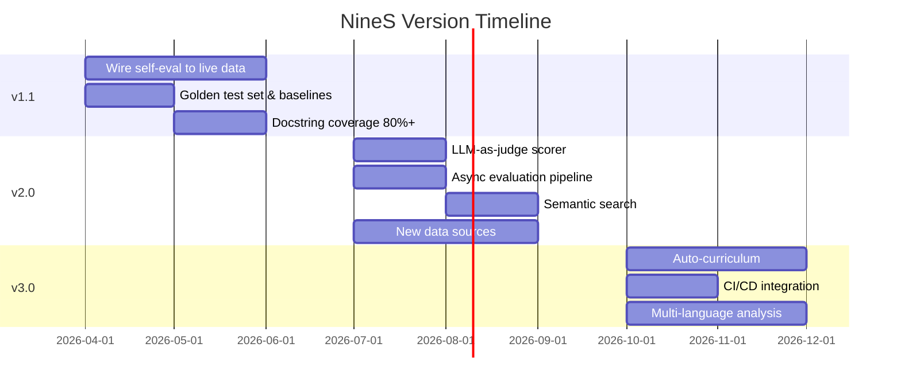

# 路线图

<!-- auto-updated: version from src/nines/__init__.py -->

NineS 的开发遵循与三顶点能力模型对齐的阶段性路线图。当前版本为 {{ nines_version }}。

---

## 版本时间线

---

## v1.1 优先事项（近期：2–4 周）

**重点：** 将自评估接入真实数据；提高基线文档质量。

### 必须完成（P0）

| ID | 项目 | 描述 | 工作量 |
|----|------|------|--------|
| v1.1-01 | 接入 V1 评估器 | 使用黄金测试集和真实 `EvalRunner` 执行，实现 `ScoringAccuracyEvaluator`、`ReliabilityEvaluator` 等 | 3 天 |
| v1.1-02 | 接入 V2 评估器 | 使用实际 collector 流水线，实现 `SourceCoverageEvaluator`、`TrackingFreshnessEvaluator` 等 | 3 天 |
| v1.1-03 | 接入 V3 评估器 | 使用参考代码库，实现 `DecompositionCoverageEvaluator`、`CodeReviewAccuracyEvaluator` 等 | 3 天 |
| v1.1-04 | 创建黄金测试集 | 整理 30+ 个具有已知正确分数的评估任务（10 个简单、10 个中等、10 个复杂） | 2 天 |

### 应该完成（P1）

| ID | 项目 | 描述 | 工作量 |
|----|------|------|--------|
| v1.1-05 | 金丝雀跟踪实体 | 配置 3–5 个 GitHub 仓库 + 2–3 个 arXiv 查询用于变更检测验证 | 1 天 |
| v1.1-06 | 标注参考代码库 | 准备 2–3 个带有架构标注的开源 Python 项目 | 2 天 |
| v1.1-07 | Docstring 覆盖率 80%+ | 为未文档化的函数添加 docstring | 2 天 |
| v1.1-08 | 搜索基准查询 | 整理 15+ 个基准查询及其真实 KnowledgeUnit ID | 1 天 |
| v1.1-09 | CLI 测试覆盖率 70%+ | 为 CLI 命令路径添加测试 | 2 天 |
| v1.1-10 | 接入系统级评估器 | 实现 `PipelineLatencyEvaluator`、`SandboxIsolationEvaluator`、`ConvergenceRateEvaluator`、`CrossVertexSynergyEvaluator` | 2 天 |

### 期望完成（P2）

| ID | 项目 | 描述 | 工作量 |
|----|------|------|--------|
| v1.1-11 | 更多测试模式 | 通过边界用例和基于属性的测试增加测试数量 | 3 天 |
| v1.1-12 | 改进错误消息 | 审计并改进所有 `NinesError` 子类的消息 | 1 天 |
| v1.1-13 | `nines dashboard` 命令 | 基于终端的仪表盘，显示自评估趋势 | 2 天 |

**里程碑目标：** 综合自评估分数完全数据驱动；docstring 覆盖率 ≥80%；CLI 覆盖率 ≥70%。

---

## v2.0 愿景（中期：1–3 个月）

**重点：** LLM 集成、扩展数据源、语义能力、异步流水线。

### 必须完成（P0）

| ID | 项目 | 描述 | 工作量 |
|----|------|------|--------|
| v2.0-01 | LLM-as-judge scorer | 集成基于 LLM 的评分（VAKRA 瀑布模式）。支持可配置的模型后端（OpenAI、Anthropic、本地）。 | 5 天 |
| v2.0-02 | 异步评估流水线 | 将 `EvalRunner` 转换为 `asyncio` 异步模式。支持并发任务评估。 | 5 天 |
| v2.0-03 | 语义搜索 | 将关键词搜索替换为基于嵌入的语义搜索。混合关键词 + 语义模式。 | 5 天 |

### 应该完成（P1）

| ID | 项目 | 描述 | 工作量 |
|----|------|------|--------|
| v2.0-04 | HuggingFace 数据源 | 添加 Hub collector，支持模型、数据集、spaces | 3 天 |
| v2.0-05 | Twitter/X 数据源 | 跟踪 AI 研究讨论 | 3 天 |
| v2.0-06 | PyPI 数据源 | 包发布跟踪、依赖分析 | 2 天 |
| v2.0-07 | LLM 增强代码审查 | 超越静态分析的语义级审查发现 | 4 天 |
| v2.0-08 | Docker 沙箱（Tier 2） | 可选的 Docker 容器隔离，带 venv 回退 | 4 天 |
| v2.0-09 | 多 scorer 校准 | 使用黄金测试集扩展的自动化校准 | 3 天 |

### 期望完成（P2）

| ID | 项目 | 描述 | 工作量 |
|----|------|------|--------|
| v2.0-10 | Web 仪表盘 | 用于自评估趋势和维度热力图的 HTML 仪表盘 | 5 天 |
| v2.0-11 | 插件系统 | 可通过 pip 安装的第三方 scorer、collector、analyzer | 4 天 |

**里程碑目标：** LLM 集成评分；异步流水线；3+ 个新数据源；语义搜索可用；综合分数 ≥0.92。

---

## v3.0 长期愿景（3–6 个月）

**重点：** 完整自动课程、跨项目知识迁移、多语言支持、CI/CD 集成。

### 必须完成（P0）

| ID | 项目 | 描述 | 工作量 |
|----|------|------|--------|
| v3.0-01 | 完整自动课程 | 基于检测到的能力差距自动生成评估任务。LLM 创建的练习，自适应难度。 | 10 天 |
| v3.0-02 | CI/CD 集成 | GitHub Actions 在 PR/release 时自动自评估。回归检测作为合并门控。徽章生成。 | 5 天 |

### 应该完成（P1）

| ID | 项目 | 描述 | 工作量 |
|----|------|------|--------|
| v3.0-03 | 跨项目知识迁移 | 在 NineS 分析的项目间共享知识单元。联邦索引。 | 8 天 |
| v3.0-04 | 多语言分析 | 通过 tree-sitter 将 AST 分析扩展到 TypeScript、Go、Rust | 10 天 |
| v3.0-05 | 会议论文集 collector | NeurIPS、ICML、ACL 论文集跟踪 | 4 天 |
| v3.0-06 | 预测性收敛 | 使用历史数据预测到收敛的剩余迭代次数 | 5 天 |

### 探索性（P3）

| ID | 项目 | 描述 | 工作量 |
|----|------|------|--------|
| v3.0-07 | 多目标 Pareto 优化 | 跨维度跟踪 Pareto 前沿 | 6 天 |
| v3.0-08 | 社区基准集成 | 导入/导出 SWE-Bench、HumanEval、Claw-Eval 格式 | 5 天 |
| v3.0-09 | Agent 间评估 | NineS 实例互相评估 | 8 天 |
| v3.0-11 | 自修改评估 | NineS 提出对自身评估标准的变更 | 10 天 |

**里程碑目标：** 自动课程可用；CI/CD 上线；多语言分析；综合分数 ≥0.95。

---

## 成功指标

| 版本 | 综合分数目标 | 关键指标 |
|------|------------|---------|
| v1.0（当前） | 0.8787 | 基础设施完成，自评估占位符 |
| v1.1 | ≥0.85（数据驱动） | 全部 19 个维度接入真实数据 |
| v2.0 | ≥0.92 | LLM 评分、语义搜索、异步流水线 |
| v3.0 | ≥0.95 | 自动课程、CI/CD、多语言 |

---

## 风险登记

| 风险 | 概率 | 影响 | 缓解措施 |
|------|------|------|---------|
| LLM API 成本超出预算 | 中 | 高 | 本地模型回退（Ollama）；每次运行的成本上限 |
| 外部 API 速率限制阻断采集 | 中 | 中 | 激进缓存；GraphQL 迁移；退避 |
| 语义搜索准确度不足 | 低 | 高 | 混合搜索（关键词 + 语义）；可调权重 |
| 目标机器上 Docker 不可用 | 中 | 低 | 优雅回退到 venv + subprocess |
| 自动课程生成低质量任务 | 中 | 高 | 人工参与的验证门控 |
