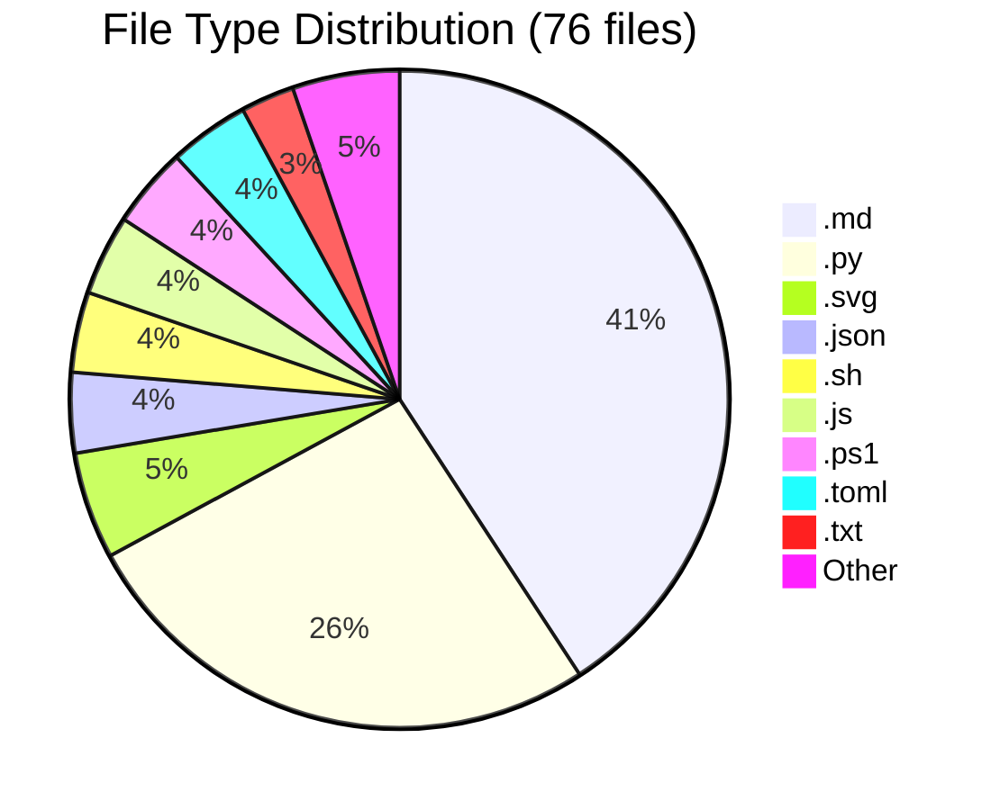
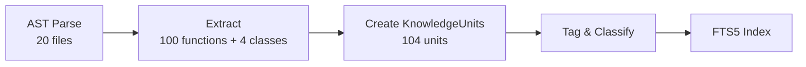
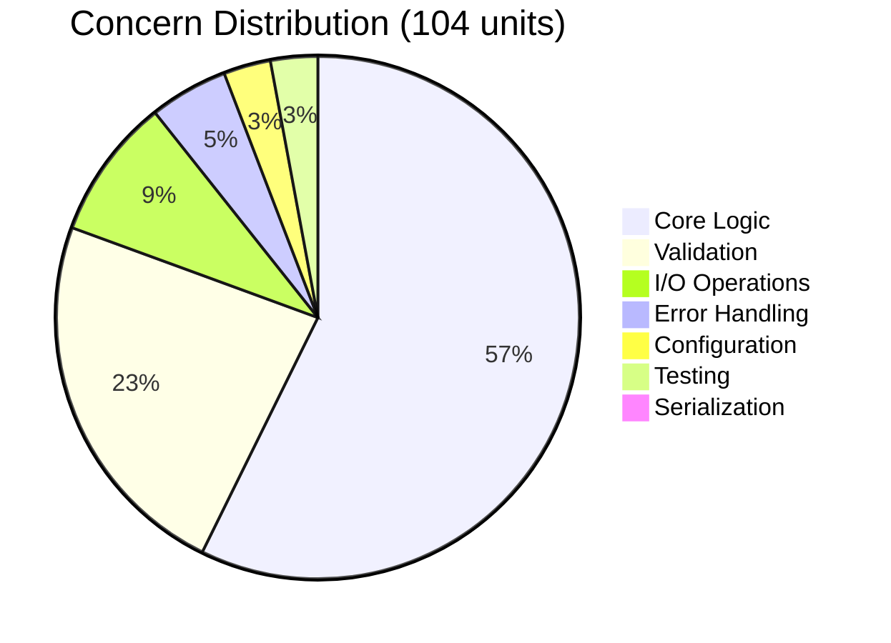

# Caveman Repository Analysis

<!-- auto-updated: version from src/nines/__init__.py -->

A real-world showcase of NineS {{ nines_version }} V3 Analysis running against [JuliusBrussee/caveman](https://github.com/JuliusBrussee/caveman) — a popular Claude Code skill for semantic token compression with 20K+ GitHub stars.

---

## Overview

**Caveman** is a Claude Code skill that performs semantic token compression on source files. It strips redundant whitespace, shortens identifiers, and removes unnecessary syntax while preserving semantics — allowing more context to fit inside LLM token windows.

This makes it an excellent analysis target because:

- **Compact but non-trivial** — 20 Python files, 2,439 lines, with real algorithmic logic
- **Clear functional boundaries** — compression, validation, detection, benchmarking
- **Duplicate structure** — code is mirrored across `caveman-compress/` and `plugins/`, revealing how NineS handles symmetry
- **Mixed concerns** — CLI, I/O, core logic, and testing coexist in a flat layout

---

## Running the Analysis

NineS fully analyzes caveman with a single deep-analysis command:

```bash
nines analyze /tmp/caveman --depth deep --decompose --index
```

```text
Analysis of /tmp/caveman
  Files analyzed: 20
  Total lines: 2439
  Functions: 100
  Classes: 4
  Avg complexity: 3.12
  Knowledge units: 104
  Findings: 38
  Duration: 59.7 ms
```

!!! success "59.7 ms for full analysis"
    NineS completed ingestion, AST parsing, structure analysis, three-strategy decomposition, and FTS5 indexing in under 60 milliseconds.

---

## Repository Structure

Caveman's repository contains **76 files** across **12 file types**. NineS identified **7 Python packages** among the 20 analyzed source files.

### File Type Distribution



| Extension | Count | Description |
|-----------|------:|-------------|
| `.md` | 31 | Documentation and skill definitions |
| `.py` | 20 | Python source (analyzed by NineS) |
| `.svg` | 4 | Vector graphics / diagrams |
| `.json` | 3 | Configuration and metadata |
| `.sh` | 3 | Shell scripts |
| `.js` | 3 | JavaScript utilities |
| `.ps1` | 3 | PowerShell scripts |
| `.toml` | 3 | Project configuration |
| `.txt` | 2 | Text files |
| `.yaml` | 1 | YAML configuration |
| `.skill` | 1 | Skill definition |
| `.html` | 1 | HTML page |
| (no ext) | 1 | Extensionless file |

### Python Packages

NineS detected **7 packages** through `__init__.py` discovery:

| Package | Purpose |
|---------|---------|
| `benchmarks` | API-based compression benchmarks |
| `caveman-compress/scripts` | Core compression library |
| `evals` | LLM evaluation and plotting |
| `plugins/caveman/skills/compress/scripts` | Plugin-packaged compression |
| `tests` | Hook and repository verification tests |

!!! note "Mirrored Modules"
    The `caveman-compress/scripts/` and `plugins/caveman/skills/compress/scripts/` packages contain identical code. NineS processes both independently, correctly counting each as separate knowledge units.

### Analyzed Python Files

| # | File | Role |
|---|------|------|
| 1 | `benchmarks/run.py` | API benchmark runner |
| 2 | `caveman-compress/scripts/__init__.py` | Package init |
| 3 | `caveman-compress/scripts/__main__.py` | Entry point |
| 4 | `caveman-compress/scripts/benchmark.py` | Token benchmark logic |
| 5 | `caveman-compress/scripts/cli.py` | CLI argument parsing |
| 6 | `caveman-compress/scripts/compress.py` | Core compression |
| 7 | `caveman-compress/scripts/detect.py` | File type detection |
| 8 | `caveman-compress/scripts/validate.py` | Output validation |
| 9 | `evals/llm_run.py` | LLM evaluation runner |
| 10 | `evals/measure.py` | Measurement utilities |
| 11 | `evals/plot.py` | Plotting utilities |
| 12–18 | `plugins/.../scripts/*.py` | Mirrored plugin copies |
| 19 | `tests/test_hooks.py` | Hook script tests |
| 20 | `tests/verify_repo.py` | Repository verification |

---

## Code Review Results

The `CodeReviewer` extracted **100 functions** and **4 classes** across 20 files, producing **38 findings**.

### Complexity Analysis

The average cyclomatic complexity is **3.12** — indicating a generally clean, well-factored codebase. Most functions fall in the "Low" tier:

| Tier | Complexity | Count | Assessment |
|------|-----------|------:|------------|
| Low | 1–5 | ~85 | Simple, easily testable |
| Medium | 6–10 | ~15 | Moderate, review recommended |
| High | 11+ | 0 | None detected |

### Top 10 Functions by Cyclomatic Complexity

| CC | File | Function |
|---:|------|----------|
| 10 | `caveman-compress/scripts/detect.py` | `detect_file_type` |
| 10 | `plugins/.../detect.py` | `detect_file_type` |
| 9 | `caveman-compress/scripts/compress.py` | `compress_file` |
| 9 | `caveman-compress/scripts/validate.py` | `extract_code_blocks` |
| 9 | `plugins/.../compress.py` | `compress_file` |
| 9 | `plugins/.../validate.py` | `extract_code_blocks` |
| 8 | `caveman-compress/scripts/benchmark.py` | `main` |
| 8 | `caveman-compress/scripts/cli.py` | `main` |
| 8 | `plugins/.../benchmark.py` | `main` |
| 8 | `plugins/.../cli.py` | `main` |

!!! tip "Symmetry in Complexity"
    Every function in the top 10 appears twice — once in `caveman-compress/` and once in `plugins/`. This confirms the mirrored structure and shows NineS correctly identifies complexity in both copies.

---

## Functional Decomposition

NineS decomposed caveman into **104 knowledge units** — one per function or class, with methods nested under their parent class.

### Pipeline



### Sample Knowledge Units

| ID | Type | Tags | CC |
|----|------|------|----|
| `benchmarks/run.py::load_prompts` | function | `io_operations` | 2 |
| `benchmarks/run.py::call_api` | function | — | 4 |
| `benchmarks/run.py::run_benchmarks` | function | — | 4 |
| `caveman-compress/scripts/compress.py::build_compress_prompt` | function | — | 1 |
| `caveman-compress/scripts/compress.py::compress_file` | function | — | 9 |
| `caveman-compress/scripts/detect.py::detect_file_type` | function | `configuration` | 10 |
| `caveman-compress/scripts/validate.py::validate` | function | `validation` | 5 |
| `tests/test_hooks.py::HookScriptTests` | class | — | — |

Each unit stores its source location, AST signature, complexity tier, tags, and parent reference — making it a self-contained, searchable knowledge fragment.

---

## Concern-Based Decomposition

NineS groups knowledge units by cross-cutting concern, revealing how responsibilities are distributed.

### Concern Distribution



| Concern | Members | Share | Description |
|---------|--------:|------:|-------------|
| `core_logic` | 59 | 56.7% | Compression, detection, benchmarking algorithms |
| `validation` | 24 | 23.1% | Input/output validation, code block extraction |
| `io_operations` | 9 | 8.7% | File reading, prompt loading, API calls |
| `error_handling` | 5 | 4.8% | Exception handling and error recovery |
| `configuration` | 3 | 2.9% | File type mappings, CLI defaults |
| `testing` | 3 | 2.9% | Test classes and fixtures |
| `serialization` | 1 | 1.0% | Data format conversion |

!!! info "Insight: Validation-Heavy Design"
    Nearly a quarter of all code units focus on validation — consistent with caveman's need to ensure compressed output remains semantically equivalent to the original. This is a hallmark of a well-engineered compression tool.

---

## Layer-Based Decomposition

NineS assigns each knowledge unit to an architectural layer based on directory and naming patterns.

| Layer | Members | Share |
|-------|--------:|------:|
| `testing` | 19 | 18.3% |
| `unclassified` | 85 | 81.7% |

!!! note "Why Most Units Are Unclassified"
    Caveman uses a flat `scripts/` layout without conventional layer directories (e.g., `services/`, `models/`, `adapters/`). NineS correctly classifies the `tests/` directory as the testing layer while placing the remaining script-style modules in "unclassified." This is expected for utility-focused CLI tools.

---

## Knowledge Search

After indexing, NineS provides instant keyword search over all 104 knowledge units using SQLite FTS5 with BM25 ranking.

### Search Examples

=== "compress"

    ```bash
    nines analyze search "compress"
    ```

    | Rank | Unit | Score |
    |-----:|------|------:|
    | 1 | `caveman-compress/scripts/compress.py::strip_llm_wrapper` | 0.965 |
    | 2 | `caveman-compress/scripts/compress.py::call_claude` | 0.965 |
    | 3 | `caveman-compress/scripts/compress.py::build_compress_prompt` | 0.965 |

=== "validate"

    ```bash
    nines analyze search "validate"
    ```

    | Rank | Unit | Score |
    |-----:|------|------:|
    | 1 | `caveman-compress/scripts/validate.py::validate` | 1.447 |
    | 2 | `caveman-compress/scripts/validate.py::read_file` | 1.085 |

=== "benchmark"

    ```bash
    nines analyze search "benchmark"
    ```

    | Rank | Unit | Score |
    |-----:|------|------:|
    | 1 | `caveman-compress/scripts/benchmark.py::count_tokens` | 1.979 |
    | 2 | `caveman-compress/scripts/benchmark.py::benchmark_pair` | 1.979 |

=== "detect file type"

    ```bash
    nines analyze search "detect file type"
    ```

    | Rank | Unit | Score |
    |-----:|------|------:|
    | 1 | `caveman-compress/scripts/detect.py::_is_code_line` | 1.825 |
    | 2 | `caveman-compress/scripts/detect.py::_is_json_content` | 1.825 |

=== "token count"

    ```bash
    nines analyze search "token count"
    ```

    | Rank | Unit | Score |
    |-----:|------|------:|
    | 1 | `evals/measure.py::count` | 3.970 |
    | 2 | `evals/plot.py::count` | 3.970 |

!!! tip "Scoped Search"
    Search results can be filtered by concern, layer, complexity tier, or file type using `--filter` flags for targeted exploration.

---

## Metrics Summary

| Metric | Value |
|--------|------:|
| Files analyzed | 20 |
| Total lines of code | 2,439 |
| Functions extracted | 100 |
| Classes extracted | 4 |
| Average cyclomatic complexity | 3.12 |
| Max cyclomatic complexity | 10 |
| Knowledge units produced | 104 |
| Code review findings | 38 |
| Concern categories | 7 |
| Architectural layers | 2 |
| Python packages | 7 |
| Total repository files | 76 |
| File types | 12 |
| Analysis duration | 59.7 ms |

---

## Insights & Takeaways

Running NineS V3 on caveman reveals several structural characteristics of the codebase:

### 1. Clean, Low-Complexity Code

With an average complexity of 3.12 and no function exceeding CC=10, caveman is well-factored. The most complex functions (`detect_file_type`, `compress_file`, `extract_code_blocks`) handle inherently branching logic like file format detection and code block parsing.

### 2. Validation as a First-Class Concern

23% of knowledge units are tagged with `validation` — an unusually high proportion that reflects caveman's core design principle: compressed output must be verifiable. NineS's concern decomposition surfaces this architectural decision automatically.

### 3. Mirrored Package Structure

The identical code in `caveman-compress/` and `plugins/` doubles the function count and produces symmetric complexity rankings. NineS handles this gracefully, treating each copy as an independent analysis target while the concern and layer views naturally reveal the duplication.

### 4. Flat Architecture

The "unclassified" layer dominance (81.7%) reflects caveman's CLI-tool nature — it doesn't follow layered architecture patterns. NineS's layer detection correctly avoids false positives, only classifying `tests/` into the testing layer.

### 5. Sub-60ms Full Pipeline

From file ingestion through AST parsing, structure analysis, three decomposition strategies, and FTS5 indexing — the entire pipeline completes in under 60 milliseconds. This makes NineS practical for IDE integration, CI pipelines, and real-time code exploration.

---

!!! abstract "Try It Yourself"
    ```bash
    git clone https://github.com/JuliusBrussee/caveman.git /tmp/caveman
    nines analyze /tmp/caveman --depth deep --decompose --index
    ```
