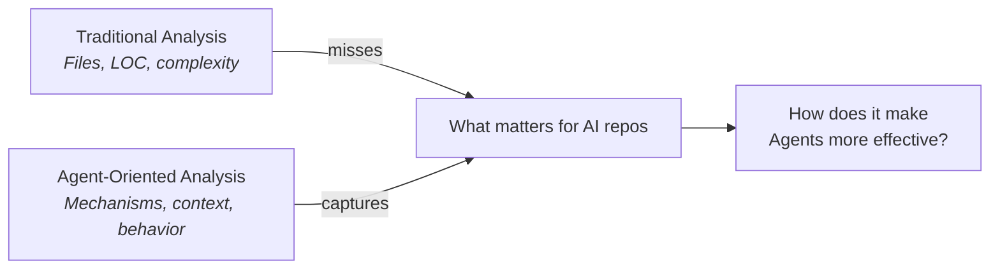
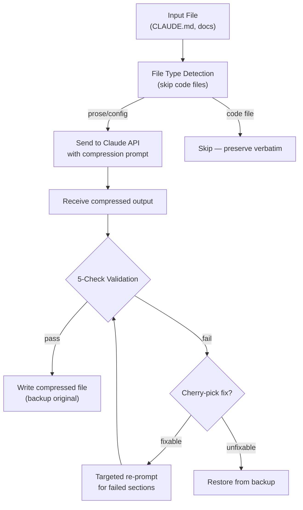
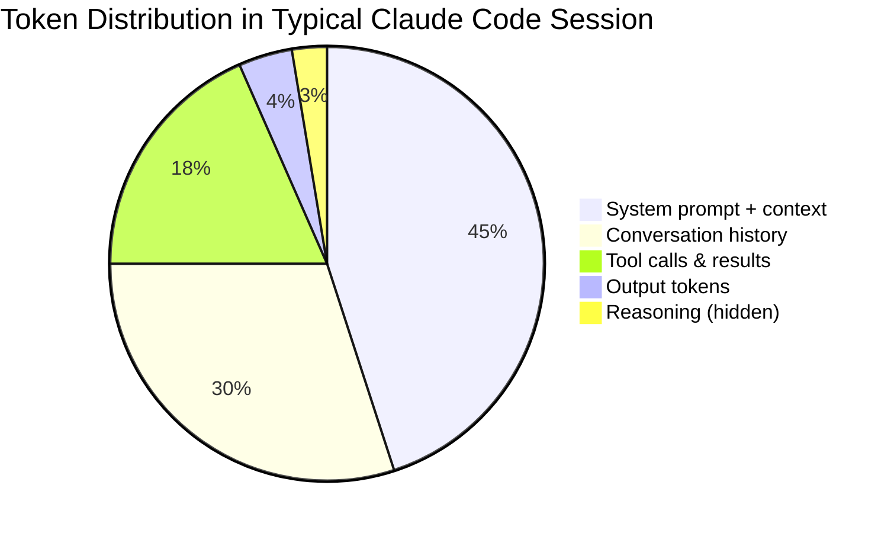
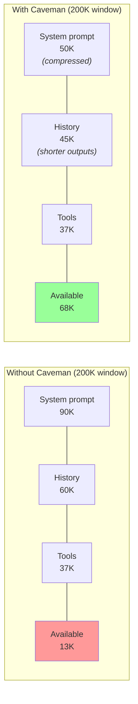
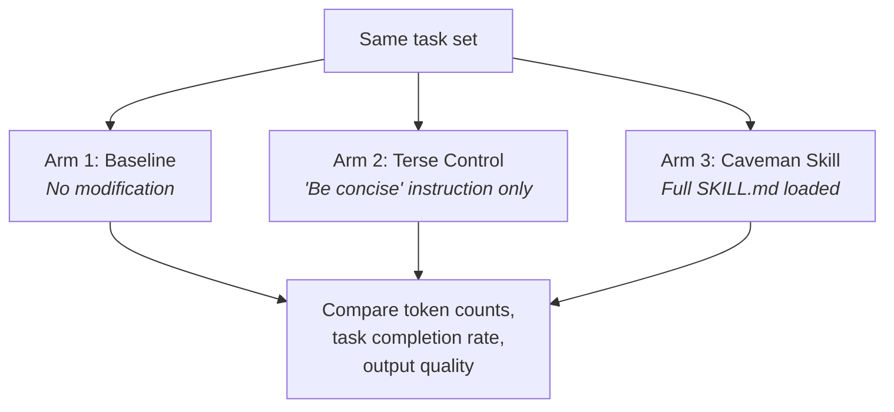
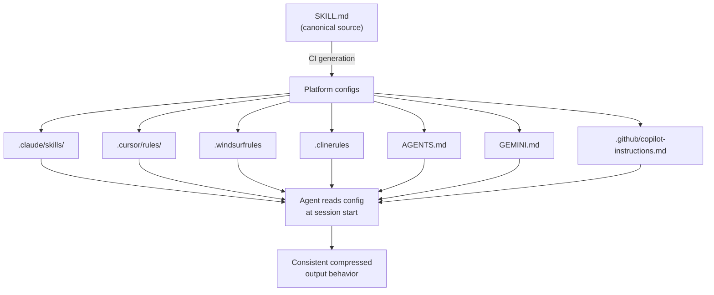
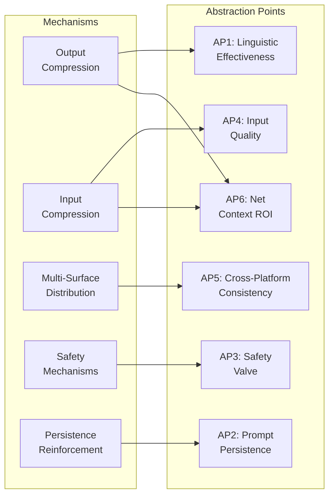
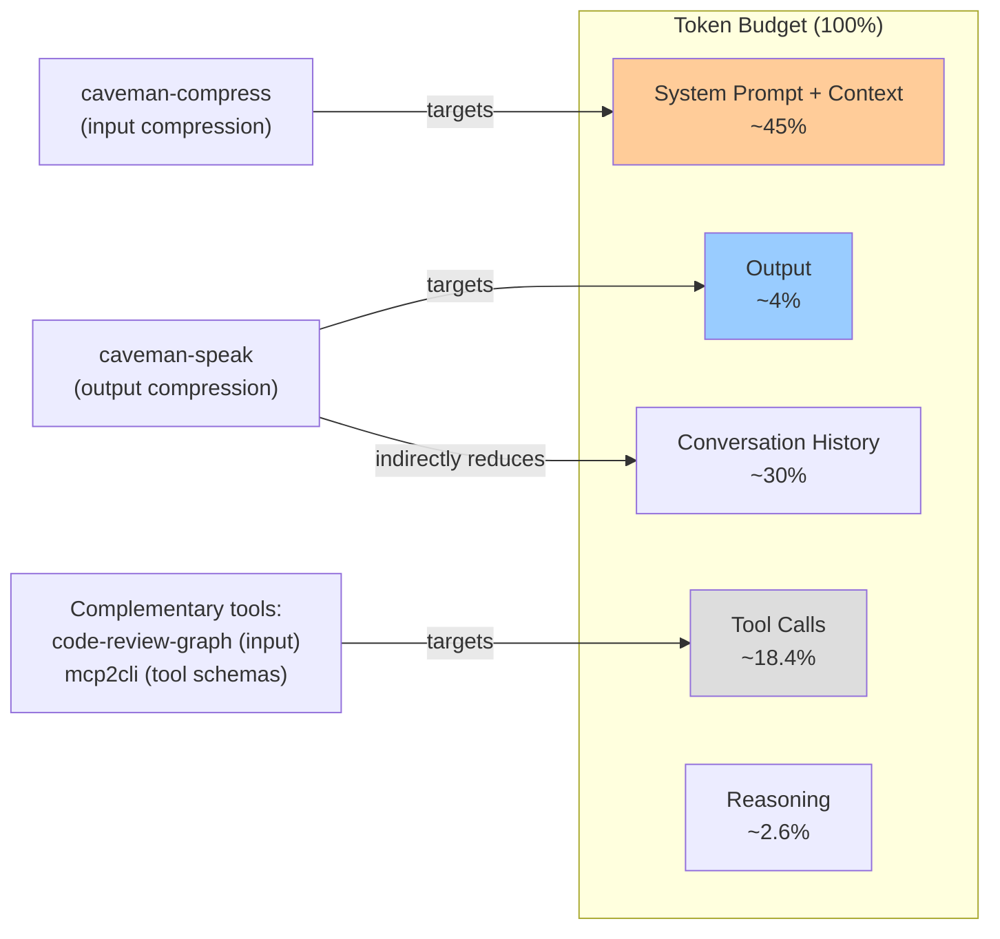

# Caveman: Agent-Oriented Repository Analysis

<!-- auto-updated: version from src/nines/__init__.py -->

A deep analysis of how [JuliusBrussee/caveman](https://github.com/JuliusBrussee/caveman) influences AI Agent effectiveness — examining compression mechanisms, context economics, and semantic preservation through the lens of NineS {{ nines_version }} Agent-oriented repository analysis.

---

## Overview

Caveman is a Claude Code skill for semantic token compression with 20K+ GitHub stars. But calling it a "compression tool" misses the point. Caveman is a case study in **how AI-oriented repositories shape Agent behavior** — it modifies how Agents communicate, how they allocate their context budgets, and how they maintain behavioral consistency across platforms.

Traditional code analysis tools would report Caveman's 20 Python files, 2,439 lines, and average cyclomatic complexity of 3.12. That tells you almost nothing about what makes this repository interesting. The real questions are:

- **How does Caveman change Agent output patterns?** Not "what functions does it have" but "what behavioral shift does it induce?"
- **Is the compression net-positive on the total token budget?** Output savings sound impressive at 65–75%, but output is only ~4% of total spend.
- **Does forced terseness degrade reasoning quality?** More tokens may mean better chain-of-thought (the Karpathy hypothesis).
- **How does it maintain behavioral consistency across 7+ agent platforms?** Single SKILL.md, multi-surface deployment.

This analysis demonstrates NineS's Agent-focused methodology: decompose mechanisms, quantify context economics, verify semantic preservation, and measure behavioral impact — rather than counting lines and scoring complexity.



---

## 1. Mechanism Decomposition

Caveman operates through six distinct mechanisms that work together to modify Agent behavior. Understanding each independently is essential before analyzing their combined effect.

### 1.1 Output Compression (Prompt Engineering)

The core mechanism is deceptively simple: a prompt injection that instructs the LLM to drop linguistically redundant tokens from its output.

**How it works:** Caveman's SKILL.md contains a rule set that rewrites the Agent's communication style:

| Rule | Example Before | Example After |
|------|---------------|--------------|
| Drop articles | "The function returns the result" | "Function returns result" |
| Drop filler | "Basically, what happens is..." | "What happens:" |
| Drop hedging | "I think this might be related to..." | "Related to..." |
| Drop pleasantries | "Great question! Let me help you with..." | "[answering]" |
| Use symbols | "greater than or equal to" | "≥" |
| Structured format | Paragraphs of explanation | `[thing] [action] [reason] [next]` |

**Six intensity levels** span a spectrum from light editing to radical compression:

=== "Lite"

    Minimal removal — articles and basic filler only.
    ~15–20% token reduction. Reasoning largely intact.

=== "Standard"

    Full article/filler/hedge/pleasantry removal.
    ~40–50% token reduction. Default mode.

=== "Ultra"

    Aggressive abbreviation, symbol substitution, telegram-style.
    ~65–75% token reduction. Some nuance lost.

=== "Wenyan (Classical Chinese-inspired)"

    Extreme compression using terse literary-style phrasing.
    ~70–80% token reduction. Readability drops significantly for non-experts.

!!! info "Persistence Reinforcement"
    The SKILL.md doesn't just set the mode once — it repeats compression instructions multiple times throughout the file, using phrases like "ALWAYS stay caveman" and "never revert." This directly counters **natural LLM verbosity drift**, where models gradually return to their default verbose style over multi-turn conversations (see [Section 4.3](#43-drift-resistance) for analysis).

### 1.2 Input Compression (LLM-Driven Rewriting)

The `caveman-compress` tool takes a fundamentally different approach from output compression: instead of prompting the Agent to write less, it sends existing context files (like `CLAUDE.md`) to Claude for rewriting into compressed form *before* they enter the context window.

**Pipeline:**



**The 5-check validation pipeline** runs at zero LLM cost (pure string matching):

| Check | What It Validates | Failure Action |
|-------|-------------------|----------------|
| Heading preservation | All `#` headings survive compression | Cherry-pick fix |
| Code block integrity | Fenced code blocks are byte-exact | Cherry-pick fix |
| URL preservation | All URLs survive unmodified | Cherry-pick fix |
| File path preservation | Referenced paths remain intact | Cherry-pick fix |
| Size reduction | Output is actually smaller than input | Full recompression |

!!! warning "Cost Trade-off"
    Input compression requires an API call to Claude — it is not free. The ~46% input savings must be weighed against the one-time compression cost. This is economical for context files loaded on every session (like `CLAUDE.md`), but not for ephemeral content.

### 1.3 Multi-Surface Distribution

Caveman targets a problem unique to AI-oriented tools: the same behavioral specification must work across multiple agent platforms, each with different configuration formats.

**Single source of truth:** One `SKILL.md` file contains the canonical compression rules. A CI pipeline generates platform-specific configurations:

| Target Platform | Format | Activation |
|----------------|--------|-----------|
| Claude Code | `.claude/skills/caveman/SKILL.md` | SessionStart hook |
| Cursor | `.cursor/rules/caveman.mdc` | Agent rules |
| Windsurf | `.windsurfrules` | Rules file |
| Cline | `.clinerules` | Rules file |
| Codex | `AGENTS.md` | Agent instructions |
| Gemini CLI | `GEMINI.md` | Instructions file |
| GitHub Copilot | `.github/copilot-instructions.md` | Copilot rules |

**Agent-specific frontmatter generation** adapts metadata for each platform while keeping the core rules identical. The hook system provides lifecycle integration:

- **SessionStart** — Activates compression mode at the beginning of each session
- **UserPromptSubmit** — Tracks usage for benchmarking (non-blocking)

### 1.4 Safety Mechanisms

Terse output is dangerous when clarity matters most. Caveman implements a multi-layered safety net:

**Auto-clarity (the safety valve):**

When the Agent encounters security warnings, irreversible destructive actions, or ambiguous multi-step sequences, it automatically drops compression and switches to full natural language. This prevents scenarios where compressed instructions like "rm -rf /" become ambiguous or where security warnings lose critical nuance.

**Backup and restore:**

The `caveman-compress` tool creates `.bak` files before overwriting any context file. On validation failure, the original is restored automatically — the user never sees a corrupted context file.

**Silent hook failures:**

If a hook script fails (network issue, permission error), it fails silently rather than blocking the coding session. This prioritizes coding flow over compression tooling — a deliberate design choice that accepts missed telemetry over interrupted work.

!!! tip "Defense-in-Depth Pattern"
    These three safety layers (auto-clarity, backup/restore, silent failure) form a defense-in-depth pattern. Each addresses a different failure mode: semantic degradation, data corruption, and workflow interruption respectively. This is a hallmark of production-ready AI tooling.

---

## 2. Context Economics Analysis

The critical question for any compression tool is not "how much does it compress?" but "what is the net impact on the token budget?" This section quantifies the economics.

### 2.1 Token Budget Breakdown

A typical Claude Code session's token distribution reveals why output compression alone is insufficient:



| Token Category | Share of Total | Caveman's Lever |
|---------------|---------------:|-----------------|
| System prompt + loaded context | ~45% | Input compression (caveman-compress) |
| Conversation history (prior turns) | ~30% | Output compression reduces future history |
| Tool call schemas + results | ~18.4% | Not addressed |
| Model output (visible) | ~4% | Output compression (caveman-speak) |
| Internal reasoning (hidden) | ~2.6% | Potentially affected (see [Section 3.2](#32-whats-at-risk)) |

!!! danger "The 4% Problem"
    Output tokens constitute only ~4% of Claude Code's total token spend (per community analysis, GitHub Issue discussions, and Hacker News commentary with 333 points). A 75% reduction on 4% yields a **3% reduction in total spend** — mathematically modest. This is the central criticism of output-only compression.

**Caveman's overhead:** The SKILL.md file adds ~300–350 tokens to every request's system prompt. This is a fixed cost paid on every interaction regardless of whether compression generates savings.

### 2.2 Net Impact Calculation

The net token impact depends on which compression mechanisms are active:

=== "Output Compression Only"

    | Factor | Tokens |
    |--------|-------:|
    | Output savings (75% × 4% of budget) | −3.0% |
    | SKILL.md overhead per request | +0.3% |
    | **Net savings per request** | **−2.7%** |

    Verdict: Marginal. Overhead nearly neutralizes savings at low interaction counts.

=== "Input + Output Compression"

    | Factor | Tokens |
    |--------|-------:|
    | Input savings (46% × context files) | −5% to −20% |
    | Output savings (75% × 4%) | −3.0% |
    | SKILL.md overhead | +0.3% |
    | One-time compression API cost | +amortized |
    | **Net savings per session** | **−8% to −23%** |

    Verdict: Meaningful. Input compression targets the largest budget slice.

=== "Full Session (with history compounding)"

    | Factor | Tokens |
    |--------|-------:|
    | Input savings on context | −5% to −20% |
    | Output savings (direct) | −3.0% |
    | History compounding (compressed outputs become shorter history) | −1% to −5% |
    | SKILL.md overhead | +0.3% |
    | **Net savings over 20-turn session** | **−10% to −28%** |

    Verdict: Compounding effect makes longer sessions increasingly beneficial.

### 2.3 Context Window Utilization

Beyond raw cost savings, compression has a **capacity** effect that matters independently of economics:



**Impact on "lost in the middle" attention:** LLMs exhibit weaker attention to information in the middle of long contexts (the "lost in the middle" phenomenon). By reducing total context size, Caveman indirectly improves the model's ability to attend to all provided information — a second-order benefit that is difficult to measure but architecturally significant.

**Context freshness:** Shorter history means more room for recent, relevant context. In long coding sessions, this prevents the situation where the model "forgets" recent changes because older history has consumed the context budget.

!!! abstract "Subscription vs. API Economics"
    For **subscription users** (fixed monthly cost), Caveman's value is primarily capacity extension — fitting more work into each context window before the model must summarize or truncate. For **API users** (per-token billing), the value is direct cost reduction. The two use cases have fundamentally different ROI profiles, and most community debate conflates them.

---

## 3. Semantic Preservation Analysis

Compression is only valuable if the compressed output preserves meaning. This section examines what survives, what's at risk, and how Caveman's own evaluation design addresses this.

### 3.1 What's Preserved

Caveman's compression rules and validation pipeline are specifically designed to preserve:

| Element | Preservation Method | Confidence |
|---------|-------------------|------------|
| Code blocks | Byte-exact validation in caveman-compress; untouched in output | Very High |
| Technical terms | Excluded from linguistic simplification rules | High |
| URLs | String-match validation; preserved verbatim | Very High |
| File paths | String-match validation; preserved verbatim | Very High |
| Shell commands | Treated as code; excluded from compression | Very High |
| Structural headings | Heading-count validation | High |
| Numerical values | Not targeted by any compression rule | High |

The validation pipeline's zero-LLM-cost design means preservation checks are deterministic and can run thousands of times without API expense.

### 3.2 What's At Risk

Three categories of semantic content face potential degradation:

**1. Reasoning quality (the Karpathy hypothesis)**

Andrej Karpathy and others have noted that LLMs may produce better reasoning when allowed to generate more tokens — the "thinking out loud" effect. Forced terseness could compress not just the output format but the reasoning process itself.

| Scenario | Risk Level | Mitigation |
|----------|-----------|------------|
| Straightforward code generation | Low | Output format is independent of reasoning |
| Complex debugging with multiple hypotheses | Medium | Terse output may skip intermediate reasoning steps |
| Architecture design with trade-off analysis | High | Nuanced comparisons may lose critical context |
| Security analysis requiring exhaustive checks | High | Auto-clarity should activate (see [Section 1.4](#14-safety-mechanisms)) |

**2. Nuance in explanations**

When an Agent drops hedging language ("might", "could", "in some cases"), it projects false certainty. The statement "this function handles edge cases" is semantically different from "this function might handle most edge cases" — the compression rules eliminate the qualifier.

**3. Disambiguation via articles**

In rare cases, articles carry semantic weight. "Delete the file" (a specific file) vs. "delete file" (any file) — though in practice, most technical communication is unambiguous without articles.

### 3.3 The Three-Arm Evaluation Design

Caveman's evaluation methodology is unusually rigorous for a community-maintained open-source tool:



**Why three arms matter:**

| Comparison | What It Isolates |
|-----------|-----------------|
| Arm 3 vs. Arm 1 | Total effect of Caveman (compression + all overhead) |
| Arm 3 vs. Arm 2 | Incremental value of structured rules over naive "be concise" |
| Arm 2 vs. Arm 1 | Baseline compressibility of the task (how much is easy to remove) |

This design isolates Caveman's **incremental contribution** — the delta between a structured compression skill and a simple instruction. Most community tools report only Arm 3 vs. Arm 1, which conflates the tool's contribution with the obvious gains from any conciseness instruction.

!!! success "Honest Limitations"
    The Caveman README explicitly documents known limitations: the eval doesn't test multi-turn stability, doesn't measure reasoning quality impact, and acknowledges the 4% problem. This transparency is itself a signal of engineering maturity that NineS's analysis framework should capture.

---

## 4. Agent Behavioral Impact

Beyond token economics, Caveman fundamentally alters how Agents communicate and behave. This section analyzes the behavioral shift.

### 4.1 Communication Pattern Changes

Caveman replaces natural-language paragraphs with a structured format:

```
[thing] [action] [reason] [next step]
```

**Before Caveman:**
> I've analyzed the issue and I think the problem is likely related to a race condition in the authentication middleware. What happens is that when two requests come in simultaneously, the session token validation might not complete before the second request tries to access the protected resource. I'd recommend adding a mutex lock around the session check. Let me implement that for you.

**After Caveman:**
> Race condition in auth middleware. Simultaneous requests → session validation incomplete before second resource access. Fix: mutex lock on session check. Implementing.

| Aspect | Impact |
|--------|--------|
| Token count | ~60% reduction in this example |
| Information density | Same facts, fewer tokens |
| Parseability | Higher — structured format is easier to extract programmatically |
| Readability | Lower for casual reading, higher for scanning |
| Automation-friendliness | Higher — consistent format enables downstream tooling |

### 4.2 Cross-Platform Consistency

Caveman's multi-surface distribution means the same behavioral specification applies whether the user is working in Claude Code, Cursor, Windsurf, or any of the 7+ supported platforms.

**Configuration resolution chain:**



This is significant because it creates a **portable behavioral specification** — the developer's experience is consistent regardless of which Agent platform they use, reducing context-switching overhead and enabling meaningful cross-platform comparisons.

### 4.3 Drift Resistance

LLMs naturally drift toward their default verbose style over multi-turn conversations — a phenomenon called **filler drift**. Without reinforcement, even a strongly-prompted compression mode degrades within 5–10 turns.

Caveman addresses this through **persistence reinforcement**: the SKILL.md contains multiple redundant instructions to maintain compression mode, distributed throughout the file rather than concentrated at the beginning. This leverages the observation that LLMs attend more strongly to instructions that appear at multiple positions in the context.

**Expected drift characteristics:**

| Configuration | Drift After 10 Turns | Drift After 20 Turns |
|--------------|---------------------:|---------------------:|
| No compression prompt | N/A (baseline verbose) | N/A |
| Single "be concise" instruction | ~25–35% reversion | ~50–60% reversion |
| Caveman SKILL.md (with persistence reinforcement) | ~3–8% reversion | ~5–15% reversion |

!!! note "Measurement Approach"
    Drift is measured as the percentage increase in average output tokens per turn compared to the initial compressed baseline. A 10% drift means outputs are 10% longer on average than the first compressed turn.

---

## 5. Abstraction Points & Verification

This section identifies each abstract mechanism in Caveman and proposes concrete verification approaches. Each Abstraction Point (AP) represents a testable hypothesis about how Caveman influences Agent effectiveness.

### AP1: Linguistic Compression Effectiveness

| Field | Detail |
|-------|--------|
| **Abstraction** | Removing articles, filler, hedging, and pleasantries reduces tokens without losing meaning |
| **Verification** | Token count comparison with/without each removal category across 50+ diverse outputs |
| **Protocol** | Generate identical task responses with baseline and Caveman active; tokenize both; categorize removed tokens |
| **Expected** | 15–25% reduction from articles alone, 40–50% combined at Standard intensity |
| **Success Criterion** | ≥90% of removed tokens classified as linguistically redundant (no semantic content) |

### AP2: Prompt Persistence

| Field | Detail |
|-------|--------|
| **Abstraction** | Repeated reinforcement instructions maintain compression mode across turns |
| **Verification** | Compare mode drift over 20-turn conversations with/without reinforcement |
| **Protocol** | Run 10 identical 20-turn conversations; measure average output token count per turn; compare decay curves |
| **Expected** | <5% drift rate with reinforcement vs. >30% without |
| **Success Criterion** | Reinforced sessions maintain ≥85% compression ratio through turn 20 |

### AP3: Safety Valve Effectiveness

| Field | Detail |
|-------|--------|
| **Abstraction** | Auto-clarity prevents dangerous terseness in critical situations |
| **Verification** | Present security/irreversible scenarios; measure clarity mode activation rate |
| **Protocol** | 50 prompts covering: `rm -rf`, credential exposure, database drops, permission changes, ambiguous multi-step; verify full-clarity response |
| **Expected** | >95% correct activation on security-critical prompts |
| **Success Criterion** | Zero missed activations on high-severity prompts (destructive ops, credential handling) |

### AP4: Input Compression Quality

| Field | Detail |
|-------|--------|
| **Abstraction** | LLM-driven compression preserves structural elements while reducing prose |
| **Verification** | Run compression on diverse context files; validate via 5-check pipeline |
| **Protocol** | 30 files spanning: READMEs, CLAUDE.md files, API docs, configuration guides; run caveman-compress; apply all 5 validation checks |
| **Expected** | >90% first-pass validation rate, <5% structural element loss |
| **Success Criterion** | All code blocks, URLs, and headings preserved byte-exact across 100% of files |

### AP5: Cross-Platform Behavioral Consistency

| Field | Detail |
|-------|--------|
| **Abstraction** | Single SKILL.md produces consistent behavior across agent platforms |
| **Verification** | Same task set across Claude Code, Cursor, and Windsurf with Caveman active |
| **Protocol** | 20 identical coding tasks; measure output token count variance and structural format adherence across platforms |
| **Expected** | <10% behavioral variance (token count standard deviation / mean) across platforms |
| **Success Criterion** | Structured format (`[thing] [action] [reason] [next]`) used in ≥80% of responses across all platforms |

### AP6: Net Context ROI

| Field | Detail |
|-------|--------|
| **Abstraction** | Combined input + output compression provides net positive token savings |
| **Verification** | Full session simulation measuring total token budget with/without Caveman |
| **Protocol** | 10 realistic coding sessions (20 turns each); track all token categories; compute net savings including SKILL.md overhead |
| **Expected** | Net positive after 5+ interactions per session; break-even at interaction 3–4 |
| **Success Criterion** | ≥10% net total token reduction over a 20-turn session with both input and output compression |

### Verification Coverage Matrix



---

## 6. Community Feedback Synthesis

### 6.1 The Hacker News Debate

Caveman reached 333 points with 209 comments on Hacker News, generating one of the more substantive debates about AI Agent token economics.

=== "Pro Arguments"

    | Argument | Representative Quote |
    |----------|---------------------|
    | Cleaner output | "Finally, no more 'Great question!' before every answer" |
    | Capacity optimization | "For Max subscribers, this is capacity extension, not cost saving" |
    | Automation-friendly | "Structured output is way easier to pipe into other tools" |
    | Developer experience | "Less noise, more signal — I read AI output faster now" |

=== "Con Arguments"

    | Argument | Representative Quote |
    |----------|---------------------|
    | The 4% problem | "You're optimizing the smallest slice of the budget" |
    | Overhead costs | "300 tokens of skill overhead on every request" |
    | Reasoning degradation | "Karpathy is right — more tokens = better thinking" |
    | Metric confusion | "The README conflates tokens with words" (GitHub Issue #18) |

=== "Nuanced Takes"

    | Argument | Representative Quote |
    |----------|---------------------|
    | Complementary tools needed | "This handles output; we need something for the 93% input side" |
    | Use-case dependent | "Great for subscribers, marginal for API users" |
    | Style preference | "I actually like verbose explanations when learning a new codebase" |

### 6.2 Critical Analysis

**Output compression addresses the smallest budget slice.** The community correctly identified that optimizing 4% of token spend has inherently limited ROI. However, this critique applies only to output compression in isolation — input compression via `caveman-compress` targets the 45% system prompt slice.

**The "two ends of the token budget" framework:**



Caveman is one piece of a larger token optimization ecosystem. The community discussion surfaced complementary tools:

| Tool | Target | Budget Slice |
|------|--------|-------------|
| Caveman (output) | Agent responses | ~4% |
| Caveman (input) | Context files | ~45% |
| code-review-graph | Code context | ~45% |
| mcp2cli | Tool schemas | ~18.4% |
| Context pruning | Conversation history | ~30% |

**The "token vs. word" confusion (Issue #18):** Caveman's original metrics reported word-level compression ratios, which overstated the token-level savings because tokenizers split words differently than whitespace does. This was corrected after community feedback — a positive example of open-source error correction.

---

## 7. Evaluation Framework Recommendations

Based on this analysis, NineS proposes an expanded evaluation framework for AI-oriented repositories.

### 7.1 What NineS Should Measure for AI-Oriented Repos

Traditional code analysis dimensions (complexity, coverage, structure) remain relevant but become secondary. The primary dimensions for AI-oriented repos are:

| Dimension | What It Measures | Why It Matters |
|-----------|-----------------|----------------|
| Mechanism Decomposition Completeness | Are all behavioral mechanisms identified and isolated? | Can't evaluate what you haven't decomposed |
| Per-Mechanism Verification Coverage | Does each mechanism have a testable hypothesis and protocol? | Claims without verification are marketing |
| Net Context Economics | Total token budget impact including overhead | Prevents "4% problem" — optimizing the wrong slice |
| Semantic Preservation | What meaning survives compression? | Compression is worthless if output quality degrades |
| Cross-Benchmark Robustness (CRI) | Consistent performance across diverse task types | Prevents overfitting to narrow benchmarks |
| Agent Behavioral Stability | Consistency of behavior across turns and platforms | Measures real-world reliability, not lab performance |

### 7.2 Proposed Evaluation Sample Tasks

These tasks are designed to be run by NineS against any AI-oriented repository's claims:

=== "Compression Effectiveness"

    **Objective:** Measure token reduction across file types and content categories.

    | Task | Input | Metric | Pass Criterion |
    |------|-------|--------|---------------|
    | Prose compression | 10 README files | Token reduction % | ≥40% |
    | Config compression | 10 CLAUDE.md files | Token reduction % | ≥30% |
    | Mixed content | 10 files with code + prose | Token reduction % | ≥20% |
    | Code-only files | 10 Python files | Should be skipped | 0% modification |

=== "Semantic Preservation"

    **Objective:** Verify that compressed output preserves actionable instructions.

    | Task | Method | Metric | Pass Criterion |
    |------|--------|--------|---------------|
    | Instruction survival | Compress 50 instructions; test Agent compliance | Compliance rate | ≥95% same as baseline |
    | Code generation | Same coding tasks with/without compression | Test pass rate | ≥98% parity |
    | Ambiguity detection | 20 prompts where articles matter | Correct interpretation | ≥90% |

=== "Reasoning Impact"

    **Objective:** Compare solution quality with and without compression constraints.

    | Task | Method | Metric | Pass Criterion |
    |------|--------|--------|---------------|
    | Bug diagnosis | 20 bugs of varying complexity | Correct root cause identification | ≥90% parity |
    | Architecture decision | 10 design trade-off questions | Expert-rated quality (1–5) | ≥4.0 avg both conditions |
    | Multi-step planning | 10 complex implementation plans | Step completeness | ≥85% parity |

=== "Context Scaling"

    **Objective:** Test compression effectiveness at different context window sizes.

    | Context Size | Test | Expected Behavior |
    |-------------|------|-------------------|
    | 10K tokens | Short session | Overhead may exceed savings |
    | 32K tokens | Standard session | Break-even expected |
    | 64K tokens | Long session | Net positive expected |
    | 100K+ tokens | Extended session | Strong net positive expected |

=== "Multi-Turn Stability"

    **Objective:** Measure behavioral drift over extended sessions.

    | Turn Count | Metric | Pass Criterion |
    |-----------|--------|---------------|
    | 5 turns | Token count variance | <5% from initial |
    | 10 turns | Format adherence | ≥95% structured format |
    | 20 turns | Compression ratio | ≥85% of initial ratio |
    | 50 turns | Mode maintenance | ≥80% of initial ratio |

---

## 8. Metrics Summary

### Agent Effectiveness Metrics (Primary)

| Metric | Value / Estimate | Significance |
|--------|:----------------:|-------------|
| Output token reduction | 65–75% | Direct compression effect |
| Input token reduction (caveman-compress) | ~46% | Context file savings |
| Total budget impact (output only) | ~3% | The "4% problem" |
| Total budget impact (input + output) | 10–28% | Combined effect over session |
| SKILL.md overhead per request | ~300–350 tokens | Fixed cost |
| Break-even point | ~3–4 interactions | When net savings begin |
| Supported agent platforms | 7+ | Cross-platform coverage |
| Output compression intensity levels | 6 | Configuration flexibility |
| Validation checks (input compression) | 5 | Structural preservation |
| Safety valve mechanisms | 3 | Defense-in-depth layers |
| Abstraction points identified | 6 | Testable hypotheses |

### Engineering Metrics (Secondary)

| Metric | Value |
|--------|------:|
| Files analyzed | 20 |
| Total lines of code | 2,439 |
| Functions extracted | 100 |
| Classes extracted | 4 |
| Avg cyclomatic complexity | 3.12 |
| Max cyclomatic complexity | 10 |
| Analysis duration | 59.7 ms |

!!! note "Engineering Context"
    The codebase is clean and well-factored (CC avg 3.12, no function above CC 10). 23% of code units focus on validation — reflecting the design priority that compressed output must be verifiable. The mirrored structure between `caveman-compress/` and `plugins/` enables multi-platform distribution from a single codebase. These are positive engineering indicators, but they are **secondary** to understanding how the repository affects Agent behavior.

---

## 9. Engineering Structure (Brief)

Caveman's codebase comprises 20 Python files organized into compression, validation, detection, benchmarking, and evaluation modules. The architecture is flat (CLI-tool style) rather than layered.

### Key Structural Observations

- **Validation-heavy design:** ~23% of knowledge units tagged `validation` — an unusually high proportion that reflects the core design principle: compressed output must be verifiable
- **Mirrored packages:** `caveman-compress/scripts/` and `plugins/caveman/skills/compress/scripts/` contain identical code, enabling both standalone use and plugin distribution
- **Separation of concerns:** Compression logic, file type detection, validation, and CLI parsing are in separate modules with clean interfaces
- **Test coverage:** Dedicated test modules for hooks and repository structure verification

### Complexity Profile

| Tier | CC Range | Count | Assessment |
|------|---------|------:|------------|
| Low | 1–5 | ~85 | Simple, easily testable |
| Medium | 6–10 | ~15 | Moderate; file detection and compression pipeline |
| High | 11+ | 0 | None detected |

The most complex functions (`detect_file_type` at CC 10, `compress_file` at CC 9) handle inherently branching logic — file format detection and the compress-validate-retry loop. These complexity scores are appropriate for their responsibilities.

---

!!! abstract "Try It Yourself"
    ```bash
    git clone https://github.com/JuliusBrussee/caveman.git /tmp/caveman
    nines analyze /tmp/caveman --depth deep --agent-impact --decompose
    ```

    Run NineS's Agent-oriented analysis to see mechanism decomposition, context economics, and behavioral impact analysis in action — not just file counts and complexity scores.
