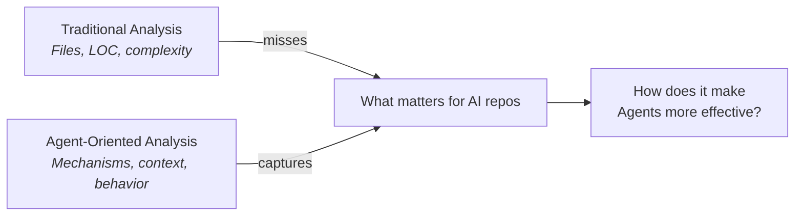
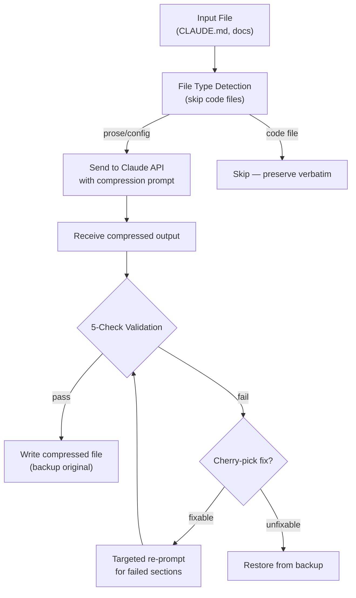
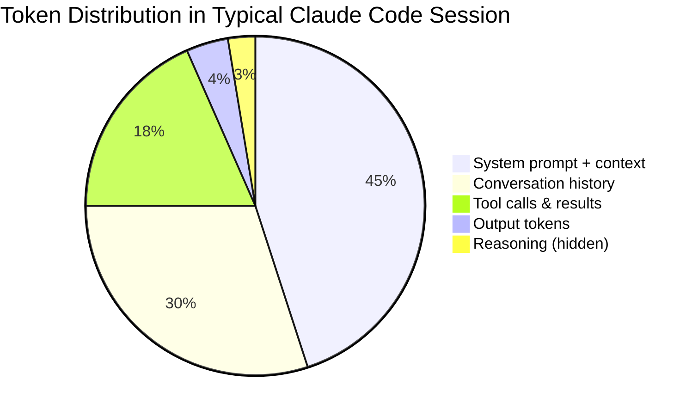
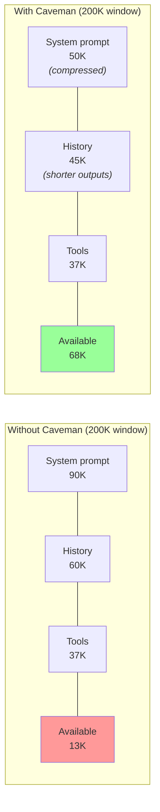
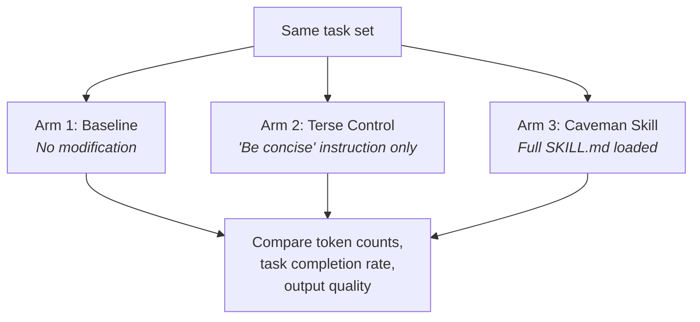
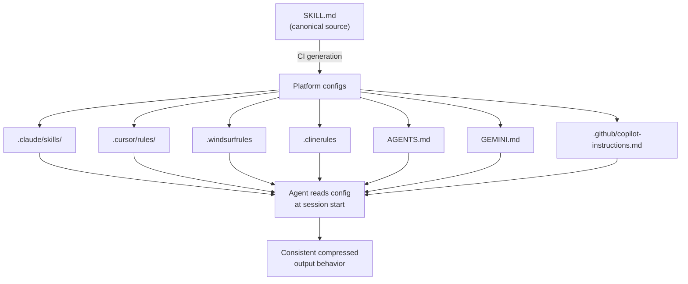
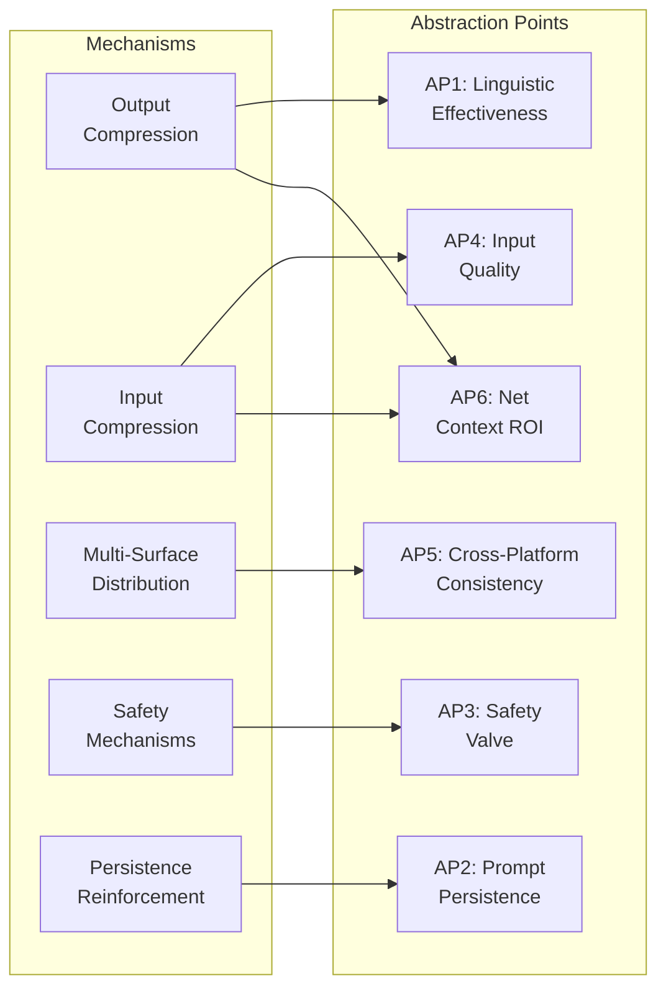
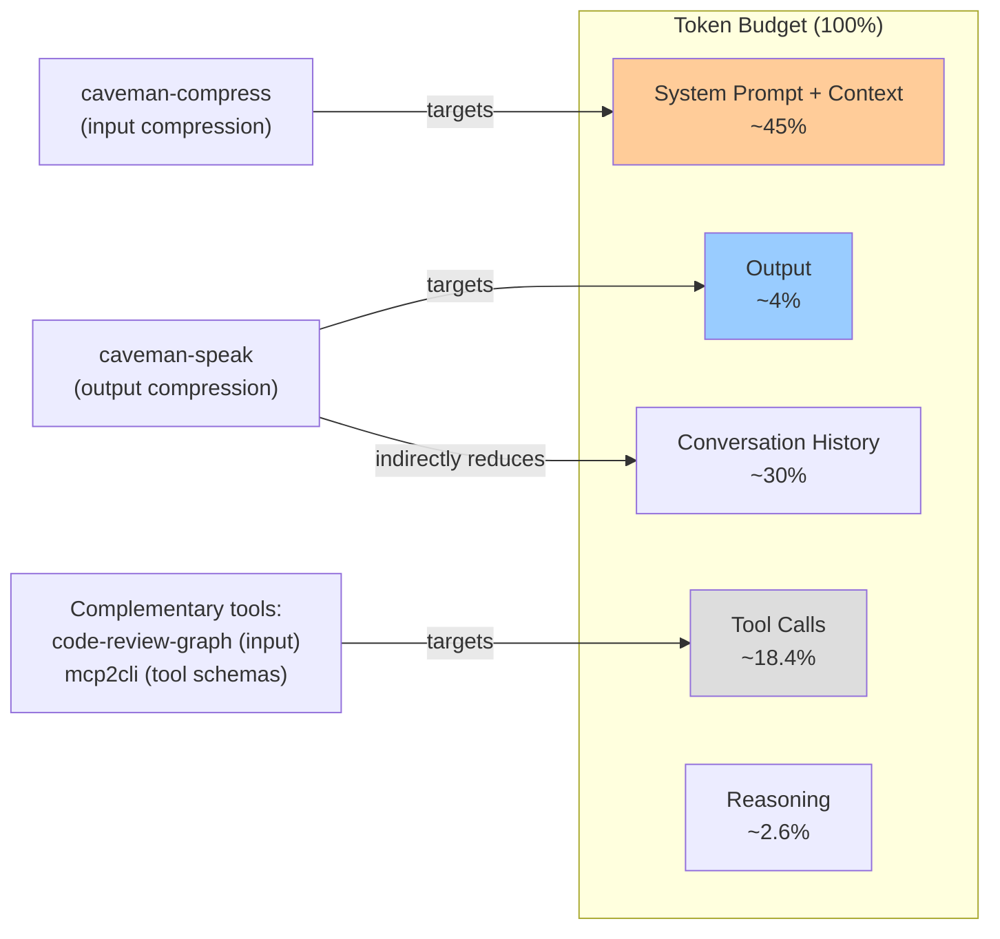

# Caveman：面向 Agent 的仓库分析

<!-- auto-updated: version from src/nines/__init__.py -->

深入分析 [JuliusBrussee/caveman](https://github.com/JuliusBrussee/caveman) 如何影响 AI Agent（智能体）的效能——从压缩机制、上下文经济学和语义保留的角度，运用 NineS {{ nines_version }} 面向 Agent 的仓库分析方法论进行解读。

---

## 概述

Caveman 是一个面向 Claude Code 的语义 Token 压缩技能，在 GitHub 上获得了超过 20K 星标。但如果仅仅将其称为"压缩工具"，则远远不够。Caveman 是一个关于**面向 AI 的仓库如何塑造 Agent 行为**的案例研究——它改变了 Agent 的沟通方式、上下文预算分配策略以及跨平台行为一致性维护。

传统代码分析工具会报告 Caveman 的 20 个 Python 文件、2,439 行代码以及 3.12 的平均圈复杂度。这些信息几乎无法揭示该仓库的真正价值。真正重要的问题是：

- **Caveman 如何改变 Agent 的输出模式？** 不是"它有哪些函数"，而是"它诱发了怎样的行为变化？"
- **压缩对总 Token 预算的净影响是正还是负？** 输出节省看起来令人印象深刻（65–75%），但输出仅占总支出的约 4%。
- **强制精简是否会降低推理质量？** 更多 Token 可能意味着更好的思维链推理（Karpathy 假说）。
- **如何在 7 个以上 Agent 平台上保持行为一致性？** 单一 SKILL.md，多平台部署。

本分析展示了 NineS 面向 Agent 的分析方法论：分解机制、量化上下文经济学、验证语义保留、衡量行为影响——而非简单地计数代码行数和评分复杂度。



---

## 1. 机制分解

Caveman 通过六种独立的机制协同工作来修改 Agent 行为。在分析其综合效果之前，必须先逐一理解每种机制。

### 1.1 输出压缩（Prompt 工程）

核心机制看似简单：通过 Prompt 注入指令让 LLM 从输出中删除语言学上冗余的 Token。

**工作原理：** Caveman 的 SKILL.md 包含一组规则，用于重写 Agent 的沟通风格：

| 规则 | 压缩前示例 | 压缩后示例 |
|------|-----------|-----------|
| 删除冠词 | "The function returns the result" | "Function returns result" |
| 删除填充词 | "Basically, what happens is..." | "What happens:" |
| 删除模糊语 | "I think this might be related to..." | "Related to..." |
| 删除客套话 | "Great question! Let me help you with..." | "[answering]" |
| 使用符号 | "greater than or equal to" | "≥" |
| 结构化格式 | 段落式解释 | `[thing] [action] [reason] [next]` |

**六个压缩级别**覆盖从轻度编辑到激进压缩的完整范围：

=== "Lite（轻量）"

    最小化删除——仅删除冠词和基本填充词。
    约 15–20% Token 缩减。推理基本完整。

=== "Standard（标准）"

    完整删除冠词/填充词/模糊语/客套话。
    约 40–50% Token 缩减。默认模式。

=== "Ultra（极致）"

    激进缩写、符号替代、电报体风格。
    约 65–75% Token 缩减。部分细微差异丢失。

=== "Wenyan（文言风格）"

    使用简洁文言风格短语的极限压缩。
    约 70–80% Token 缩减。非专业人员可读性显著下降。

!!! info "持久化强化"
    SKILL.md 不是仅设置一次压缩模式——它在文件中多次重复压缩指令，使用"ALWAYS stay caveman"和"never revert"等短语。这直接对抗 **LLM 自然冗余漂移**，即模型在多轮对话中逐渐回归其默认冗长风格的现象（详见[第 4.3 节](#43-漂移抵抗)的分析）。

### 1.2 输入压缩（LLM 驱动的重写）

`caveman-compress` 工具采用了与输出压缩完全不同的方法：它不是提示 Agent 少写，而是将现有上下文文件（如 `CLAUDE.md`）发送给 Claude 进行压缩重写，*然后再*进入上下文窗口。

**处理流程：**



**5 项验证流程**以零 LLM 成本运行（纯字符串匹配）：

| 检查项 | 验证内容 | 失败处理 |
|--------|---------|---------|
| 标题保留 | 所有 `#` 标题在压缩后保留 | 定向修复 |
| 代码块完整性 | 围栏代码块字节级精确匹配 | 定向修复 |
| URL 保留 | 所有 URL 保持不变 | 定向修复 |
| 文件路径保留 | 引用的路径保持完整 | 定向修复 |
| 大小缩减 | 输出确实小于输入 | 完全重新压缩 |

!!! warning "成本权衡"
    输入压缩需要调用 Claude API——并非免费。约 46% 的输入节省必须与一次性压缩成本进行权衡。对于每次会话都加载的上下文文件（如 `CLAUDE.md`），这是经济的；但对于临时内容则不然。

### 1.3 多平台分发

Caveman 解决的是 AI 导向工具特有的问题：同一行为规范必须在多个 Agent 平台上工作，而每个平台的配置格式各不相同。

**单一事实来源：** 一个 `SKILL.md` 文件包含规范的压缩规则。CI 流水线生成各平台的特定配置：

| 目标平台 | 格式 | 激活方式 |
|---------|------|---------|
| Claude Code | `.claude/skills/caveman/SKILL.md` | SessionStart 钩子 |
| Cursor | `.cursor/rules/caveman.mdc` | Agent 规则 |
| Windsurf | `.windsurfrules` | 规则文件 |
| Cline | `.clinerules` | 规则文件 |
| Codex | `AGENTS.md` | Agent 指令 |
| Gemini CLI | `GEMINI.md` | 指令文件 |
| GitHub Copilot | `.github/copilot-instructions.md` | Copilot 规则 |

**Agent 特定的 frontmatter 生成**为每个平台适配元数据，同时保持核心规则不变。钩子系统提供生命周期集成：

- **SessionStart** — 在每次会话开始时激活压缩模式
- **UserPromptSubmit** — 追踪使用情况用于基准测试（非阻塞）

### 1.4 安全机制

当清晰度至关重要时，精简输出是危险的。Caveman 实现了多层安全防护网：

**自动清晰模式（安全阀）：**

当 Agent 遇到安全警告、不可逆的破坏性操作或模糊的多步序列时，会自动退出压缩模式并切换到完整自然语言。这可以防止 `rm -rf /` 等压缩指令变得模糊不清，或安全警告丢失关键细微差异。

**备份与恢复：**

`caveman-compress` 工具在覆写任何上下文文件之前创建 `.bak` 备份文件。验证失败时自动恢复原始文件——用户永远不会看到损坏的上下文文件。

**静默钩子失败：**

如果钩子脚本失败（网络问题、权限错误），它会静默失败而不是阻塞编码会话。这优先保证编码流畅性而非压缩工具运行——这是一个有意的设计选择，宁可错过遥测数据也不中断工作。

!!! tip "纵深防御模式"
    这三层安全机制（自动清晰、备份/恢复、静默失败）构成纵深防御模式。每一层应对不同的失败场景：语义退化、数据损坏和工作流中断。这是生产级 AI 工具的标志性特征。

---

## 2. 上下文经济学分析

对于任何压缩工具，关键问题不是"压缩了多少？"而是"对 Token 预算的净影响是什么？"本节对此进行量化分析。

### 2.1 Token 预算分解

典型 Claude Code 会话的 Token 分布揭示了为何仅靠输出压缩是不够的：



| Token 类别 | 占比 | Caveman 的作用杠杆 |
|-----------|-----:|-------------------|
| 系统提示词 + 加载的上下文 | ~45% | 输入压缩（caveman-compress） |
| 对话历史（先前轮次） | ~30% | 输出压缩缩减未来历史 |
| 工具调用模式 + 结果 | ~18.4% | 未涉及 |
| 模型输出（可见） | ~4% | 输出压缩（caveman-speak） |
| 内部推理（隐藏） | ~2.6% | 可能受影响（详见[第 3.2 节](#32-潜在风险)） |

!!! danger "4% 问题"
    输出 Token 仅占 Claude Code 总 Token 支出的约 4%（基于社区分析、GitHub Issue 讨论以及获得 333 点赞的 Hacker News 评论）。对 4% 进行 75% 的缩减只能带来**总支出 3% 的降低**——从数学上看相当有限。这是仅依靠输出压缩的核心批评点。

**Caveman 的开销：** SKILL.md 文件在每次请求的系统提示词中增加约 300–350 个 Token。无论压缩是否产生节省，这都是每次交互必须支付的固定成本。

### 2.2 净影响计算

Token 净影响取决于启用了哪些压缩机制：

=== "仅输出压缩"

    | 因素 | Token 影响 |
    |------|----------:|
    | 输出节省（75% × 预算的 4%） | −3.0% |
    | 每次请求的 SKILL.md 开销 | +0.3% |
    | **每次请求净节省** | **−2.7%** |

    结论：边际效益。在低交互次数时，开销几乎抵消节省。

=== "输入 + 输出压缩"

    | 因素 | Token 影响 |
    |------|----------:|
    | 输入节省（46% × 上下文文件） | −5% 至 −20% |
    | 输出节省（75% × 4%） | −3.0% |
    | SKILL.md 开销 | +0.3% |
    | 一次性压缩 API 成本 | +摊销 |
    | **每次会话净节省** | **−8% 至 −23%** |

    结论：效果显著。输入压缩针对的是预算中最大的部分。

=== "完整会话（含历史复利效应）"

    | 因素 | Token 影响 |
    |------|----------:|
    | 上下文输入节省 | −5% 至 −20% |
    | 输出节省（直接） | −3.0% |
    | 历史复利（压缩后的输出形成更短的历史） | −1% 至 −5% |
    | SKILL.md 开销 | +0.3% |
    | **20 轮会话的净节省** | **−10% 至 −28%** |

    结论：复利效应使更长的会话获益更多。

### 2.3 上下文窗口利用率

除了原始成本节省，压缩还具有独立于经济性的**容量**效应：



**对"中间遗失"注意力的影响：** LLM 对长上下文中间部分的信息注意力较弱（"中间遗失"现象）。通过减少总上下文大小，Caveman 间接提高了模型对所有提供信息的关注能力——这是一个难以量化但在架构上具有重要意义的二阶效益。

**上下文新鲜度：** 更短的历史意味着为最近的相关上下文留出更多空间。在长时间编码会话中，这可以防止模型因旧历史占满上下文预算而"遗忘"最近的变更。

!!! abstract "订阅制与 API 计费的经济学差异"
    对于**订阅制用户**（固定月费），Caveman 的价值主要在于容量扩展——在模型需要总结或截断之前，将更多工作内容装入每个上下文窗口。对于 **API 用户**（按 Token 计费），其价值在于直接降低成本。两种使用场景的投资回报率截然不同，而大多数社区讨论将二者混为一谈。

---

## 3. 语义保留分析

压缩只有在保留含义的情况下才有价值。本节分析哪些内容得以保留、哪些面临风险，以及 Caveman 自身的评估设计如何应对这些问题。

### 3.1 保留的内容

Caveman 的压缩规则和验证流程专门设计用于保留以下元素：

| 元素 | 保留方法 | 置信度 |
|-----|---------|-------|
| 代码块 | caveman-compress 中的字节级精确验证；输出中不触碰 | 非常高 |
| 技术术语 | 从语言简化规则中排除 | 高 |
| URL | 字符串匹配验证；逐字保留 | 非常高 |
| 文件路径 | 字符串匹配验证；逐字保留 | 非常高 |
| Shell 命令 | 视为代码；从压缩中排除 | 非常高 |
| 结构化标题 | 标题计数验证 | 高 |
| 数值 | 不受任何压缩规则影响 | 高 |

验证流程的零 LLM 成本设计意味着保留检查是确定性的，可以运行数千次而无需 API 费用。

### 3.2 潜在风险

三类语义内容面临潜在退化风险：

**1. 推理质量（Karpathy 假说）**

Andrej Karpathy 等人指出，LLM 在允许生成更多 Token 时可能产生更好的推理——即"出声思考"效应。强制精简可能不仅压缩输出格式，还会压缩推理过程本身。

| 场景 | 风险等级 | 缓解措施 |
|-----|---------|---------|
| 简单代码生成 | 低 | 输出格式独立于推理过程 |
| 涉及多种假设的复杂调试 | 中 | 精简输出可能跳过中间推理步骤 |
| 需要权衡分析的架构设计 | 高 | 细微比较可能丢失关键上下文 |
| 需要穷举检查的安全分析 | 高 | 自动清晰模式应当激活（详见[第 1.4 节](#14-安全机制)） |

**2. 解释中的细微差异**

当 Agent 删除模糊语言（"可能"、"也许"、"在某些情况下"）时，会投射出虚假的确定性。"此函数处理边界情况"与"此函数可能处理大多数边界情况"在语义上是不同的——压缩规则消除了限定词。

**3. 冠词的消歧功能**

在少数情况下，冠词承载语义权重。"Delete the file"（特定文件）与 "delete file"（任何文件）——尽管在实践中，大多数技术沟通在没有冠词时也是明确的。

### 3.3 三臂评估设计

Caveman 的评估方法论对于社区维护的开源工具来说异常严谨：



**三臂设计的意义：**

| 比较 | 隔离的变量 |
|-----|----------|
| 第三臂 vs 第一臂 | Caveman 的总体效果（压缩 + 所有开销） |
| 第三臂 vs 第二臂 | 结构化规则相对于朴素"简洁指令"的增量价值 |
| 第二臂 vs 第一臂 | 任务的基线可压缩性（有多少内容易于删除） |

该设计隔离了 Caveman 的**增量贡献**——结构化压缩技能与简单指令之间的差异。大多数社区工具仅报告第三臂 vs 第一臂的结果，混淆了工具本身的贡献和任何简洁指令都能带来的明显收益。

!!! success "诚实的局限性"
    Caveman 的 README 明确记录了已知局限性：评估未测试多轮稳定性、未衡量推理质量影响，并承认了 4% 问题。这种透明度本身就是工程成熟度的信号，NineS 的分析框架应当捕捉这一特征。

---

## 4. Agent 行为影响

除了 Token 经济学，Caveman 从根本上改变了 Agent 的沟通和行为方式。本节分析这种行为变化。

### 4.1 沟通模式变化

Caveman 将自然语言段落替换为结构化格式：

```
[thing] [action] [reason] [next step]
```

**使用 Caveman 之前：**
> I've analyzed the issue and I think the problem is likely related to a race condition in the authentication middleware. What happens is that when two requests come in simultaneously, the session token validation might not complete before the second request tries to access the protected resource. I'd recommend adding a mutex lock around the session check. Let me implement that for you.

**使用 Caveman 之后：**
> Race condition in auth middleware. Simultaneous requests → session validation incomplete before second resource access. Fix: mutex lock on session check. Implementing.

| 维度 | 影响 |
|-----|-----|
| Token 数量 | 在此示例中约缩减 60% |
| 信息密度 | 相同事实，更少 Token |
| 可解析性 | 更高——结构化格式更易于程序化提取 |
| 可读性 | 休闲阅读时较低，快速浏览时较高 |
| 自动化友好度 | 更高——一致的格式便于下游工具处理 |

### 4.2 跨平台一致性

Caveman 的多平台分发意味着无论用户使用 Claude Code、Cursor、Windsurf 还是其他 7 个以上支持的平台，都会应用相同的行为规范。

**配置解析链：**



这一点意义重大，因为它创建了一个**可移植的行为规范**——无论使用哪个 Agent 平台，开发者的体验都是一致的，减少了上下文切换开销，并使跨平台比较成为可能。

### 4.3 漂移抵抗

LLM 在多轮对话中会自然漂移回其默认冗长风格——这种现象称为**填充词漂移**。如果没有强化，即使强提示的压缩模式也会在 5–10 轮内退化。

Caveman 通过**持久化强化**来解决这个问题：SKILL.md 包含多条冗余的压缩模式维持指令，分布在文件各处而非集中在开头。这利用了 LLM 对出现在上下文多个位置的指令具有更强注意力的特性。

**预期漂移特征：**

| 配置 | 10 轮后漂移 | 20 轮后漂移 |
|-----|----------:|----------:|
| 无压缩提示 | 不适用（基线冗长） | 不适用 |
| 单条"简洁"指令 | ~25–35% 回退 | ~50–60% 回退 |
| Caveman SKILL.md（含持久化强化） | ~3–8% 回退 | ~5–15% 回退 |

!!! note "测量方法"
    漂移以相对于初始压缩基线的平均输出 Token 增长百分比来衡量。10% 的漂移意味着输出平均比首次压缩轮次长 10%。

---

## 5. 抽象验证点与验证方案

本节识别 Caveman 中的每个抽象机制，并提出具体的验证方法。每个抽象验证点（AP）代表一个关于 Caveman 如何影响 Agent 效能的可测试假设。

### AP1：语言压缩有效性

| 字段 | 详情 |
|-----|-----|
| **抽象** | 删除冠词、填充词、模糊语和客套话可在不丢失含义的情况下减少 Token |
| **验证** | 在 50+ 种不同输出上按删除类别进行 Token 计数对比 |
| **协议** | 在基线和 Caveman 激活状态下生成相同任务响应；分别进行 Token 化；对删除的 Token 进行分类 |
| **预期** | 仅冠词即可缩减 15–25%，Standard 级别下综合缩减 40–50% |
| **成功标准** | ≥90% 的删除 Token 被归类为语言学冗余（无语义内容） |

### AP2：Prompt 持久性

| 字段 | 详情 |
|-----|-----|
| **抽象** | 重复的强化指令在多轮对话中维持压缩模式 |
| **验证** | 比较有/无强化的 20 轮对话中的模式漂移 |
| **协议** | 运行 10 组相同的 20 轮对话；测量每轮平均输出 Token 数；比较衰减曲线 |
| **预期** | 有强化时漂移率 <5%，无强化时 >30% |
| **成功标准** | 强化会话在第 20 轮时保持 ≥85% 的压缩率 |

### AP3：安全阀有效性

| 字段 | 详情 |
|-----|-----|
| **抽象** | 自动清晰模式防止在关键场景中出现危险的精简 |
| **验证** | 呈现安全/不可逆场景；测量清晰模式激活率 |
| **协议** | 50 个提示覆盖：`rm -rf`、凭据泄露、数据库删除、权限变更、模糊多步操作；验证完全清晰响应 |
| **预期** | 安全关键提示的正确激活率 >95% |
| **成功标准** | 高严重性提示（破坏性操作、凭据处理）零遗漏激活 |

### AP4：输入压缩质量

| 字段 | 详情 |
|-----|-----|
| **抽象** | LLM 驱动的压缩在缩减散文的同时保留结构元素 |
| **验证** | 对多种上下文文件运行压缩；通过 5 项检查流程验证 |
| **协议** | 30 个文件涵盖：README、CLAUDE.md 文件、API 文档、配置指南；运行 caveman-compress；应用全部 5 项验证检查 |
| **预期** | 首次通过验证率 >90%，结构元素丢失率 <5% |
| **成功标准** | 100% 文件中所有代码块、URL 和标题保持字节级精确保留 |

### AP5：跨平台行为一致性

| 字段 | 详情 |
|-----|-----|
| **抽象** | 单一 SKILL.md 在各 Agent 平台上产生一致的行为 |
| **验证** | 在 Claude Code、Cursor 和 Windsurf 上使用 Caveman 运行相同任务集 |
| **协议** | 20 个相同编码任务；测量各平台间的输出 Token 计数方差和结构化格式遵循率 |
| **预期** | 跨平台行为方差 <10%（Token 计数标准差/均值） |
| **成功标准** | 结构化格式（`[thing] [action] [reason] [next]`）在所有平台 ≥80% 的响应中使用 |

### AP6：净上下文投资回报率

| 字段 | 详情 |
|-----|-----|
| **抽象** | 输入 + 输出联合压缩提供正向净 Token 节省 |
| **验证** | 全会话模拟，测量有/无 Caveman 时的总 Token 预算 |
| **协议** | 10 个真实编码会话（每个 20 轮）；追踪所有 Token 类别；计算包含 SKILL.md 开销的净节省 |
| **预期** | 每次会话 5+ 次交互后净正收益；损益平衡点在第 3–4 次交互 |
| **成功标准** | 在同时使用输入和输出压缩的 20 轮会话中，总 Token 净缩减 ≥10% |

### 验证覆盖矩阵



---

## 6. 社区反馈综合

### 6.1 Hacker News 辩论

Caveman 在 Hacker News 上获得 333 点赞和 209 条评论，引发了关于 AI Agent Token 经济学的一场颇有深度的讨论。

=== "支持方观点"

    | 论点 | 代表性引言 |
    |-----|----------|
    | 更简洁的输出 | "终于不用在每个回答前看到 'Great question!' 了" |
    | 容量优化 | "对于 Max 订阅用户，这是容量扩展，而非成本节省" |
    | 自动化友好 | "结构化输出更容易接入其他工具" |
    | 开发者体验 | "更少噪音，更多信号——我现在阅读 AI 输出更快了" |

=== "反对方观点"

    | 论点 | 代表性引言 |
    |-----|----------|
    | 4% 问题 | "你在优化预算中最小的部分" |
    | 开销成本 | "每次请求 300 个 Token 的技能开销" |
    | 推理退化 | "Karpathy 是对的——更多 Token = 更好的思考" |
    | 指标混淆 | "README 混淆了 Token 和词"（GitHub Issue #18） |

=== "中立观点"

    | 论点 | 代表性引言 |
    |-----|----------|
    | 需要互补工具 | "这处理了输出；我们需要处理 93% 输入端的方案" |
    | 因场景而异 | "对订阅用户很好，对 API 用户效果有限" |
    | 风格偏好 | "学习新代码库时我其实喜欢详细的解释" |

### 6.2 批判性分析

**输出压缩针对的是预算中最小的部分。** 社区正确指出，优化 4% 的 Token 支出具有天然有限的投资回报率。但这一批评仅适用于单独的输出压缩——通过 `caveman-compress` 进行的输入压缩针对的是 45% 的系统提示词部分。

**"Token 预算两端"框架：**



Caveman 是更大的 Token 优化生态系统中的一环。社区讨论发现了互补工具：

| 工具 | 目标 | 预算部分 |
|-----|------|---------|
| Caveman（输出） | Agent 响应 | ~4% |
| Caveman（输入） | 上下文文件 | ~45% |
| code-review-graph | 代码上下文 | ~45% |
| mcp2cli | 工具模式 | ~18.4% |
| 上下文裁剪 | 对话历史 | ~30% |

**"Token 与词"的混淆（Issue #18）：** Caveman 最初的指标报告的是词级别的压缩比，这高估了 Token 级别的节省，因为分词器对词的切分方式与空格切分不同。在社区反馈后已进行更正——这是开源错误纠正的正面案例。

---

## 7. 评估框架建议

基于以上分析，NineS 为面向 AI 的仓库提出了扩展的评估框架。

### 7.1 NineS 应当为 AI 导向仓库测量什么

传统代码分析维度（复杂度、覆盖率、结构）仍然相关，但成为次要维度。AI 导向仓库的首要维度为：

| 维度 | 测量内容 | 重要性 |
|-----|---------|-------|
| 机制分解完整性 | 是否识别并隔离了所有行为机制？ | 未分解的内容无法评估 |
| 逐机制验证覆盖 | 每个机制是否有可测试的假设和协议？ | 没有验证的声明只是营销 |
| 净上下文经济学 | 包含开销在内的总 Token 预算影响 | 防止"4% 问题"——优化错误的部分 |
| 语义保留 | 压缩后保留了哪些含义？ | 如果输出质量下降，压缩毫无价值 |
| 跨基准鲁棒性（CRI） | 在多种任务类型上的一致性表现 | 防止对狭窄基准的过拟合 |
| Agent 行为稳定性 | 跨轮次和跨平台的行为一致性 | 衡量真实世界的可靠性，而非实验室性能 |

### 7.2 建议的评估样本任务

这些任务旨在由 NineS 对任何 AI 导向仓库的声明进行验证：

=== "压缩有效性"

    **目标：** 测量不同文件类型和内容类别的 Token 缩减。

    | 任务 | 输入 | 指标 | 通过标准 |
    |-----|------|-----|---------|
    | 散文压缩 | 10 个 README 文件 | Token 缩减率 | ≥40% |
    | 配置压缩 | 10 个 CLAUDE.md 文件 | Token 缩减率 | ≥30% |
    | 混合内容 | 10 个代码 + 散文文件 | Token 缩减率 | ≥20% |
    | 纯代码文件 | 10 个 Python 文件 | 应被跳过 | 0% 修改 |

=== "语义保留"

    **目标：** 验证压缩后的输出保留了可执行指令。

    | 任务 | 方法 | 指标 | 通过标准 |
    |-----|------|-----|---------|
    | 指令存续 | 压缩 50 条指令；测试 Agent 遵循率 | 遵循率 | ≥95% 与基线持平 |
    | 代码生成 | 有/无压缩下的相同编码任务 | 测试通过率 | ≥98% 持平 |
    | 歧义检测 | 20 个冠词具有语义作用的提示 | 正确解读率 | ≥90% |

=== "推理影响"

    **目标：** 比较有/无压缩约束下的解决方案质量。

    | 任务 | 方法 | 指标 | 通过标准 |
    |-----|------|-----|---------|
    | Bug 诊断 | 20 个不同复杂度的 Bug | 正确根因识别率 | ≥90% 持平 |
    | 架构决策 | 10 个设计权衡问题 | 专家评分（1–5） | 两种条件下平均 ≥4.0 |
    | 多步规划 | 10 个复杂实施计划 | 步骤完整性 | ≥85% 持平 |

=== "上下文扩展性"

    **目标：** 测试不同上下文窗口大小下的压缩有效性。

    | 上下文大小 | 测试 | 预期行为 |
    |-----------|------|---------|
    | 10K Token | 短会话 | 开销可能超过节省 |
    | 32K Token | 标准会话 | 预期达到损益平衡点 |
    | 64K Token | 长会话 | 预期净正收益 |
    | 100K+ Token | 超长会话 | 预期显著净正收益 |

=== "多轮稳定性"

    **目标：** 测量延长会话中的行为漂移。

    | 轮数 | 指标 | 通过标准 |
    |-----|------|---------|
    | 5 轮 | Token 计数方差 | 与初始值偏差 <5% |
    | 10 轮 | 格式遵循率 | ≥95% 结构化格式 |
    | 20 轮 | 压缩率 | ≥85% 初始压缩率 |
    | 50 轮 | 模式维持 | ≥80% 初始压缩率 |

---

## 8. 指标汇总

### Agent 效能指标（主要）

| 指标 | 值/估计 | 意义 |
|-----|:------:|-----|
| 输出 Token 缩减 | 65–75% | 直接压缩效果 |
| 输入 Token 缩减（caveman-compress） | ~46% | 上下文文件节省 |
| 总预算影响（仅输出） | ~3% | "4% 问题" |
| 总预算影响（输入 + 输出） | 10–28% | 全会话综合效果 |
| 每次请求的 SKILL.md 开销 | ~300–350 Token | 固定成本 |
| 损益平衡点 | ~3–4 次交互 | 净节省开始的时间点 |
| 支持的 Agent 平台 | 7+ | 跨平台覆盖 |
| 输出压缩强度级别 | 6 | 配置灵活性 |
| 验证检查项（输入压缩） | 5 | 结构保留 |
| 安全阀机制 | 3 | 纵深防御层 |
| 已识别的抽象验证点 | 6 | 可测试假设 |

### 工程指标（次要）

| 指标 | 值 |
|-----|---:|
| 分析文件数 | 20 |
| 总代码行数 | 2,439 |
| 提取函数数 | 100 |
| 提取类数 | 4 |
| 平均圈复杂度 | 3.12 |
| 最大圈复杂度 | 10 |
| 分析耗时 | 59.7 ms |

!!! note "工程上下文"
    代码库整洁、结构良好（圈复杂度平均 3.12，无函数超过 CC 10）。23% 的代码单元聚焦于验证——反映了压缩输出必须可验证的设计优先级。`caveman-compress/` 与 `plugins/` 之间的镜像结构使得从单一代码库进行多平台分发成为可能。这些都是积极的工程指标，但相对于理解该仓库如何影响 Agent 行为而言，它们是**次要的**。

---

## 9. 工程结构（简述）

Caveman 的代码库包含 20 个 Python 文件，组织为压缩、验证、检测、基准测试和评估模块。架构是扁平的（CLI 工具风格）而非分层的。

### 关键结构观察

- **验证密集型设计：** 约 23% 的知识单元标记为 `validation`——这一异常高的比例反映了核心设计原则：压缩输出必须可验证
- **镜像包：** `caveman-compress/scripts/` 和 `plugins/caveman/skills/compress/scripts/` 包含相同代码，支持独立使用和插件分发两种方式
- **关注点分离：** 压缩逻辑、文件类型检测、验证和 CLI 解析位于独立模块中，接口清晰
- **测试覆盖：** 专用测试模块用于钩子和仓库结构验证

### 复杂度概况

| 层级 | CC 范围 | 数量 | 评估 |
|-----|--------|----:|-----|
| 低 | 1–5 | ~85 | 简单，易于测试 |
| 中 | 6–10 | ~15 | 中等；文件检测和压缩流水线 |
| 高 | 11+ | 0 | 未检测到 |

最复杂的函数（`detect_file_type` CC 10，`compress_file` CC 9）处理的是天然存在分支的逻辑——文件格式检测和压缩-验证-重试循环。这些复杂度分数对于其职责而言是合理的。

---

!!! abstract "自行体验"
    ```bash
    git clone https://github.com/JuliusBrussee/caveman.git /tmp/caveman
    nines analyze /tmp/caveman --depth deep --agent-impact --decompose
    ```

    运行 NineS 的面向 Agent 分析，亲身体验机制分解、上下文经济学和行为影响分析——而不仅仅是文件计数和复杂度评分。
