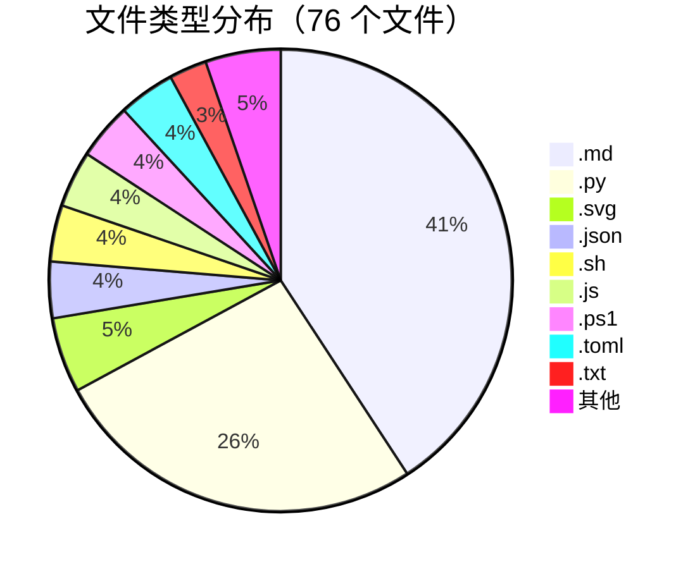
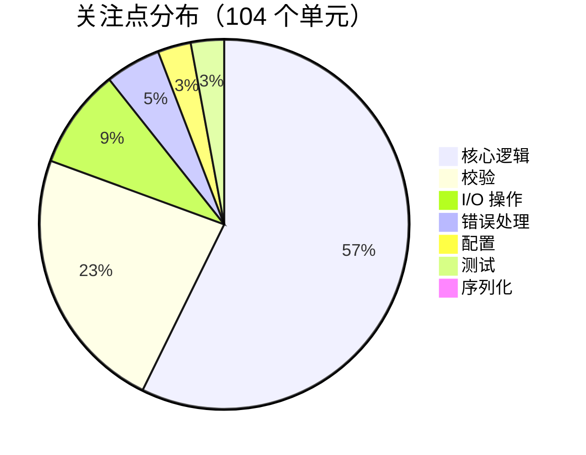

# Caveman 仓库分析

<!-- auto-updated: version from src/nines/__init__.py -->

一个真实的 NineS {{ nines_version }} V3 分析案例展示，分析对象为 [JuliusBrussee/caveman](https://github.com/JuliusBrussee/caveman) —— 一个拥有 20K+ GitHub Stars 的热门 Claude Code 技能，用于语义化 Token 压缩。

---

## 概述

**Caveman** 是一个 Claude Code 技能，用于对源文件执行语义化 Token 压缩。它去除冗余空白、缩短标识符、移除不必要的语法，同时保留代码语义——使更多上下文能够容纳在 LLM 的 Token 窗口内。

它是一个理想的分析目标，原因如下：

- **紧凑但非平凡** — 20 个 Python 文件，2,439 行代码，包含真实的算法逻辑
- **清晰的功能边界** — 压缩、校验、检测、基准测试各司其职
- **重复结构** — 代码在 `caveman-compress/` 和 `plugins/` 之间镜像分布，展示 NineS 如何处理对称性
- **混合关注点** — CLI、I/O、核心逻辑和测试共存于扁平布局中

---

## 运行分析

NineS 通过一条深度分析命令即可完整分析 caveman：

```bash
nines analyze /tmp/caveman --depth deep --decompose --index
```

```text
Analysis of /tmp/caveman
  Files analyzed: 20
  Total lines: 2439
  Functions: 100
  Classes: 4
  Avg complexity: 3.12
  Knowledge units: 104
  Findings: 38
  Duration: 59.7 ms
```

!!! success "59.7 毫秒完成全量分析"
    NineS 在不到 60 毫秒内完成了摄取、AST 解析、结构分析、三策略分解和 FTS5 索引建立的全部流程。

---

## 仓库结构

Caveman 仓库包含 **76 个文件**，涵盖 **12 种文件类型**。NineS 在 20 个被分析的源文件中识别出 **7 个 Python 包**。

### 文件类型分布



| 扩展名 | 数量 | 说明 |
|--------|-----:|------|
| `.md` | 31 | 文档和技能定义 |
| `.py` | 20 | Python 源码（NineS 分析目标） |
| `.svg` | 4 | 矢量图形/图表 |
| `.json` | 3 | 配置和元数据 |
| `.sh` | 3 | Shell 脚本 |
| `.js` | 3 | JavaScript 工具 |
| `.ps1` | 3 | PowerShell 脚本 |
| `.toml` | 3 | 项目配置 |
| `.txt` | 2 | 文本文件 |
| `.yaml` | 1 | YAML 配置 |
| `.skill` | 1 | 技能定义文件 |
| `.html` | 1 | HTML 页面 |
| （无扩展名） | 1 | 无扩展名文件 |

### Python 包

NineS 通过 `__init__.py` 发现机制检测到 **7 个包**：

| 包名 | 用途 |
|------|------|
| `benchmarks` | 基于 API 的压缩基准测试 |
| `caveman-compress/scripts` | 核心压缩库 |
| `evals` | LLM 评估与可视化 |
| `plugins/caveman/skills/compress/scripts` | 插件打包的压缩模块 |
| `tests` | Hook 脚本和仓库验证测试 |

!!! note "镜像模块"
    `caveman-compress/scripts/` 和 `plugins/caveman/skills/compress/scripts/` 包含相同的代码。NineS 独立处理两者，正确地将每一份计为独立的知识单元。

### 已分析的 Python 文件

| # | 文件 | 角色 |
|---|------|------|
| 1 | `benchmarks/run.py` | API 基准测试运行器 |
| 2 | `caveman-compress/scripts/__init__.py` | 包初始化 |
| 3 | `caveman-compress/scripts/__main__.py` | 入口点 |
| 4 | `caveman-compress/scripts/benchmark.py` | Token 基准测试逻辑 |
| 5 | `caveman-compress/scripts/cli.py` | CLI 参数解析 |
| 6 | `caveman-compress/scripts/compress.py` | 核心压缩 |
| 7 | `caveman-compress/scripts/detect.py` | 文件类型检测 |
| 8 | `caveman-compress/scripts/validate.py` | 输出校验 |
| 9 | `evals/llm_run.py` | LLM 评估运行器 |
| 10 | `evals/measure.py` | 度量工具 |
| 11 | `evals/plot.py` | 可视化工具 |
| 12–18 | `plugins/.../scripts/*.py` | 镜像的插件副本 |
| 19 | `tests/test_hooks.py` | Hook 脚本测试 |
| 20 | `tests/verify_repo.py` | 仓库验证 |

---

## 代码审查结果

`CodeReviewer` 从 20 个文件中提取了 **100 个函数**和 **4 个类**，产生了 **38 条发现**。

### 复杂度分析

平均圈复杂度为 **3.12** — 表明代码库整体干净、分解良好。绝大多数函数处于"低"复杂度级别：

| 级别 | 复杂度 | 数量 | 评估 |
|------|--------|-----:|------|
| 低 | 1–5 | ~85 | 简单，易于测试 |
| 中 | 6–10 | ~15 | 中等，建议审查 |
| 高 | 11+ | 0 | 未检测到 |

### 圈复杂度 Top 10 函数

| CC | 文件 | 函数 |
|---:|------|------|
| 10 | `caveman-compress/scripts/detect.py` | `detect_file_type` |
| 10 | `plugins/.../detect.py` | `detect_file_type` |
| 9 | `caveman-compress/scripts/compress.py` | `compress_file` |
| 9 | `caveman-compress/scripts/validate.py` | `extract_code_blocks` |
| 9 | `plugins/.../compress.py` | `compress_file` |
| 9 | `plugins/.../validate.py` | `extract_code_blocks` |
| 8 | `caveman-compress/scripts/benchmark.py` | `main` |
| 8 | `caveman-compress/scripts/cli.py` | `main` |
| 8 | `plugins/.../benchmark.py` | `main` |
| 8 | `plugins/.../cli.py` | `main` |

!!! tip "复杂度对称性"
    Top 10 中的每个函数都出现了两次——分别在 `caveman-compress/` 和 `plugins/` 中。这验证了镜像结构，也表明 NineS 能正确识别两份副本中的复杂度。

---

## 功能分解

NineS 将 caveman 分解为 **104 个知识单元** — 每个函数或类对应一个单元，方法作为子单元嵌套在其所属类下。

### 流水线


### 知识单元示例

| ID | 类型 | 标签 | CC |
|----|------|------|----|
| `benchmarks/run.py::load_prompts` | 函数 | `io_operations` | 2 |
| `benchmarks/run.py::call_api` | 函数 | — | 4 |
| `benchmarks/run.py::run_benchmarks` | 函数 | — | 4 |
| `caveman-compress/scripts/compress.py::build_compress_prompt` | 函数 | — | 1 |
| `caveman-compress/scripts/compress.py::compress_file` | 函数 | — | 9 |
| `caveman-compress/scripts/detect.py::detect_file_type` | 函数 | `configuration` | 10 |
| `caveman-compress/scripts/validate.py::validate` | 函数 | `validation` | 5 |
| `tests/test_hooks.py::HookScriptTests` | 类 | — | — |

每个单元存储其源码位置、AST 签名、复杂度级别、标签和父引用——使其成为一个自包含、可搜索的知识片段。

---

## 关注点分解

NineS 按横切关注点对知识单元进行分组，揭示职责分布情况。

### 关注点分布



| 关注点 | 成员数 | 占比 | 说明 |
|--------|-------:|-----:|------|
| `core_logic` | 59 | 56.7% | 压缩、检测、基准测试算法 |
| `validation` | 24 | 23.1% | 输入/输出校验、代码块提取 |
| `io_operations` | 9 | 8.7% | 文件读取、提示词加载、API 调用 |
| `error_handling` | 5 | 4.8% | 异常处理和错误恢复 |
| `configuration` | 3 | 2.9% | 文件类型映射、CLI 默认值 |
| `testing` | 3 | 2.9% | 测试类和 Fixture |
| `serialization` | 1 | 1.0% | 数据格式转换 |

!!! info "洞察：以校验为核心的设计"
    近四分之一的代码单元聚焦于校验——这与 caveman 需要确保压缩输出与原始代码语义等价的需求一致。这是一个设计精良的压缩工具的典型特征。

---

## 层级分解

NineS 根据目录和命名模式将每个知识单元分配到架构层级。

| 层级 | 成员数 | 占比 |
|------|-------:|-----:|
| `testing` | 19 | 18.3% |
| `unclassified` | 85 | 81.7% |

!!! note "为何大多数单元"未分类""
    Caveman 采用扁平的 `scripts/` 布局，没有传统的层级目录（如 `services/`、`models/`、`adapters/`）。NineS 正确地将 `tests/` 目录分类为测试层，同时将其余脚本式模块归为"未分类"。对于工具型 CLI 项目来说，这是预期行为。

---

## 知识搜索

索引建立后，NineS 使用 SQLite FTS5 和 BM25 排序，对全部 104 个知识单元提供即时关键词搜索。

### 搜索示例

=== "compress"

    ```bash
    nines analyze search "compress"
    ```

    | 排名 | 单元 | 得分 |
    |-----:|------|-----:|
    | 1 | `caveman-compress/scripts/compress.py::strip_llm_wrapper` | 0.965 |
    | 2 | `caveman-compress/scripts/compress.py::call_claude` | 0.965 |
    | 3 | `caveman-compress/scripts/compress.py::build_compress_prompt` | 0.965 |

=== "validate"

    ```bash
    nines analyze search "validate"
    ```

    | 排名 | 单元 | 得分 |
    |-----:|------|-----:|
    | 1 | `caveman-compress/scripts/validate.py::validate` | 1.447 |
    | 2 | `caveman-compress/scripts/validate.py::read_file` | 1.085 |

=== "benchmark"

    ```bash
    nines analyze search "benchmark"
    ```

    | 排名 | 单元 | 得分 |
    |-----:|------|-----:|
    | 1 | `caveman-compress/scripts/benchmark.py::count_tokens` | 1.979 |
    | 2 | `caveman-compress/scripts/benchmark.py::benchmark_pair` | 1.979 |

=== "detect file type"

    ```bash
    nines analyze search "detect file type"
    ```

    | 排名 | 单元 | 得分 |
    |-----:|------|-----:|
    | 1 | `caveman-compress/scripts/detect.py::_is_code_line` | 1.825 |
    | 2 | `caveman-compress/scripts/detect.py::_is_json_content` | 1.825 |

=== "token count"

    ```bash
    nines analyze search "token count"
    ```

    | 排名 | 单元 | 得分 |
    |-----:|------|-----:|
    | 1 | `evals/measure.py::count` | 3.970 |
    | 2 | `evals/plot.py::count` | 3.970 |

!!! tip "范围搜索"
    搜索结果可通过 `--filter` 标志按关注点、层级、复杂度级别或文件类型进行过滤，实现精准探索。

---

## 指标总览

| 指标 | 值 |
|------|---:|
| 已分析文件数 | 20 |
| 总代码行数 | 2,439 |
| 提取的函数数 | 100 |
| 提取的类数 | 4 |
| 平均圈复杂度 | 3.12 |
| 最大圈复杂度 | 10 |
| 产生的知识单元数 | 104 |
| 代码审查发现数 | 38 |
| 关注点分类数 | 7 |
| 架构层级数 | 2 |
| Python 包数 | 7 |
| 仓库总文件数 | 76 |
| 文件类型数 | 12 |
| 分析耗时 | 59.7 毫秒 |

---

## 洞察与总结

在 caveman 上运行 NineS V3 揭示了该代码库的若干结构特征：

### 1. 干净的低复杂度代码

平均复杂度 3.12，且没有函数超过 CC=10，caveman 的分解非常良好。最复杂的函数（`detect_file_type`、`compress_file`、`extract_code_blocks`）处理的是文件格式检测和代码块解析这类天然具有分支逻辑的任务。

### 2. 校验作为一等关注点

23% 的知识单元被标记为 `validation` — 这一异常高的比例反映了 caveman 的核心设计原则：压缩输出必须是可验证的。NineS 的关注点分解自动揭示了这一架构决策。

### 3. 镜像包结构

`caveman-compress/` 和 `plugins/` 中的相同代码使函数数量翻倍，并产生对称的复杂度排名。NineS 优雅地处理了这种情况，将每份副本作为独立的分析目标，而关注点和层级视图自然揭示了这种重复。

### 4. 扁平架构

"未分类"层级的主导地位（81.7%）反映了 caveman 作为 CLI 工具的本质——它不遵循分层架构模式。NineS 的层级检测正确地避免了误判，仅将 `tests/` 分类到测试层。

### 5. 亚 60 毫秒全流水线

从文件摄取到 AST 解析、结构分析、三种分解策略和 FTS5 索引建立——整个流水线在 60 毫秒内完成。这使得 NineS 可以轻松集成到 IDE、CI 流水线和实时代码探索场景中。

---

!!! abstract "亲自体验"
    ```bash
    git clone https://github.com/JuliusBrussee/caveman.git /tmp/caveman
    nines analyze /tmp/caveman --depth deep --decompose --index
    ```
