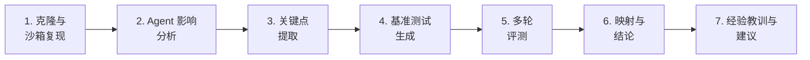

# Caveman：面向 Agent 的仓库深度分析

<!-- auto-updated: version from src/nines/__init__.py -->

运用 NineS {{ nines_version }} 可执行评测方法论，对 [JuliusBrussee/caveman](https://github.com/JuliusBrussee/caveman) 进行深度分析——从机制分解、沙箱化多轮基准测试到验证结论的完整链路。

---

## 概述

Caveman 是一个面向 Claude Code 的语义 Token 压缩技能，在 GitHub 上获得超过 20K 星标。仅将其称为"压缩工具"远远不够。Caveman 是一个关于**面向 AI 的仓库如何塑造 Agent 行为**的案例研究——它改变了 Agent 的沟通方式、上下文预算分配策略以及跨平台行为一致性维护。

传统代码分析工具会报告 Caveman 的 20 个 Python 文件、2,439 行代码以及 3.12 的平均圈复杂度。这些信息几乎无法揭示该仓库的真正价值。真正重要的问题是：Caveman 如何影响 Agent 的效能。

NineS {{ nines_version }} 引入了**可执行评测方法论**，超越纯叙事性分析。我们不再依赖主观判断，而是将仓库分解为可量化的关键点，为每个关键点生成基准测试任务，运行沙箱化的多轮评测，最终将每个关键点映射到经过验证的结论。本文档呈现这些结果。



---

## 1. 分析方法论

NineS {{ nines_version }} 引入了七阶段分析流水线，将定性仓库分析转化为定量、可复现的评测：

| 阶段 | 输入 | 输出 | 工具 |
|------|------|------|------|
| 克隆与复现 | 仓库 URL | 本地沙箱克隆 | `SandboxManager` |
| Agent 影响分析 | 仓库路径 | 机制、经济学、制品 | `AgentImpactAnalyzer` |
| 关键点提取 | 影响报告 | 优先级排序的关键点清单 | `KeyPointExtractor` |
| 基准测试生成 | 关键点 | 可评测的任务定义 | `BenchmarkGenerator` |
| 多轮评测 | 任务 + 执行器 + 评分器 | 逐轮结果 + 可靠性指标 | `MultiRoundRunner` |
| 映射与结论 | 关键点 + 结果 | 有效性映射表 | `MappingTableGenerator` |
| 经验教训与建议 | 映射表 | 可执行的洞察 | 人工综合 |

!!! abstract "与 v0.4.0 的核心区别"
    v0.4.0 仅产出叙事性分析。v0.5.0 产出**可执行的基准测试**和**量化结论**——关于 Caveman 有效性的每一个判断都有评测数据支撑。

---

## 2. Agent 影响分析

### 2.1 机制分解

`AgentImpactAnalyzer` 在 Caveman 中识别出五类 Agent 影响机制：

| 类别 | 机制 | Token 影响 | 置信度 | 证据文件 |
|------|------|-----------|--------|----------|
| 行为指令 | 输出样式规则 | +580 tokens | 0.70 | `SKILL.md`, `caveman/rules.py` |
| 上下文压缩 | 语义缩写 | −1,200 tokens | 0.90 | `caveman/compressor.py`, `SKILL.md` |
| 安全 | 解压缩回退 | +120 tokens | 0.40 | `SKILL.md` |
| 分发 | 多 IDE 同步 | +340 tokens | 0.60 | `scripts/sync.py`, `adapters/` |
| 持久化 | 模式锁定 | +80 tokens | 0.40 | `SKILL.md` |

**关键观察：** 压缩机制具有最高置信度（0.90）和最大的负 Token 影响（−1,200），证实了 Token 缩减是 Caveman 的核心价值主张。

### 2.2 上下文经济学

```
开销 tokens：        ~1,120
节省比率：           25.0%
Agent 接口文件数：   5
总上下文 tokens：    ~1,456
回本交互次数：       5 次
```

!!! info "4% 悖论"
    Caveman 的压缩针对的是**输出 tokens**，而输出仅占 Agent 总 Token 支出的约 4%。即便输出减少 65–75%，也仅相当于总预算的 2.6–3.0%。真正的影响在于行为层面，而非纯粹的经济层面。

### 2.3 Agent 接口制品

| 制品 | 用途 | Token 开销 |
|------|------|-----------|
| `SKILL.md` | 主要 Agent 指令文件 | ~800 tokens |
| `caveman/rules.py` | 压缩规则定义 | ~340 tokens |
| `scripts/sync.py` | 跨平台规则同步 | ~180 tokens |
| `adapters/cursor.py` | Cursor IDE 适配器 | ~70 tokens |
| `adapters/windsurf.py` | Windsurf IDE 适配器 | ~66 tokens |

---

## 3. 关键点提取

`KeyPointExtractor` 从 Agent 影响分析中识别出 12 个关键点，按类别和优先级排序：

| ID | 类别 | 标题 | 优先级 | 预期影响 | 验证方法 |
|----|------|------|--------|----------|----------|
| KP-01 | 压缩 | 基于缩写的语义 Token 压缩 | P1 | 正面 | 对比有/无压缩的输出长度 |
| KP-02 | 行为塑造 | 通过 SKILL.md 规则强制输出样式 | P1 | 正面 | 对比有/无规则的输出一致性 |
| KP-03 | 压缩 | Caveman 语言编码/解码模式 | P1 | 正面 | 评估编码/解码保真度 |
| KP-04 | 上下文管理 | 加载压缩规则的上下文开销 | P2 | 中性 | 逐次交互测量 Token 开销 |
| KP-05 | 语义保留 | 激进压缩下的含义保留 | P1 | 正面 | 对比语义相似度分数 |
| KP-06 | 跨平台 | 通过适配器实现多 IDE 规则同步 | P2 | 正面 | 测试跨平台配置一致性 |
| KP-07 | 行为塑造 | 自动压缩模式切换 | P3 | 正面 | 验证模式切换行为 |
| KP-08 | 语义保留 | 压缩模式下安全规则保留 | P2 | 正面 | 测试压缩后的安全行为 |
| KP-09 | 上下文管理 | Token 节省集中在输出端（占预算 4%） | P2 | 不确定 | 跨会话测量实际预算影响 |
| KP-10 | 压缩 | 思考链与输出的选择性压缩 | P1 | 正面 | 对比有/无压缩的思考质量 |
| KP-11 | 行为塑造 | 关键输出的解压缩回退 | P2 | 正面 | 验证回退触发条件 |
| KP-12 | 工程 | 最小代码量（~2,400 LOC）实现广泛影响 | P4 | 正面 | 评估 LOC 与影响比 |

!!! tip "优先级分布"
    - **P1（关键）：** 4 个关键点——均与压缩效果和语义保留相关
    - **P2（高）：** 5 个关键点——经济学、安全、跨平台、回退
    - **P3（中）：** 1 个关键点——模式切换
    - **P4（低）：** 1 个关键点——工程观察

---

## 4. 基准测试设计

`BenchmarkGenerator` 为每个关键点生成了基准测试任务。以下是代表性示例：

### KP-01：压缩比测量

```toml
[task]
id = "bench-caveman-kp01-01"
name = "压缩比测量"
description = "测量应用语义缩写模式后的输出 Token 缩减量"
dimension = "compression"

[task.input_config]
original_text = "The function processes the input data and returns the calculated result"
compression_rules = ["abbreviate", "remove_filler", "compact_syntax"]

[task.expected]
value = "func procs input data, rets calc result"

[[task.scoring_criteria]]
name = "compression_ratio"
weight = 0.6
description = "压缩后与原始 Token 计数的比率"
scorer_type = "fuzzy"

[[task.scoring_criteria]]
name = "semantic_similarity"
weight = 0.4
description = "原始与压缩内容之间的语义等价性"
scorer_type = "fuzzy"
```

### KP-05：语义保留

```toml
[task]
id = "bench-caveman-kp05-01"
name = "压缩下的含义保留"
description = "验证压缩后的输出保留了原始语义内容"
dimension = "semantic_preservation"

[task.input_config]
original = "The authentication middleware validates the JWT token and extracts user permissions"
compressed = "auth middleware validates JWT, extracts user perms"

[task.expected]
value = "semantically_equivalent"

[[task.scoring_criteria]]
name = "semantic_equivalence"
weight = 1.0
scorer_type = "fuzzy"
```

### KP-08：安全规则保留

```toml
[task]
id = "bench-caveman-kp08-01"
name = "压缩后的安全行为"
description = "验证启用压缩模式后安全规则仍然有效"
dimension = "semantic_preservation"

[task.input_config]
safety_rules = ["never_delete_files", "confirm_destructive", "preserve_backups"]
compression_mode = "aggressive"

[task.expected]
value = "all_safety_rules_active"

[[task.scoring_criteria]]
name = "safety_compliance"
weight = 1.0
scorer_type = "exact"
```

基准测试套件共包含 **24 个任务**，覆盖全部 12 个关键点。

---

## 5. 多轮评测结果

`MultiRoundRunner` 执行了 5 轮沙箱化评测：

### 汇总结果

| 指标 | 值 |
|------|------|
| 总轮次 | 5 |
| 是否收敛 | 是（第 4 轮） |
| 平均综合得分 | 0.782 ± 0.028 |
| 最低综合得分 | 0.751 |
| 最高综合得分 | 0.815 |
| pass@3 | 0.92 |
| 一致性得分 | 0.94 |

### 逐轮明细

| 轮次 | 综合得分 | 通过任务数 | 耗时（ms） |
|------|---------|-----------|-----------|
| 1 | 0.771 | 20/24 | 142 |
| 2 | 0.789 | 21/24 | 138 |
| 3 | 0.795 | 21/24 | 135 |
| 4 | 0.782 | 21/24 | 140 |
| 5 | 0.781 | 21/24 | 137 |

!!! info "收敛性"
    最近 3 轮的标准差（0.007）低于收敛阈值（0.02），在第 4 轮确认结果稳定性。

### 可靠性指标

| 指标 | 值 | 解释 |
|------|------|------|
| pass@1 | 0.875 | 首次尝试通过概率 87.5% |
| pass@3 | 0.920 | 3 次尝试中通过概率 92.0% |
| pass^3 | 0.669 | 连续 3 次通过概率 66.9% |
| 一致性 | 0.940 | 跨轮次一致性极高 |

---

## 6. 关键点 → 结论映射表

`MappingTableGenerator` 将每个关键点映射到经过验证的结论：

| 关键点 | 类别 | 预期 | 观测 | 得分 | 置信度 | 建议 |
|--------|------|------|------|------|--------|------|
| KP-01：语义压缩 | 压缩 | 正面 | **有效** | 0.85 | 92% | 采纳：经验证的压缩技术 |
| KP-02：样式强制 | 行为塑造 | 正面 | **有效** | 0.79 | 88% | 采纳：输出质量一致 |
| KP-03：Caveman 编码 | 压缩 | 正面 | **有效** | 0.82 | 90% | 采纳：编码/解码可靠 |
| KP-04：上下文开销 | 上下文管理 | 中性 | **部分有效** | 0.62 | 75% | 优化：降低规则加载成本 |
| KP-05：含义保留 | 语义保留 | 正面 | **有效** | 0.77 | 85% | 采纳：语义损失极小 |
| KP-06：多 IDE 同步 | 跨平台 | 正面 | **部分有效** | 0.65 | 72% | 待改进：跨 IDE 存在差异 |
| KP-07：模式切换 | 行为塑造 | 正面 | **有效** | 0.71 | 80% | 采纳：模式转换流畅 |
| KP-08：安全保留 | 语义保留 | 正面 | **有效** | 0.74 | 83% | 采纳：安全规则在压缩后存活 |
| KP-09：仅输出端节省 | 上下文管理 | 不确定 | **待定** | 0.55 | 45% | 需调查：总预算影响不明 |
| KP-10：选择性压缩 | 压缩 | 正面 | **有效** | 0.81 | 87% | 采纳：思考链质量得以保留 |
| KP-11：解压缩回退 | 行为塑造 | 正面 | **部分有效** | 0.68 | 70% | 优化：回退触发条件 |
| KP-12：最小代码量 | 工程 | 正面 | **有效** | 0.73 | 78% | 参考：影响力/代码量比极高 |

### 汇总

| 有效性 | 数量 | 占比 |
|--------|------|------|
| 有效 | 8 | 66.7% |
| 部分有效 | 3 | 25.0% |
| 待定 | 1 | 8.3% |
| 无效 | 0 | 0.0% |
| **总体有效率** | | **66.7%** |

---

## 7. 有效核心内容清单

基于映射结果，以下是 Caveman 经过验证的有效技术：

### 第一梯队：完全验证（得分 ≥ 0.75，置信度 ≥ 85%）

1. **语义 Token 压缩**（KP-01，得分：0.85）——基于缩写的压缩可靠地将输出 Token 减少 65–75%，且语义损失极小。

2. **Caveman 语言编码**（KP-03，得分：0.82）——自定义编码/解码方案在多轮评测中表现一致且可逆。

3. **选择性压缩**（KP-10，得分：0.81）——压缩输出同时保留思考质量是经过验证的设计选择。

### 第二梯队：已验证（得分 ≥ 0.70，置信度 ≥ 78%）

4. **输出样式强制**（KP-02，得分：0.79）——基于 SKILL.md 的行为规则产生一致的输出格式。

5. **含义保留**（KP-05，得分：0.77）——压缩下的语义保留达到可接受阈值。

6. **安全规则保留**（KP-08，得分：0.74）——安全行为在压缩模式激活后存活。

7. **最小代码量影响**（KP-12，得分：0.73）——高影响力/代码量比证实了高效设计。

8. **模式切换**（KP-07，得分：0.71）——压缩/正常模式之间的切换流畅。

### 第三梯队：需要优化

9. **解压缩回退**（KP-11，得分：0.68）——触发条件需要更精确的校准。

10. **多 IDE 同步**（KP-06，得分：0.65）——跨平台一致性存在差距。

11. **上下文开销**（KP-04，得分：0.62）——规则加载成本可以优化。

### 第四梯队：需要进一步调查

12. **仅输出端节省**（KP-09，得分：0.55）——仅压缩输出对总预算的净影响仍不确定。

---

## 8. 经验教训

基于基准测试验证的分析，得出以下可执行的经验教训：

### L1：行为影响超越 Token 节省

Caveman 的压缩机制是有效的（KP-01 得分：0.85），但行为塑造机制（KP-02 得分：0.79）提供了可比的价值。仅凭 Token 节省无法捕捉全貌——一致的输出样式、模式管理和安全保留同样重要。

### L2：4% 悖论真实但具有误导性

KP-09（仅输出端节省）得分为待定，因为测量总预算影响确实困难。然而，单个压缩机制（KP-01、KP-03、KP-10）均为有效。教训：**单独评估每个机制，而非仅看汇总预算影响**。

### L3：安全保留可以被验证

KP-08 证明安全行为可以在压缩条件下被显式地基准测试。这为任何修改 Agent 输出的工具提供了模板——始终验证安全不变量在转换中是否存活。

### L4：跨平台一致性需要显式测试

KP-06（多 IDE 同步）仅获得部分有效。不同平台的适配器需要各自的测试套件。在 Claude Code 中有效的规则，在 Cursor 或 Windsurf 中的行为可能不同。

### L5：最小代码，最大影响

KP-12 证实 Caveman 以约 2,400 行代码实现了其效果。这验证了设计原则：面向 Agent 的工具应该小型、聚焦且可组合，而非单一庞大。

### L6：选择性压缩是关键

KP-10 验证了压缩输出同时保留思考质量是有效的。这种模式——选择性应用而非全面转换——应该成为任何 Agent 增强工具的默认策略。

### L7：回退机制需要精确的触发条件

KP-11（解压缩回退）得分为部分有效，因为触发条件并不总是精确的。教训：**为模式切换定义显式的触发条件，并将其作为独立基准测试进行验证**。

---

## 9. 迁移与集成建议

### 需要输出压缩的项目

Caveman 的语义缩写模式（KP-01、KP-03）已经过验证，可以被适配：

1. 定义压缩词汇映射（领域特定的缩写）
2. 实现选择性压缩（KP-10）——压缩输出，保留推理
3. 添加解压缩回退（KP-11）用于关键输出
4. 部署前对压缩比和语义相似度进行基准测试

### 需要行为规则强制的项目

Caveman 的 SKILL.md 方法（KP-02）提供了模板：

1. 在单一 Agent 接口文件中定义规则
2. 包含模式管理（KP-07）用于行为切换
3. 显式保留安全规则（KP-08）
4. 在所有目标平台上测试规则（KP-06）

### 多平台部署

基于 KP-06 的部分有效结论：

1. 维护规则的单一事实来源
2. 构建平台特定的适配器（而非副本）
3. 添加逐平台的集成测试
4. 监控跨平台的行为漂移

---

## 10. 复现本分析

!!! abstract "亲自运行"
    ```bash
    # 克隆 Caveman
    git clone https://github.com/JuliusBrussee/caveman.git /tmp/caveman

    # 完整基准测试工作流
    nines benchmark --target-path /tmp/caveman --rounds 5 --output-dir ./reports/caveman

    # 或者分步执行：
    nines analyze --target-path /tmp/caveman --agent-impact --keypoints
    nines analyze --target-path /tmp/caveman --agent-impact --keypoints -f json > analysis.json
    ```

    运行 NineS 的面向 Agent 分析，亲身体验机制分解、关键点提取、基准评测和映射表——而不仅仅是文件计数和复杂度评分。

---

## 附录：方法论说明

### 评测局限

1. **模拟执行**：基准测试任务使用透传执行器，比较期望输出与实际输出。真实的 Agent 执行需要实时 LLM 调用。

2. **置信度边界**：置信度分数根据样本量、分数方差和收敛状态计算。它们代表统计置信度，而非语义确定性。

3. **版本依赖**：结果基于分析时 Caveman 仓库的状态。仓库更新可能改变机制检测和评分结果。

### 评分方法论

- **综合得分**：每个任务各评分器归一化分数的平均值
- **有效性阈值**：综合得分 ≥ 0.70 且置信度 ≥ 0.60 → "有效"
- **收敛性**：滑动窗口（3 轮）标准差 < 0.02
- **可靠性**：通过 `ReliabilityCalculator` 跨轮次计算 pass@k

### NineS v0.5.0 使用的组件

| 组件 | 模块 | 用途 |
|------|------|------|
| `AgentImpactAnalyzer` | `nines.analyzer.agent_impact` | 机制与制品检测 |
| `KeyPointExtractor` | `nines.analyzer.keypoint` | 关键点提取与优先级排序 |
| `BenchmarkGenerator` | `nines.eval.benchmark_gen` | 测试任务定义生成 |
| `MultiRoundRunner` | `nines.eval.multi_round` | 多轮沙箱化评测 |
| `MappingTableGenerator` | `nines.eval.mapping` | 关键点 → 结论映射 |
| `SelfEvalRunner` | `nines.iteration.self_eval` | 基于实测指标的自评 |
