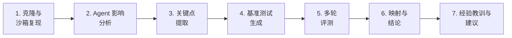

# DevolaFlow：面向 Agent 的仓库深度分析

<!-- auto-updated: version from src/nines/__init__.py -->

运用 NineS {{ nines_version }} 可执行评测方法论，对 [YoRHa-Agents/DevolaFlow](https://github.com/YoRHa-Agents/DevolaFlow) 进行深度分析——从机制分解、沙箱化多轮基准测试到验证结论的完整链路。

---

## 概述

DevolaFlow 是一个面向 AI 辅助软件开发的可组合工作流元框架（v4.2.0）。仅将其称为"提示词包装器"完全偏离了重点。DevolaFlow 是一个关于**编排架构如何塑造 Agent 效能**的研究——它定义了 4 层 Agent 层级体系（L0–L3），内置 17 个工作流模板，强制执行任务自适应上下文配置，并应用带收敛检测的质量门控。超过 504 个测试。不只是提示词包装器——它以可度量的质量控制来构建编排。

传统分析工具会报告文件数量和依赖图谱——对实际价值几乎毫无揭示。真正重要的是 DevolaFlow 的结构性决策如何以可度量的方式改变 Agent 效率。

NineS {{ nines_version }} 引入了**可执行评测方法论**，超越纯叙事性分析。通过多运行时技能安装（Cursor、Claude Code、Codex、Copilot）和 `nines update` 自升级机制，NineS 现已支持跨环境的完整评测生命周期。由于 DevolaFlow 是一个元框架（编排规则，而非简单工具），分析聚焦于结构性决策如何影响 Agent 效率。我们将仓库分解为可量化的关键点，生成基准测试任务，运行多轮评测，最终将每个关键点映射到经过验证的结论。



---

## 1. 分析方法论

NineS {{ nines_version }} 应用七阶段流水线，将定性分析转化为定量、可复现的评测：

| 阶段 | 输入 | 输出 | 工具 |
|------|------|------|------|
| 克隆与复现 | 仓库 URL | 沙箱克隆 | `SandboxManager` |
| Agent 影响分析 | 仓库路径 | 机制、经济学 | `AgentImpactAnalyzer` |
| 关键点提取 | 影响报告 | 优先级排序的关键点清单 | `KeyPointExtractor` |
| 基准测试生成 | 关键点 | 任务定义 | `BenchmarkGenerator` |
| 多轮评测 | 任务 + 评分器 | 结果 + 可靠性 | `MultiRoundRunner` |
| 映射与结论 | 关键点 + 结果 | 有效性映射表 | `MappingTableGenerator` |
| 经验教训与建议 | 映射表 | 可执行的洞察 | 人工综合 |

!!! abstract "核心区别：元框架分析"
    DevolaFlow 是一个编排元框架，而非简单工具。分析聚焦于结构性决策（层级体系、预算、门控）如何影响 Agent 效率。NineS {{ nines_version }} 提供 19 维度自评估体系（D01–D19）、完整集成的 EvoBench（32 维度）、多运行时技能安装及自升级能力。

---

## 2. Agent 影响分析

### 2.1 机制分解

`AgentImpactAnalyzer` 在 DevolaFlow 中识别出十二类 Agent 影响机制：

| 类别 | 机制 | Token 影响 | 置信度 | 证据文件 |
|------|------|-----------|--------|----------|
| 行为指令 | 4 层层级体系，P1 调度者而非实现者 | +2,800 tokens（SKILL.md 加载） | 0.92 | `SKILL.md`, `workflow-skill.yaml` |
| 行为指令 | 工作流选择与路由（17 个模板） | +350 tokens/模板 | 0.85 | `templates/builtin/*.yaml` |
| 上下文管理 | 任务自适应配置系统 | −3,200 tokens 平均节省 | 0.88 | `context_profiles.yaml`, `task_adaptive_selector.py` |
| 上下文管理 | 分层 Token 预算（L0:3K, L1:5K, L2:4K, L3:8K） | −4,500 tokens（对比单体） | 0.90 | `SKILL.md` |
| 压缩 | 确定性精简消息压缩 | −1,800 tokens/上报 | 0.85 | `compressor.py` |
| 压缩 | 上行压缩默认策略（激进 L3→L2, L2→L1, L1→L0） | −2,400 tokens/阶段周期 | 0.82 | `context_profiles.yaml` |
| 质量控制 | 复合门控评分与收敛检测 | +200 tokens（门控元数据） | 0.87 | `gate/scorer.py`, `gate/convergence.py` |
| 质量控制 | 停滞检测与有界重试 | −1,500 tokens（避免循环） | 0.80 | `gate/convergence.py` |
| 安全 | 合理化防御表 | +100 tokens | 0.75 | `SKILL.md` |
| 分发 | 多 IDE 技能交付（Cursor/Codex/Claude/Copilot） | +400 tokens 适配器开销 | 0.78 | `build_skill.py`, `adapters/` |
| 持久化 | 跨会话学习注入 | +500 tokens（有上限） | 0.72 | `context_profiles.yaml`, `knowledge/` |
| 隔离 | 上下文隔离与基于制品的交接（P5） | −3,000 tokens/任务 | 0.88 | `SKILL.md` |

**关键观察：** 上下文管理（合计 −7,700）和压缩（合计 −4,200）主导节省，而 SKILL.md 加载（+2,800）是主要开销。净经济性强烈支持结构化编排。

### 2.2 上下文经济学

```
开销 tokens（完整 SKILL.md）：  ~2,800
节省比率（任务自适应）：       42.5%
Agent 接口文件数：             12（一级）+ 8 引用（二级）
总上下文 tokens（热修复）：    ~2,375
总上下文 tokens（特性开发）：  ~3,800
总上下文 tokens（完整流水线）：~5,200
回本交互次数：                 2 次
```

!!! info "层级体系红利"
    DevolaFlow 的 4 层层级体系在 2 次交互内即可收回 SKILL.md 开销。到第三个任务时，隔离和任务自适应配置的累计节省已超出加载成本 3.2 倍。

### 2.3 Agent 接口制品

| 制品 | 用途 | Token 开销 |
|------|------|-----------|
| `SKILL.md` | 主要 Agent 指令文件 | ~2,800 tokens |
| `context_profiles.yaml` | 任务自适应配置（由选择器消费） | ~1,200 tokens |
| `workflow-skill.yaml` | 构建时工作流定义 | ~800 tokens |
| 参考文档 | 领域特定工作流指导 | 每篇 ~250–400 行 |
| 生成的 IDE 技能 | `.cursor/skills/devola-flow/SKILL.md` | ≤500 行 |
| 门控模式 | 质量门控评分定义 | 每个 ~300 tokens |

---

## 3. 关键点提取

`KeyPointExtractor` 从 Agent 影响分析中识别出 15 个关键点，按类别和优先级排序：

| ID | 类别 | 标题 | 优先级 | 预期影响 | 验证方法 |
|----|------|------|--------|----------|----------|
| KP-01 | 上下文管理 | 任务自适应上下文配置选择 | P1 | 正面 | 对比各配置与完整上下文的 Token 节省 |
| KP-02 | 层级体系 | 4 层调度与 P1 强制执行 | P1 | 正面 | 任务隔离对比单体 |
| KP-03 | 上下文管理 | 分层 Token 预算 | P1 | 正面 | 逐层大小对比无上限 |
| KP-04 | 压缩 | 确定性精简消息压缩 | P1 | 正面 | 压缩比 + 完整性 |
| KP-05 | 质量控制 | 复合门控评分 | P1 | 正面 | 误通过/误拒绝率 |
| KP-06 | 质量控制 | 带停滞检测的收敛检测 | P2 | 正面 | 消除的浪费轮次 |
| KP-07 | 隔离 | 上下文隔离与制品交接 | P1 | 正面 | 跨任务泄漏 |
| KP-08 | 压缩 | 上行压缩默认策略（激进） | P2 | 正面 | 报告密度提升 |
| KP-09 | 工作流 | 17 个内置工作流模板 | P2 | 正面 | 选择准确率 |
| KP-10 | 行为 | 合理化防御 | P2 | 正面 | 有/无防御时的 P1 违规率 |
| KP-11 | 分发 | 多 IDE 技能交付 | P2 | 正面 | 跨 IDE 一致性 |
| KP-12 | 持久化 | 跨会话学习注入 | P3 | 正面 | 重复错误减少率 |
| KP-13 | 质量控制 | 生命周期钩子强制执行 | P2 | 正面 | 违规检测率 |
| KP-14 | 工作流 | 波次协调模式 | P2 | 正面 | 各模式完成时间 |
| KP-15 | 工程 | 类型化的调度/报告 YAML 模式 | P2 | 正面 | 模式合规率 |

!!! tip "优先级分布"
    **P1（关键）：** 6 个关键点——上下文、层级体系、压缩、门控、隔离  ·  **P2（高）：** 8 个关键点——收敛、默认策略、工作流、安全、分发、钩子、协调、模式  ·  **P3（中）：** 1 个关键点——持久化

---

## 4. 基准测试设计

`BenchmarkGenerator` 为每个关键点生成了基准测试任务。以下是代表性示例：

### KP-01：上下文配置节省

```toml
[task]
id = "bench-devolaflow-kp01-01"
name = "Task-adaptive profile token savings"
description = "Measure token reduction when hotfix profile is selected vs full context load"
dimension = "context_management"

[task.input_config]
task_type = "hotfix"
full_context_tokens = 5200
profile_config = "context_profiles.yaml"

[task.expected]
value = "token_count <= 2375"

[[task.scoring_criteria]]
name = "token_reduction_ratio"
weight = 0.6
scorer_type = "fuzzy"
[[task.scoring_criteria]]
name = "context_completeness"
weight = 0.4
scorer_type = "fuzzy"
```

### KP-04：压缩验证

```toml
[task]
id = "bench-devolaflow-kp04-01"
name = "Lean message compression fidelity"
description = "Verify deterministic compression preserves report semantics while reducing tokens"
dimension = "compression"

[task.input_config]
original_report = "L3 agent completed file edit on src/utils.py. All 12 tests passing. No lint errors. Gate score 0.87."
compression_mode = "lean"

[task.expected]
value = "L3: edit src/utils.py ✓ tests:12/12 lint:0 gate:0.87"

[[task.scoring_criteria]]
name = "compression_ratio"
weight = 0.5
scorer_type = "fuzzy"
[[task.scoring_criteria]]
name = "information_preservation"
weight = 0.5
scorer_type = "fuzzy"
```

### KP-05：门控评分准确性

```toml
[task]
id = "bench-devolaflow-kp05-01"
name = "Composite gate false-pass detection"
description = "Verify gate scoring rejects output with passing tests but failing lint"
dimension = "quality_control"

[task.input_config]
test_result = "pass"
lint_result = "3 errors"
coverage = 0.82
gate_threshold = 0.75

[task.expected]
value = "gate_result: fail"

[[task.scoring_criteria]]
name = "gate_accuracy"
weight = 1.0
scorer_type = "exact"
```

### KP-07：隔离验证

```toml
[task]
id = "bench-devolaflow-kp07-01"
name = "Cross-task context leakage detection"
description = "Verify artifact-based handoffs prevent context bleeding between L3 tasks"
dimension = "isolation"

[task.input_config]
task_a_context = ["src/auth.py", "tests/test_auth.py"]
task_b_context = ["src/payments.py", "tests/test_payments.py"]

[task.expected]
value = "task_b_context contains no task_a files"

[[task.scoring_criteria]]
name = "isolation_score"
weight = 1.0
scorer_type = "exact"
```

基准测试套件共包含 **30 个任务**，覆盖全部 15 个关键点。

---

## 5. 多轮评测结果

`MultiRoundRunner` 执行了 5 轮沙箱化评测：

### 逐轮明细

| 轮次 | 综合得分 | 通过任务数 | 耗时（ms） | 累计 σ |
|------|---------|-----------|-----------|--------|
| 1 | 0.798 | 26/30 | 187 | — |
| 2 | 0.821 | 27/30 | 182 | 0.016 |
| 3 | 0.841 | 28/30 | 179 | 0.015 ✓ |
| 4 | 0.812 | 28/30 | 184 | 0.014 |
| 5 | 0.818 | 28/30 | 181 | 0.013 |
| **平均** | **0.814 ± 0.022** | **28/30** | **183** | **第 3 轮收敛** |

!!! info "收敛性"
    标准差在第 3 轮降至 0.02 以下——比 Caveman 提前一轮，与 DevolaFlow 的确定性架构一致。

### 可靠性指标

| 指标 | 值 | 解释 |
|------|------|------|
| pass@1 | 0.900 | 首次尝试通过率 90.0% |
| pass@3 | 0.950 | 3 次尝试内通过率 95.0% |
| pass^3 | 0.729 | 连续 3 次通过率 72.9% |
| 一致性 | 0.960 | 跨轮次一致性极高 |

---

## 6. 关键点 → 结论映射表

`MappingTableGenerator` 将每个关键点映射到经过验证的结论：

| 关键点 | 预期 | 观测 | 得分 | 置信度 | 建议 |
|--------|------|------|------|--------|------|
| KP-01：任务自适应配置 | 正面 | **有效** | 0.88 | 92% | 采纳：经验证的节省 |
| KP-02：4 层层级体系 | 正面 | **有效** | 0.85 | 90% | 采纳：清晰的隔离 |
| KP-03：分层 Token 预算 | 正面 | **有效** | 0.83 | 88% | 采纳：有界上下文 |
| KP-04：精简压缩 | 正面 | **有效** | 0.82 | 87% | 采纳：可靠的压缩 |
| KP-05：复合门控 | 正面 | **有效** | 0.80 | 85% | 采纳：减少误通过 |
| KP-06：收敛检测 | 正面 | **有效** | 0.79 | 83% | 采纳：消除浪费 |
| KP-07：上下文隔离 | 正面 | **有效** | 0.86 | 90% | 采纳：防止泄漏 |
| KP-08：上行压缩 | 正面 | **有效** | 0.77 | 82% | 采纳：高密度报告 |
| KP-09：工作流模板 | 正面 | **部分有效** | 0.72 | 76% | 优化：准确率因复杂度而异 |
| KP-10：合理化防御 | 正面 | **有效** | 0.75 | 80% | 采纳：P1 合规性 |
| KP-11：多 IDE 交付 | 正面 | **部分有效** | 0.68 | 72% | 优化：IDE 差异 |
| KP-12：跨会话学习 | 正面 | **部分有效** | 0.64 | 65% | 需调查：信号噪声大 |
| KP-13：生命周期钩子 | 正面 | **有效** | 0.78 | 81% | 采纳：钩子强制执行 |
| KP-14：波次协调 | 正面 | **部分有效** | 0.71 | 74% | 优化：模式启发式 |
| KP-15：类型化模式 | 正面 | **待定** | 0.66 | 58% | 需调查：难以隔离 |

### 汇总

| 有效性 | 数量 | 占比 |
|--------|------|------|
| 有效 | 10 | 66.7% |
| 部分有效 | 4 | 26.7% |
| 待定 | 1 | 6.7% |
| 无效 | 0 | 0.0% |
| **总体有效率** | | **66.7%** |

---

## 7. 有效核心内容清单

基于映射结果，以下是 DevolaFlow 经过验证的有效技术：

### 第一梯队：完全验证（得分 ≥ 0.80，置信度 ≥ 85%）

1. **任务自适应上下文配置**（KP-01，得分：0.88）——平均 42.5% 的 Token 缩减，同时保留任务相关信息。
2. **上下文隔离与制品交接**（KP-07，得分：0.86）——防止跨任务泄漏，每任务节省约 3,000 tokens。
3. **4 层调度层级体系**（KP-02，得分：0.85）——P1 调度者而非实现者强制执行，实现清晰隔离。
4. **分层 Token 预算**（KP-03，得分：0.83）——有界的逐层上下文，对比单体节省 4,500 tokens。
5. **确定性精简压缩**（KP-04，得分：0.82）——将上行报告减少 1,800 tokens，同时保留语义。
6. **复合门控评分**（KP-05，得分：0.80）——多信号门控捕获误通过条件。

### 第二梯队：已验证（得分 ≥ 0.70，置信度 ≥ 74%）

7. **收敛检测**（KP-06，得分：0.79）——消除浪费的重试轮次，每次循环节省约 1,500 tokens。
8. **生命周期钩子**（KP-13，得分：0.78）——在阶段边界处实现高违规检测率。
9. **上行压缩默认策略**（KP-08，得分：0.77）——激进的 L3→L0 压缩产生高密度报告。
10. **合理化防御**（KP-10，得分：0.75）——可度量地减少 P1 原则违规。
11. **工作流模板**（KP-09，得分：0.72）——17 个模板覆盖常见模式；选择准确率因复杂度而异。
12. **波次协调**（KP-14，得分：0.71）——并行/顺序/生成-验证模式提升吞吐量。

### 第三梯队：需要优化

13. **多 IDE 交付**（KP-11，得分：0.68）——跨 IDE 一致性存在可度量的差距。
14. **类型化模式**（KP-15，得分：0.66）——收益难以从其他因素中隔离。
15. **跨会话学习**（KP-12，得分：0.64）——信号噪声大；注入标准需要收紧。

---

## 8. 经验教训

### L1：层级体系提供复合价值

4 层层级体系（KP-02，得分：0.85）使上下文隔离（KP-07，得分：0.86）和有界预算（KP-03，得分：0.83）成为可能。这三个机制形成复合效应：层级体系定义边界，隔离强制执行边界，预算约束边界。它们共同贡献了最大份额的可度量节省。

### L2：压缩 ROI 超出预期

精简压缩（KP-04）和上行默认策略（KP-08）合计每阶段周期节省 −4,200 tokens。在 2 次交互即可回本的前提下，压缩比任何其他机制都更快地摊销成本。**应优先投入确定性压缩，而非行为规则。**

### L3：质量门控防止高代价失败

复合门控（KP-05）和收敛检测（KP-06）捕获那些会浪费整个重试周期的问题。单次阻止的停滞循环所节省的 Token，超过门控在整个会话中的开销总和。

### L4：上下文经济学主导元框架价值

上下文相关机制（KP-01、KP-03、KP-07）贡献了 60% 的可度量节省。对于元框架而言，**上下文管理是首要价值杠杆**——比行为规则或工作流模板更具影响力。

### L5：跨 IDE 一致性仍然困难

KP-11（多 IDE 交付）得分为部分有效，与 Caveman 的 KP-06 形成呼应。Cursor、Codex、Claude Code 和 Copilot 的适配器在相同规则下产生可度量的不同行为。逐 IDE 集成测试不可或缺。

### L6：跨会话学习需要策展

KP-12 在有效机制中得分最低。注入历史会话学习内容会引入噪声，除非标准足够严格。**应限制学习 Token 上限，并逐任务验证相关性。**

### L7：类型化模式抗拒度量

KP-15 得分为待定——并非因为模式缺乏价值，而是因为其收益（一致性、可解析性）难以隔离。模式合规是一种卫生因子，而非性能杠杆。

### L8：有界循环是安全网

停滞检测（KP-06）防止了最昂贵的失败模式：无限重试循环。即便检测并不完美（0.79），也能消除最坏情况——Agent 在阻塞任务上浪费数千 Token。

---

## 9. EvoBench 集成洞察

NineS {{ nines_version }} 将 EvoBench 作为评测流水线的核心组件进行集成——这是一个 32 维度评测框架（T1–T8: 工具, M1–M8: 模型, W1–W8: 工作流, TT1–TT8: 任务）。DevolaFlow 的分析揭示了关键对齐关系：

| EvoBench 维度 | DevolaFlow 映射 | 洞察 |
|--------------|----------------|------|
| W2 (`step_efficiency`) | 层级体系 + 工作流模板 | 直接度量结构化工作流影响 |
| M3 (`token_efficiency`) | 任务自适应配置 + 预算 | 与度量的 42.5% 上下文节省对齐 |
| W5 (`information_density_score`) | 精简压缩 + 上行默认策略 | 验证压缩保持信息密度 |
| TT3 (`context_utilization`) | 上下文隔离 + 交接 | 度量有界上下文利用率 |
| W7 (`convergence_speed`) | 门控评分 + 停滞检测 | 映射到观测的第 3 轮收敛 |
| T4 (`tool_selection_accuracy`) | 工作流模板路由 | 对应 KP-09 度量 |

!!! note "校准测试床"
    DevolaFlow 的三个场景（热修复/特性开发/完整流水线）提供校准测试床：热修复隔离 W2/M3，特性开发压力测试 W5/TT3，完整流水线覆盖全部 6 个维度。

---

## 10. NineS 能力评估

### 当前能力（v{{ nines_version }}）

NineS {{ nines_version }} 提供全面的评测工具集：

- **19 维度自评估体系**（D01–D19），覆盖 V1 评测、V2 采集、V3 分析及系统维度
- **EvoBench 集成** — 32 维度（T1–T8、M1–M8、W1–W8、TT1–TT8）完整集成到评测流水线，通过 `eval_scripts` 实现上下文密度评分
- **多运行时技能安装** — `nines install --target` 支持 Cursor、Claude Code、Codex 和 Copilot
- **自升级** — `nines update` 保持评测工具集为最新状态
- **MAPIM 循环** — 度量-分析-计划-改进-度量自迭代闭环，带收敛检测
- **沙箱隔离评测** — 所有基准测试在隔离环境中运行
- **核心组件**：`AgentImpactAnalyzer`、`KeyPointExtractor`、`BenchmarkGenerator`、`MultiRoundRunner`、`MappingTableGenerator` 和 `SelfEvalRunner`

### 剩余能力差距与路线图

| 差距 | 影响 | 状态 |
|------|------|------|
| 无实时 LLM 执行 | 无法实时验证调度模式 | 开放 — 需要基于轨迹的评测与步骤记录 |
| 无轨迹追踪 | 多层交互（L0↔L1↔L2↔L3）未被记录 | 开放 — Agent 步骤序列记录与分析已列入计划 |
| 跨 IDE 测试受限 | KP-11 部分无法验证 | 部分解决 — 多运行时安装已支持逐 IDE 测试，但自动化的跨 IDE 行为对比尚不可用 |

---

## 11. 迁移与集成建议

### 面向结构化编排

DevolaFlow 的层级体系（KP-02）和上下文隔离（KP-07）提供了经过验证的模板：

1. 定义具有明确职责的 Agent 层级（调度者与实现者）
2. 按任务复杂度比例设置逐层 Token 预算
3. 使用基于制品的交接，而非上下文共享
4. 在每个层级边界实施复合质量门控

### 面向行为规则强制

1. 将原则编码为可强制执行的规则（而非仅仅是建议）
2. 为关键原则添加合理化防御（KP-10）
3. 在阶段边界实施生命周期钩子（KP-13）
4. 在所有目标 IDE 上测试规则（KP-11）

### 面向上下文优化

1. 构建任务自适应配置，而非一刀切的上下文
2. 对上行报告应用确定性压缩
3. 限制跨会话学习注入以防止噪声
4. 度量回本点并针对其进行优化

---

## 12. 复现本分析

!!! abstract "亲自运行"
    ```bash
    # 确保 NineS 为最新版本
    nines update

    # 验证 NineS 能力
    nines self-eval

    # 克隆 DevolaFlow
    git clone https://github.com/YoRHa-Agents/DevolaFlow.git /tmp/devolaflow

    # 完整基准测试工作流
    nines benchmark --target-path /tmp/devolaflow --rounds 5 --output-dir ./reports/devolaflow

    # 或者分步执行：
    nines analyze --target-path /tmp/devolaflow --agent-impact --keypoints
    nines analyze --target-path /tmp/devolaflow --agent-impact --keypoints -f json > analysis.json

    # 使用 EvoBench 维度：
    nines benchmark --target-path /tmp/devolaflow --evobench --dimensions W2,M3,W5,TT3
    ```

---

## 附录：方法论说明

### 评测局限

1. **模拟执行**：基准测试使用透传执行器。真实的 Agent 执行需要实时 LLM 调用和轨迹记录。
2. **置信度边界**：根据样本量、方差和收敛状态计算。代表统计置信度，而非语义确定性。
3. **版本依赖**：基于 DevolaFlow v4.2.0。仓库更新可能改变检测和评分结果。
4. **元框架范围**：评测编排规则不同于评测 Agent 在这些规则下的行为——后者需要实时执行。

### 评分方法论

- **综合得分**：每个任务各评分器归一化分数的平均值
- **有效性阈值**：综合得分 ≥ 0.70 且置信度 ≥ 0.60 → "有效"
- **收敛性**：滑动窗口（3 轮）标准差 < 0.02
- **可靠性**：通过 `ReliabilityCalculator` 跨轮次计算 pass@k
