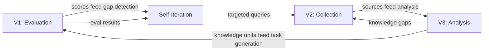

# User Guide

<!-- auto-updated: version from src/nines/__init__.py -->

This guide covers the full set of NineS capabilities organized by vertex, plus cross-cutting workflows and configuration reference.

---

## The Three Vertices

NineS operates through three interconnected capability vertices that mutually reinforce each other:



| Vertex | Purpose | Module | Guide |
|--------|---------|--------|-------|
| **V1: Evaluation** | Benchmark AI agent capabilities with structured tasks | `nines.eval` | [Evaluation Guide](evaluation.md) |
| **V2: Collection** | Discover and track external information sources | `nines.collector` | [Collection Guide](collection.md) |
| **V3: Analysis** | Analyze codebases into structured knowledge | `nines.analyzer` | [Analysis Guide](analysis.md) |
| **Cross-Vertex** | Self-evaluation and self-improvement iteration | `nines.iteration` | [Self-Iteration Guide](self-iteration.md) |

---

## Common Workflows

### Evaluate → Report

The simplest workflow: run evaluation tasks and generate reports.

```bash
nines eval tasks/ --scorer composite --format markdown -o report.md
```

### Collect → Analyze → Index

Gather external repositories, then analyze them into searchable knowledge units.

```bash
nines collect github "LLM evaluation framework" --limit 20 --store ./data
nines analyze ./target-repo --decompose --index
```

### Self-Eval → Iterate → Improve

Run the full MAPIM self-improvement cycle.

```bash
nines self-eval --report -o baseline.md
nines iterate --max-rounds 5 --convergence-threshold 0.001
```

### Full Pipeline

Combine all three vertices with self-iteration:

```bash
nines collect github "AI agent eval" --incremental
nines analyze ./target-repo --depth deep --decompose --index
nines eval tasks/coding.toml --scorer composite --sandbox
nines self-eval --dimensions D01,D11,D14 --compare
nines iterate --max-rounds 3
```

---

## Configuration Reference

NineS uses TOML configuration with a 4-level priority system (highest first):

1. **CLI flags** — `--config`, `--verbose`, `--scorer`, etc.
2. **Environment variables** — `NINES_EVAL_DEFAULT_SCORER`, etc.
3. **Project config** — `nines.toml` in the project root
4. **User config** — `~/.config/nines/config.toml`
5. **Built-in defaults** — `src/nines/core/defaults.toml`

Key configuration sections:

| Section | Controls | Key Settings |
|---------|----------|--------------|
| `[general]` | Global behavior | `log_level`, `output_dir`, `db_path` |
| `[eval]` | Evaluation pipeline | `default_scorer`, `sandbox_enabled`, `default_timeout` |
| `[eval.reliability]` | Reliability metrics | `min_trials`, `report_pass_at_k` |
| `[eval.matrix]` | Matrix evaluation | `max_cells`, `sampling_strategy` |
| `[collect]` | Collection pipeline | `default_limit`, `incremental` |
| `[collect.github]` | GitHub collector | `token`, `use_graphql`, `search_rate_limit` |
| `[collect.arxiv]` | arXiv collector | `rate_limit_interval`, `sort_by` |
| `[analyze]` | Analysis pipeline | `default_depth`, `decompose`, `index` |
| `[analyze.decomposer]` | Decomposition | `strategies`, `concern_categories` |
| `[self_eval]` | Self-evaluation | `dimensions`, `stability_runs` |
| `[self_eval.weights]` | Composite scoring | `v1`, `v2`, `v3`, `system` weights |
| `[iteration]` | MAPIM loop | `max_rounds`, `convergence_method` |
| `[sandbox]` | Sandbox isolation | `backend`, `pool_size`, `default_timeout` |
| `[skill]` | Agent Skill | `default_target` |

See the [CLI Reference](cli-reference.md) for all command-line options.

---

## Guides in This Section

- [Evaluation Guide](evaluation.md) — Task definitions, scorers, matrix evaluation, reliability metrics
- [Collection Guide](collection.md) — GitHub & arXiv sources, incremental tracking, change detection
- [Analysis Guide](analysis.md) — Code review, structure analysis, decomposition, knowledge indexing
- [Self-Iteration Guide](self-iteration.md) — MAPIM cycle, 19 dimensions, convergence checking
- [CLI Reference](cli-reference.md) — Complete command reference with all flags and options
