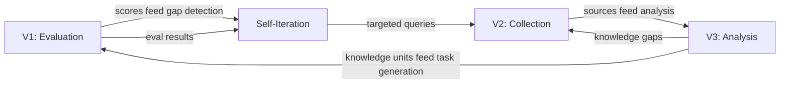

# 用户指南

<!-- auto-updated: version from src/nines/__init__.py -->

本指南涵盖 NineS 的全部功能，按顶点（Vertex）组织，另外包括跨顶点工作流和配置参考。

---

## 三大顶点

NineS 通过三个相互关联、相互增强的能力顶点进行运作：



| 顶点 | 用途 | 模块 | 指南 |
|------|------|------|------|
| **V1: 评估（Evaluation）** | 使用结构化任务对 AI 代理能力进行基准测试 | `nines.eval` | [评估指南](evaluation.md) |
| **V2: 采集（Collection）** | 发现和追踪外部信息源 | `nines.collector` | [采集指南](collection.md) |
| **V3: 分析（Analysis）** | 将代码库分析为结构化知识 | `nines.analyzer` | [分析指南](analysis.md) |
| **跨顶点** | 自我评估与自我改进迭代 | `nines.iteration` | [自迭代指南](self-iteration.md) |

---

## 常用工作流

### 评估 → 报告

最简工作流：运行评估任务并生成报告。

```bash
nines eval tasks/ --scorer composite --format markdown -o report.md
```

### 采集 → 分析 → 索引

收集外部代码仓库，然后将其分析为可搜索的知识单元。

```bash
nines collect github "LLM evaluation framework" --limit 20 --store ./data
nines analyze ./target-repo --decompose --index
```

### 自评估 → 迭代 → 改进

运行完整的 MAPIM 自改进循环。

```bash
nines self-eval --report -o baseline.md
nines iterate --max-rounds 5 --convergence-threshold 0.001
```

### 完整流水线

将三大顶点与自迭代相结合：

```bash
nines collect github "AI agent eval" --incremental
nines analyze ./target-repo --depth deep --decompose --index
nines eval tasks/coding.toml --scorer composite --sandbox
nines self-eval --dimensions D01,D11,D14 --compare
nines iterate --max-rounds 3
```

---

## 配置参考

NineS 使用 TOML 配置，采用 4 级优先级系统（优先级从高到低）：

1. **CLI 标志** — `--config`、`--verbose`、`--scorer` 等
2. **环境变量** — `NINES_EVAL_DEFAULT_SCORER` 等
3. **项目配置** — 项目根目录下的 `nines.toml`
4. **用户配置** — `~/.config/nines/config.toml`
5. **内置默认值** — `src/nines/core/defaults.toml`

关键配置节：

| 节 | 控制内容 | 关键设置 |
|----|---------|---------|
| `[general]` | 全局行为 | `log_level`、`output_dir`、`db_path` |
| `[eval]` | 评估流水线 | `default_scorer`、`sandbox_enabled`、`default_timeout` |
| `[eval.reliability]` | 可靠性指标 | `min_trials`、`report_pass_at_k` |
| `[eval.matrix]` | 矩阵评估 | `max_cells`、`sampling_strategy` |
| `[collect]` | 采集流水线 | `default_limit`、`incremental` |
| `[collect.github]` | GitHub 采集器 | `token`、`use_graphql`、`search_rate_limit` |
| `[collect.arxiv]` | arXiv 采集器 | `rate_limit_interval`、`sort_by` |
| `[analyze]` | 分析流水线 | `default_depth`、`decompose`、`index` |
| `[analyze.decomposer]` | 分解策略 | `strategies`、`concern_categories` |
| `[self_eval]` | 自评估 | `dimensions`、`stability_runs` |
| `[self_eval.weights]` | 综合评分 | `v1`、`v2`、`v3`、`system` 权重 |
| `[iteration]` | MAPIM 循环 | `max_rounds`、`convergence_method` |
| `[sandbox]` | 沙箱隔离 | `backend`、`pool_size`、`default_timeout` |
| `[skill]` | 代理技能 | `default_target` |

详见 [CLI 参考](cli-reference.md) 了解所有命令行选项。

---

## 本节指南

- [评估指南](evaluation.md) — 任务定义、评分器、矩阵评估、可靠性指标
- [采集指南](collection.md) — GitHub 和 arXiv 数据源、增量追踪、变更检测
- [分析指南](analysis.md) — 代码审查、结构分析、分解、知识索引
- [自迭代指南](self-iteration.md) — MAPIM 循环、19 个维度、收敛检查
- [CLI 参考](cli-reference.md) — 完整的命令参考，包含所有标志和选项
