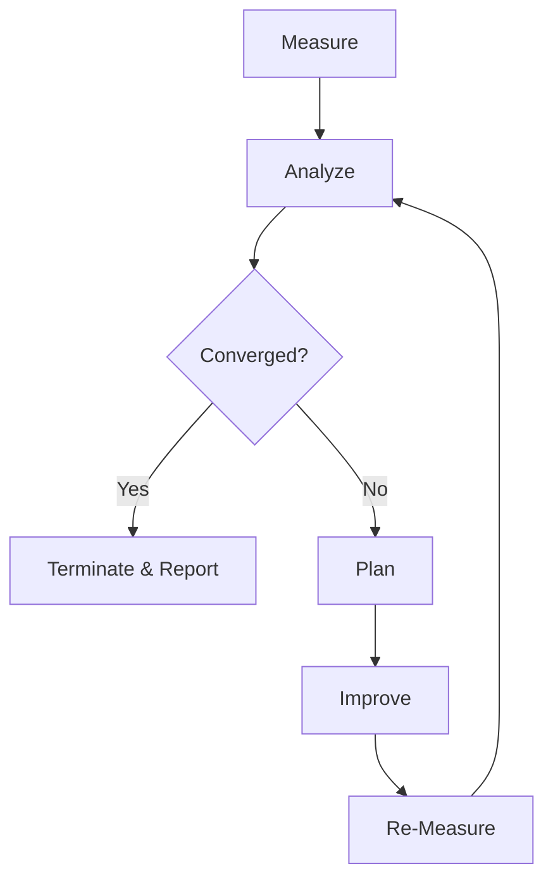

# Self-Iteration Guide

<!-- auto-updated: version from src/nines/__init__.py -->

NineS implements a closed-loop self-improvement system through the MAPIM (Measure–Analyze–Plan–Improve–Measure) cycle. This guide explains how to run self-evaluations, understand the 19 dimensions, manage baselines, and configure convergence checking.

---

## The MAPIM Cycle

The self-iteration mechanism is a control loop: NineS measures its own capabilities, detects gaps, plans improvements, applies them, and re-measures.



| Phase | Component | Output |
|-------|-----------|--------|
| **Measure** | `SelfEvalRunner` | `SelfEvalReport` with 19 dimension scores |
| **Analyze** | `GapDetector` | `GapAnalysisReport` with prioritized gaps |
| **Plan** | `ImprovementPlanner` | `ImprovementPlan` with ≤3 actions |
| **Improve** | `ActionExecutor` | Applied changes (MVP: logged for manual execution) |
| **Re-Measure** | `SelfEvalRunner` | Updated scores + `ConvergenceReport` |

---

## Running Self-Evaluation

### Full Self-Evaluation

Evaluate all 19 dimensions:

```bash
nines self-eval
```

### Specific Dimensions

Evaluate only selected dimensions:

```bash
nines self-eval --dimensions D01,D02,D03
```

### Compare Against Baseline

```bash
nines self-eval --baseline v1 --compare
```

### Generate Report

```bash
nines self-eval --report -o self_eval_report.md
```

---

## Understanding the 19 Dimensions

NineS tracks 19 self-evaluation dimensions across four categories:

### V1 Evaluation Dimensions (D01–D05)

| ID | Name | Metric | Direction | Target |
|----|------|--------|-----------|--------|
| D01 | Scoring Accuracy | Agreement with golden test set | Higher is better | ≥0.90 |
| D02 | Evaluation Coverage | Fraction of task types covered | Higher is better | 1.00 |
| D03 | Reliability (Pass^k) | Same result across k runs | Higher is better | ≥0.95 |
| D04 | Report Quality | Required report sections present | Higher is better | 1.00 |
| D05 | Scorer Agreement | Pairwise Cohen's κ across scorers | Higher is better | ≥0.70 |

### V2 Search Dimensions (D06–D10)

| ID | Name | Metric | Direction | Target |
|----|------|--------|-----------|--------|
| D06 | Source Coverage | Active sources / configured sources | Higher is better | 1.00 |
| D07 | Tracking Freshness | Median detection lag (minutes) | Lower is better | ≤60 |
| D08 | Change Detection Recall | Detected changes / actual changes | Higher is better | ≥0.85 |
| D09 | Data Completeness | Populated fields / total fields | Higher is better | ≥0.90 |
| D10 | Collection Throughput | Entities per minute | Higher is better | ≥50 |

### V3 Analysis Dimensions (D11–D15)

| ID | Name | Metric | Direction | Target |
|----|------|--------|-----------|--------|
| D11 | Decomposition Coverage | Captured elements / total elements | Higher is better | ≥0.85 |
| D12 | Abstraction Quality | Pattern classification F1 score | Higher is better | ≥0.60 |
| D13 | Code Review Accuracy | Finding detection F1 score | Higher is better | ≥0.70 |
| D14 | Index Recall | Recall@10 on benchmark queries | Higher is better | ≥0.70 |
| D15 | Structure Recognition | Correctly identified patterns | Higher is better | ≥0.60 |

### System-Wide Dimensions (D16–D19)

| ID | Name | Metric | Direction | Target |
|----|------|--------|-----------|--------|
| D16 | Pipeline Latency | End-to-end p50 (seconds) | Lower is better | ≤30 |
| D17 | Sandbox Isolation | Clean PollutionReport rate | Higher is better | 1.00 |
| D18 | Convergence Rate | 1 - (iterations / max_iterations) | Higher is better | ≥0.50 |
| D19 | Cross-Vertex Synergy | Lagged cross-correlation | Higher is better | ≥0.00 |

---

## Baseline Management

Baselines are frozen snapshots of dimension scores used as reference points for gap analysis.

### Create a Baseline

```bash
nines self-eval --save-baseline v1
```

### List Baselines

```bash
nines self-eval --list-baselines
```

### Compare Against a Baseline

```bash
nines self-eval --baseline v1 --compare
```

Baselines are stored in `data/baselines/{version}/`:

```
data/baselines/
├── v1/
│   ├── baseline.json    # Structured evaluation data
│   └── metadata.json    # Hardware, version, params
└── latest -> v1/        # Symlink to most recent
```

---

## Gap Detection and Improvement Planning

The `GapDetector` classifies each dimension gap by severity:

| Severity | Condition | Priority Weight |
|----------|-----------|----------------|
| **Critical** | Score < 50% of target OR regression > 10% | 4.0 |
| **Major** | Score < 75% of target OR regression > 5% | 3.0 |
| **Minor** | Score < 90% of target | 2.0 |
| **Acceptable** | Score ≥ 90% of target | 1.0 |

The `ImprovementPlanner` generates up to 3 concrete actions per iteration, prioritized by:

1. Gap severity × |gap to target| × dimension weight
2. Cross-vertex bonus (+20% for multi-vertex improvements)
3. Regression penalty (+50% for actions fixing regressions)

---

## Running the Iteration Loop

### Basic Iteration

```bash
nines iterate --max-rounds 5
```

### With Convergence Threshold

```bash
nines iterate --max-rounds 10 --convergence-threshold 0.001
```

### Dry Run

Preview planned improvements without executing:

```bash
nines iterate --max-rounds 5 --dry-run
```

---

## Convergence Checking

Convergence is determined by **majority vote** across four statistical methods (≥3 of 4 must agree):

### Method 1: Sliding Window Variance

Variance of the last *w* scores must be below threshold (default: 0.001).

### Method 2: Relative Improvement Rate

Average per-step improvement must be below minimum threshold (default: 0.5%).

### Method 3: Mann-Kendall Trend Test

Non-parametric test for monotonic trend. Converged when no significant trend at 95% confidence.

### Method 4: CUSUM Change Detection

Cumulative sum control chart. Converged when no shift from reference mean is detected.

### Convergence Actions

| State | Condition | Action |
|-------|-----------|--------|
| Active Improvement | ≤2 methods agree | Continue MAPIM loop |
| Near Convergence | 3 agree, still improving >0.5% | Run 2 more iterations to confirm |
| Converged | ≥3 agree, delta <0.5% for 3 iterations | Terminate, generate final report |
| Oscillating | Mann-Kendall no trend, CUSUM detects changes | Investigate conflicting actions |
| Regressing | Mann-Kendall shows negative trend | Halt, rollback last change |

Configuration:

```toml
[iteration.convergence]
sliding_window_size = 5
variance_threshold = 0.001
min_improvement_rate = 0.005
mann_kendall_confidence = 0.95
cusum_drift = 0.5
vote_threshold = 3
```

---

## Composite Scoring Formula

The composite score aggregates per-category scores with configurable weights:

```
composite = 0.30 × V1_score + 0.25 × V2_score + 0.25 × V3_score + 0.20 × system_score
```

Where each category score is the weighted mean of its normalized dimensions. Lower-is-better dimensions (D07, D16) are inverted before aggregation.

Configuration:

```toml
[self_eval.weights]
v1 = 0.30
v2 = 0.25
v3 = 0.25
system = 0.20
```
