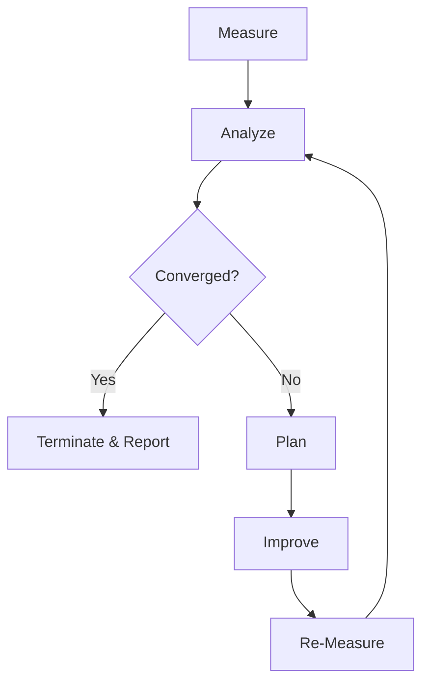

# 自迭代指南

<!-- auto-updated: version from src/nines/__init__.py -->

NineS 通过 MAPIM（度量–分析–计划–改进–度量）循环实现了闭环自改进系统。本指南介绍如何运行自评估、理解 19 个维度、管理基线以及配置收敛检查。

---

## MAPIM 循环

自迭代机制是一个控制循环：NineS 度量自身能力，检测差距，规划改进，执行改进，然后重新度量。



| 阶段 | 组件 | 输出 |
|------|------|------|
| **度量（Measure）** | `SelfEvalRunner` | 包含 19 个维度得分的 `SelfEvalReport` |
| **分析（Analyze）** | `GapDetector` | 包含优先级排序差距的 `GapAnalysisReport` |
| **计划（Plan）** | `ImprovementPlanner` | 包含 ≤3 个操作的 `ImprovementPlan` |
| **改进（Improve）** | `ActionExecutor` | 已应用的变更（MVP 阶段：记录以供手动执行） |
| **重新度量（Re-Measure）** | `SelfEvalRunner` | 更新后的得分 + `ConvergenceReport` |

---

## 运行自评估

### 完整自评估

评估全部 19 个维度：

```bash
nines self-eval
```

### 指定维度

仅评估选定的维度：

```bash
nines self-eval --dimensions D01,D02,D03
```

### 与基线对比

```bash
nines self-eval --baseline v1 --compare
```

### 生成报告

```bash
nines self-eval --report -o self_eval_report.md
```

---

## 理解 19 个维度

NineS 跨四个类别追踪 19 个自评估维度：

### V1 评估维度（D01–D05）

| ID | 名称 | 指标 | 方向 | 目标 |
|----|------|------|------|------|
| D01 | 评分准确度 | 与黄金测试集的一致性 | 越高越好 | ≥0.90 |
| D02 | 评估覆盖率 | 已覆盖的任务类型比例 | 越高越好 | 1.00 |
| D03 | 可靠性（Pass^k） | k 次运行结果一致 | 越高越好 | ≥0.95 |
| D04 | 报告质量 | 必需报告章节的完整性 | 越高越好 | 1.00 |
| D05 | 评分器一致性 | 评分器之间的成对 Cohen's κ | 越高越好 | ≥0.70 |

### V2 搜索维度（D06–D10）

| ID | 名称 | 指标 | 方向 | 目标 |
|----|------|------|------|------|
| D06 | 数据源覆盖率 | 活跃数据源 / 已配置数据源 | 越高越好 | 1.00 |
| D07 | 追踪时效性 | 中位检测延迟（分钟） | 越低越好 | ≤60 |
| D08 | 变更检测召回率 | 检测到的变更 / 实际变更 | 越高越好 | ≥0.85 |
| D09 | 数据完整性 | 已填充字段 / 总字段 | 越高越好 | ≥0.90 |
| D10 | 采集吞吐量 | 实体数/分钟 | 越高越好 | ≥50 |

### V3 分析维度（D11–D15）

| ID | 名称 | 指标 | 方向 | 目标 |
|----|------|------|------|------|
| D11 | 分解覆盖率 | 已捕获元素 / 总元素 | 越高越好 | ≥0.85 |
| D12 | 抽象质量 | 模式分类 F1 分数 | 越高越好 | ≥0.60 |
| D13 | 代码审查准确度 | 问题检测 F1 分数 | 越高越好 | ≥0.70 |
| D14 | 索引召回率 | 基准查询的 Recall@10 | 越高越好 | ≥0.70 |
| D15 | 结构识别 | 正确识别的模式数 | 越高越好 | ≥0.60 |

### 系统级维度（D16–D19）

| ID | 名称 | 指标 | 方向 | 目标 |
|----|------|------|------|------|
| D16 | 流水线延迟 | 端到端 p50（秒） | 越低越好 | ≤30 |
| D17 | 沙箱隔离性 | 清洁 PollutionReport 率 | 越高越好 | 1.00 |
| D18 | 收敛速率 | 1 - (迭代次数 / 最大迭代次数) | 越高越好 | ≥0.50 |
| D19 | 跨顶点协同 | 滞后交叉相关 | 越高越好 | ≥0.00 |

---

## 基线管理

基线是维度得分的冻结快照，用作差距分析的参考点。

### 创建基线

```bash
nines self-eval --save-baseline v1
```

### 列出基线

```bash
nines self-eval --list-baselines
```

### 与基线对比

```bash
nines self-eval --baseline v1 --compare
```

基线存储在 `data/baselines/{version}/` 中：

```
data/baselines/
├── v1/
│   ├── baseline.json    # Structured evaluation data
│   └── metadata.json    # Hardware, version, params
└── latest -> v1/        # Symlink to most recent
```

---

## 差距检测与改进计划

`GapDetector` 按严重程度对每个维度差距进行分类：

| 严重程度 | 条件 | 优先级权重 |
|---------|------|-----------|
| **严重（Critical）** | 得分 < 目标的 50% 或 回退 > 10% | 4.0 |
| **重要（Major）** | 得分 < 目标的 75% 或 回退 > 5% | 3.0 |
| **次要（Minor）** | 得分 < 目标的 90% | 2.0 |
| **可接受（Acceptable）** | 得分 ≥ 目标的 90% | 1.0 |

`ImprovementPlanner` 每次迭代生成最多 3 个具体操作，优先级排序依据：

1. 差距严重程度 × |与目标的差距| × 维度权重
2. 跨顶点加成（多顶点改进 +20%）
3. 回退惩罚（修复回退的操作 +50%）

---

## 运行迭代循环

### 基本迭代

```bash
nines iterate --max-rounds 5
```

### 带收敛阈值

```bash
nines iterate --max-rounds 10 --convergence-threshold 0.001
```

### 干运行

预览计划的改进，但不执行：

```bash
nines iterate --max-rounds 5 --dry-run
```

---

## 收敛检查

收敛由四种统计方法的**多数投票**决定（≥3/4 必须一致）：

### 方法 1：滑动窗口方差

最近 *w* 个得分的方差必须低于阈值（默认：0.001）。

### 方法 2：相对改进率

平均每步改进必须低于最小阈值（默认：0.5%）。

### 方法 3：Mann-Kendall 趋势检验

检测单调趋势的非参数检验。当在 95% 置信水平下无显著趋势时判定为收敛。

### 方法 4：CUSUM 变化检测

累积和控制图。当未检测到偏离参考均值的偏移时判定为收敛。

### 收敛操作

| 状态 | 条件 | 操作 |
|------|------|------|
| 活跃改进 | ≤2 种方法一致 | 继续 MAPIM 循环 |
| 接近收敛 | 3 种一致，改进仍 >0.5% | 再运行 2 次迭代以确认 |
| 已收敛 | ≥3 种一致，连续 3 次迭代 delta <0.5% | 终止并生成最终报告 |
| 振荡 | Mann-Kendall 无趋势，CUSUM 检测到变化 | 调查冲突操作 |
| 回退 | Mann-Kendall 显示负趋势 | 停止，回滚上一次变更 |

配置：

```toml
[iteration.convergence]
sliding_window_size = 5
variance_threshold = 0.001
min_improvement_rate = 0.005
mann_kendall_confidence = 0.95
cusum_drift = 0.5
vote_threshold = 3
```

---

## 综合评分公式

综合分数通过可配置的权重聚合各类别得分：

```
composite = 0.30 × V1_score + 0.25 × V2_score + 0.25 × V3_score + 0.20 × system_score
```

其中每个类别得分是其归一化维度的加权平均值。越低越好的维度（D07、D16）在聚合前会进行反转。

配置：

```toml
[self_eval.weights]
v1 = 0.30
v2 = 0.25
v3 = 0.25
system = 0.20
```
